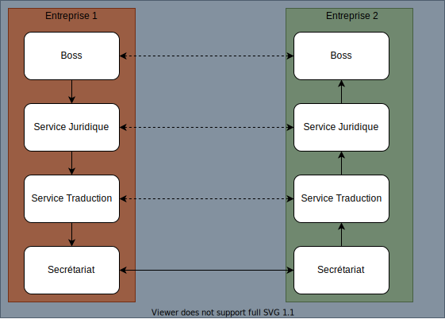
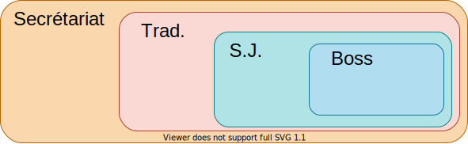
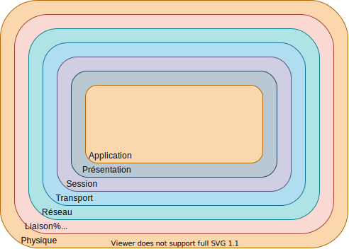

# Cours de R102 - Principe et Architecture des Réseaux

## I - Architecture des réseaux

Le message ne doit pas changer mais le support, si.
(des notions de calcul partagé)

NCP: Network Control Protocol

Principe de neutralité sur les gateways et routeurs.  
Un serveur, c'est une machine qui rend un service.

### La notion d'encapsulation



Un message provenant du `Boss` de l'`entreprise 1` à destination du `Boss` de l'`entreprise 2`
ne va pas directement à son homologue.  
Il passe d'abord par le service juridique qui ajoute sa partie, puis
passe le service de traduction (dans un cas où la langue natale est différente, on suppose qu'une langue commune aux deux entreprise a été décidée au préalable) qui traduit la proposition et des notes de traduction
puis passe au secrétariat qui est chargé d'envoyer la propostion à l'autre entreprise.

Aucune partie n'a pour elle conscience des autres parties que son homologue
sur la proposition car à chaque fois, qu'elle passe par un service chaque
partie s'occupe que de ce qui la concerne et tramsmets la proposition à la partie suivante qu'avec le contenu le lui concernant.

Le support de transmission, c'est le coté physique.



On transmet des informations nécessaires mais pas utiles.

### Modèle OSI

- Open System Interconnection
- Réference [ISO 7498](https://www.rfc-editor.org/rfc/rfc7498)
- Modèle à 7 couches



### Modèle TCP/IP

- Modèle Internet
- Trame TCP dans une trame IP
- Couche Application fusionnée avec Présentation et Session
- Les couches Laison et Physique fusionnées

## II - 

### Analyse de protocoles

- Couche 3
  - ARP
  - IP
  - ICMP
- Couche 4
  - TCP
  - UDP

### Protocole ARP

Déterminer l'adresse physique avec l'adresse logique.  
Plusieurs cas:

- Réseau point à point -> PPP -> 2 seules machines
- Réseau multi points -> ARP utile car plusieurs machines

IPv6: ARP perd sa place et NDP prend sa place
NDP: Neighbor Discovery Protocol

Protocole de niveau -> Se situe entre la couche 2 et 3, [RFC 826](https://www.rfc-editor.org/rfc/rfc826)

La requête ARP est en diffusion (broadcast), sa réponse est en unicast.

#### Le cache ARP

Sous Linux:

```sh
ip neigh

## ou

cat /proc/net/arp
```

Sous Windows:

```batch
arp -a
```

Le cache ARP est utilisé afin d'éviter des résolutions à chaque paquet.

#### Le timeout

Après 3 tentatives ratées, on arrête.

#### ARP gratuit

L'ARP gratuit est l'action où une nouvelle machine se connectant sur un résseau annonce en diffusion
son adresse IP et son adresse Ethernet. Windows l'utilise fréquemment.

### Protocole IP

[RFC 791](https://www.rfc-editor.org/rfc/rfc791)
[RFC 1349](https://www.rfc-editor.org/rfc/rfc1349)

Le protocole IP achemine "au mieux" (Best Effort) les paquets.

#### Protocole IP non fiable

- Possible corruption des donnéess
- Ordre des paquets non garanti
- Duplication des paquets

#### Protocole IP - fiabilités

- Le PCI du protocole est vérifié
  - Si erreur, alors destruction du paquet + envoi d'un message ICMP
- Assure une couche d'homogénéité au niveau du réseau
- On est dans un monde tout IP
- IP est capable de
  - dé-fragmentation (principalement par les routeurs)
  - Réassemblage (principalement le client)
