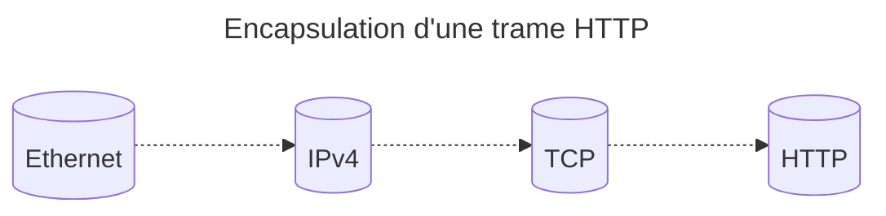
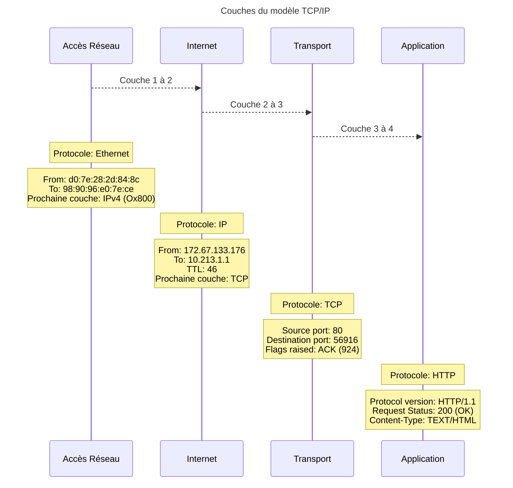
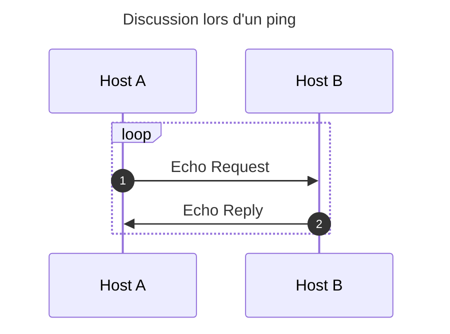
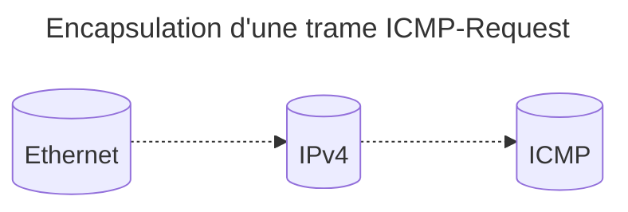
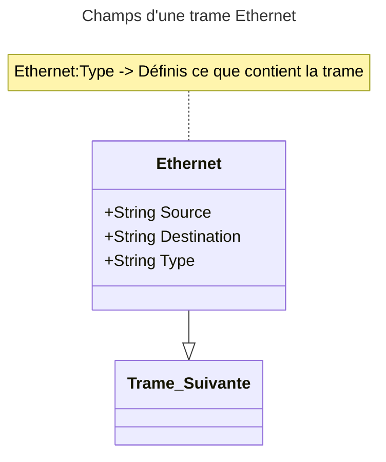

# Compte rendu de R102-TP1 - Captures de trames / Protocole ARP

## 1/ Capture et analyse de trames

### Exercice 1

#### Comment filtrer l'adresse sur Wireshark

Sur wireshark, on filtre les requêtes provenant de ou qui partent de la machine avec le filtre `ip.addr == xx.xx.xx.xx` comme montré ci-dessous:


<div style="page-break-after:always"></div>

#### Capture des trames HTTP lors de la consultation du site [perdu.com](https://perdu.com)


##### Une trame HTTP plus en détail


<div style="page-break-after:always"></div>





<div style="page-break-after:always"></div>

> Prenez l'un des paquets de votre choix. Dans son analyse en couches, une couche apparait tout en haut indiquant `Frame XXX` où `XXX` est un numéro.
>
> A quelle couche du modèle TCP/IP correspond cette information ? Que contient-elle ?

Elle n'apartient à aucune couche, elle est seulement présente dans wireshark pour "encapsuler" les informations d'une trame particulière.  
Elle fait office de synthèse des informations techniques de la trame: sa taille, de quelle interface réseau elle provient.

### Exercice 2 - Analyse d'une trame ICMP Request

#### Quels paquets sont émis et reçus lors d'un ping

| Paquets Emis | Paquets Reçus |
|--------------|---------------|
| Echo Request | Echo Reply    |

La trame d'un `ping` est constituée de deux paquets: Les `Echo Request` et les `Echo Reply`.  
Quand une `Echo Request` est envoyée par `Host A` à `Host B`, `Host B` renvoie une `Echo Reply` à `Host A`.



<div style="page-break-after:always"></div>

#### L'encapsulation d'une trame ICMP-Request




### Exercice 3 - Follow TCP Stream

#### Ce qui se passe quand on sélection "Follow TCP stream" sur Wireshark

Vu que, sous TCP, on a des drapeaux de `début de session` et de `fin de session`,
wireshark filtre les trames qui proviennent du protocole TCP et qui se situent entre ces deux drapeaux.

<div style="page-break-after:always"></div>

### Exercice 4 - Graphique des flux

Le graphique des flux montre les interactions entre deux hôtes (adresses IP) à l'échelle du temps.


### Exercice 5 - Analyse d'une trame Ethernet



<div style="page-break-after:always"></div>

### Exercice 6 - Ecriture d'un filtre sous Wireshark

Un filtre pour:

- Les paquets émis par sa machine (10.213.1.1)
- En TCP
- A destination du port 80

On doit donc écrire:

```txt
(ip.src == 10.213.1.1) && (tcp.distport == 80)
```


<div style="page-break-after:always"></div>

Sur le paquet précédemment téléchargé, l'on a:

```text
(ip.src == 172.42.20.212) && (tcp.distport == 80)
```


L'adresse MAC de destination est `d4:be:d9:a9:43:14` (celle de la passerelle, très probablement).  
L'adresse IP de destination est `151.139.120.14`.

### Exercice 7 - Découverte de tcpdump

On crée un filtre d'écoute TCPDUMP sur l'interface `eno1`:

```bash
tcpdump -i <interface> -nn > tcpdumped.txt
```

| Option | Effect                             |
|--------|------------------------------------|
| -i     | Specify the interface to listen to |
| -nn    | Disable DNS lookup and translation |

<div style="page-break-after:always"></div>

## 2/ La résolution ARP

L'objectif est de bien comprendre le fonctionnement du protocole ARP.  
Pour cela nous allons effectuer des captures de trames lors de résolutions classiques.
On étudiera ensuite l'évolution du cache ARP d'une machine.

## 2.1/ Fonctionnement du protocole ARP

### Exercice 8 - Le cache ARP de notre machine


Dans notre cache, nous avons des `STALE` (Still Reachable) et des `REACHABLE`.

<div style="page-break-after:always"></div>

### Exercice 9 - Capture de paquets lors d'un ping avec Wireshark

Vu qu'à ce moment là, le professeur n'était pas connecté au réseau de la salle,
j'ai ping le poste à coté de moi.


| Trames Emises | Trames Reçues |
|---------------|---------------|
| ARP           | ARP           |
| ICMP          | ICMP          |

Durant une requête où l'adresse MAC de l'adresse IP n'est pas présente dans notre cache ARP,
on fait une requête ARP afin de l'obtenir. On met donc à jour notre cache.

### Exercice 10 - Comment afficher le cache ARP

Le cache ARP contient les dernières adresses que l'on a utilisé.  
Souvent avec un statut `STALE`, `REACHABLE`.

### Exercice 11 - Un nouveau ping

On observe que si les pings sont faits sur un interval réduit,
on ne refait pas de requêtes ARP lors du deuxième ping.

## 2.2/ Observation du cache ARP

### Exercice 12 - Un ping vers notre voisin

On observe qu'après avoir envoyé un ping vers la machine de notre voisin,
son adresse MAC à été affiliée à son adresse IP dans notre cache ARP.

<div style="page-break-after:always"></div>

### Exercice 13 - Requête Externe

Après avoir fait une requête vers un serveur extérieur (8.8.8.8),
notre cache ARP obtient une nouvelle entrée, celle de la gateway.

Cela ne sert à rien de refaire la manipulation avec un autre serveur externe,
puisque pour sortir du réseau local, l'on doit passer par notre passerelle.  
C'est à dire qu'au niveau des adresses MAC, l'on aura toujours celle de la gateway
quand on demandera une adresse IP externe. L'adresse MAC est confinée au réseau local.

### Exercice 14 - La signification des statuts du cache ARP

| Statut    | Signification                                                                                                                     |
|-----------|-----------------------------------------------------------------------------------------------------------------------------------|
| REACHABLE | On vient d'accéder à l'addresse => est donc toujours accessible                                                                   |
| STALE     | A été accédée, il y a relativement longtemps mais on suppose que l'adresse est toujours accessible sans requête ARP au préalable  |
| PERMANENT | Une addresse ajoutée manuellement, on considère qu'elle est permanente.                                                           |

### Exercice 15 - Changement de statut des entrées ARP dans le temps

Après quelques temps (plusieurs minutes), les entrées ARP avec le statut `REACHABLE` deviennent `STALE`.

### Exercice 16 - Contrôler la durée de vie du cache ARP


Le fichier qui gère la "durée de vie" d'une entrée du cache ARP est `/proc/sys/net/ipv4/neigh/<interface>/base_reachable_time` et sa valeur est de 30, comme montré ci-dessus.

## 2.3/ Modification du cache ARP

Il s'agit maintenant de modifier le cache ARP de votre machine afin de déclarer une machine de façon statique.  
Dans cette partie, nous prendrons comme exemple la passerelle.

<div style="page-break-after:always"></div>

### Exercice 17 - Changements lors d'un ping vers google.fr

On nettoie notre cache ARP et ping [google.fr](https://google.fr):


<div style="page-break-after:always"></div>

Notre cache ARP après le ping:


On voit bien qu'après avoir ping google.fr, notre cache ARP n'obtient pas l'adresse MAC de google.fr
mais bien celle de la gateway de notre réseau.

<div style="page-break-after:always"></div>

### Exercice 18 - Deuxième tentative avec tf1.fr


Après avoir ping tf1.fr, l'on peut voir que l'adresse MAC de la gateway est de nouveau dans notre cache ARP
en statut `REACHABLE`, cela veut dire que l'on a de nouveau fait une requête ARP.

A force d'en faire, on peut ralentir le réseau à faire des requêtes ARP.

<div style="page-break-after:always"></div>

### Exercice 19 - Ajout static d'une entrée dans le cache ARP

Pour cela, on fait:

```bash
ip neigh add <ip-address> dev <interface> lladdr <mac-address>
```

| options                | effets                                                                                                              |
|------------------------|---------------------------------------------------------------------------------------------------------------------|
| neigh                  | informe que l'on agit sur la configuration neigh (ARP-related) de l'utilitaire IP                                   |
| add `<ip-address>`     | On veut ajouter l'adresse `<ip-adress>` au cache ARP                                                                |
| dev `<interface>`      | On indique par quelle interface on communique pour accéder à cette adresse IP                                       |
| lladdr `<mac-address>` | On indique l'adresse MAC de destination, référencée dans la documentation comme étant une adresse de couche liaison |


Maintenant, quand on accède à une machine extérieure, on ne fait plus de requête ARP.

## 3/ Les switchs (partie optionelle)

### Exercice 20 - Administration d'un switch Ciscon 2960
