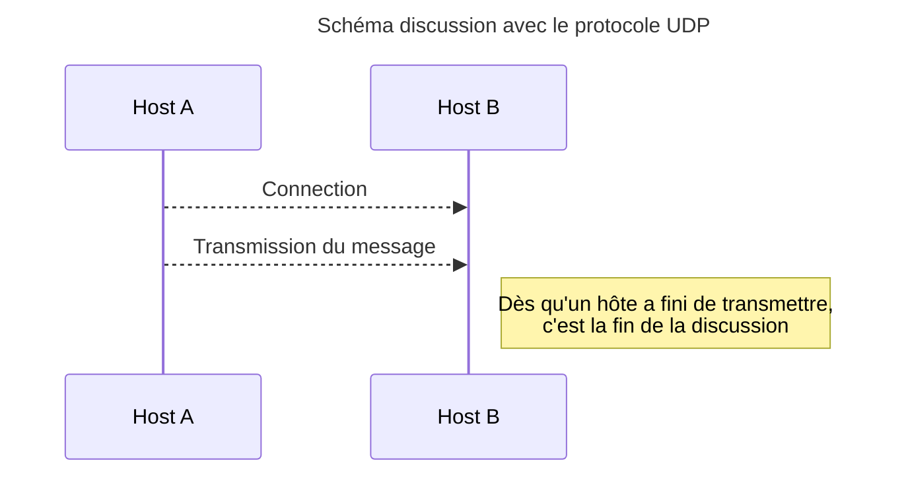
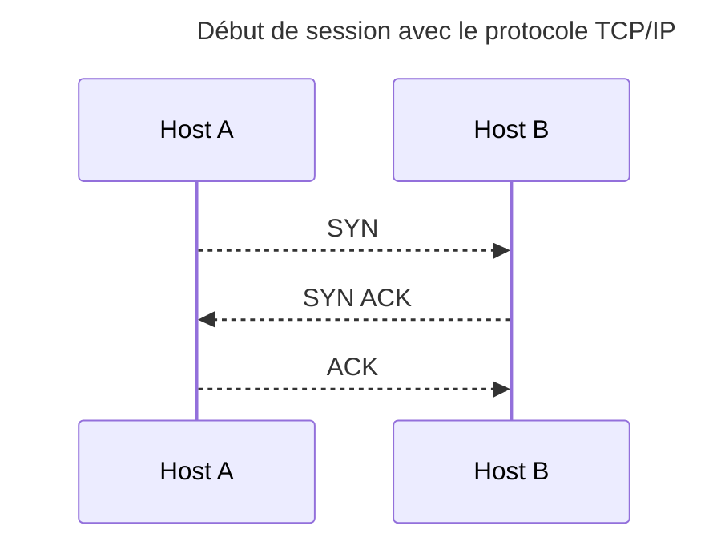
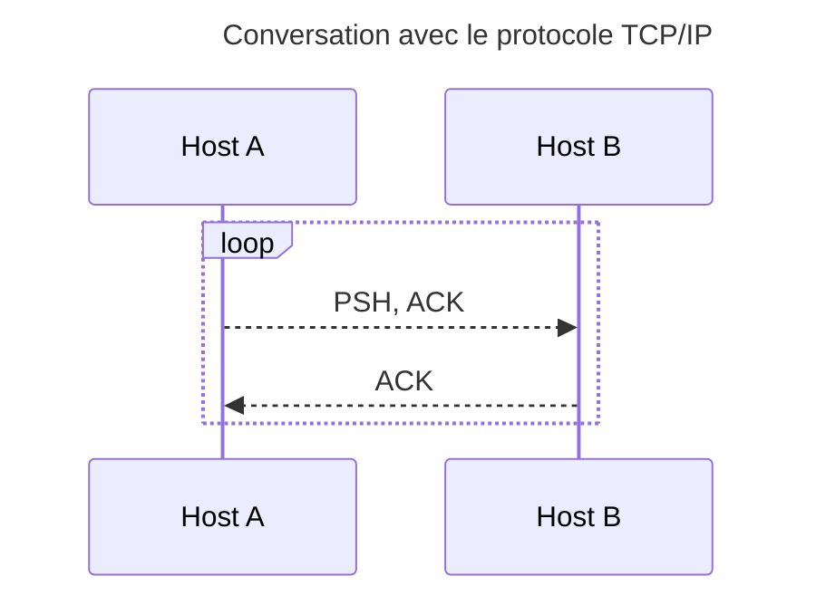
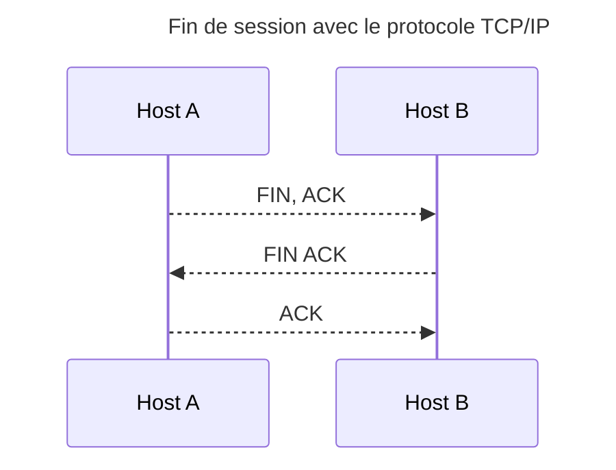
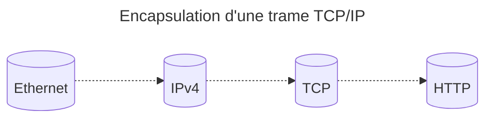

# Compte rendu de R102-TP3

## 1 - Préliminaires

### Plan d'adressage

| Poste                    | Adresse 1 (eno1) | Adresse 2 (adaptateur USB-Ethernet) |
|--------------------------|------------------|-------------------------------------|
| Alexis (moi) - PC client | 192.168.1.1/24   | N/A                                 |
| Lucas - PC routeur       | 10.213.2.1/16    | 192.168.1.255/24                    |

Avec la configuration donnée, on ne peut pas accéder à internet car la trame sort du client
mais n'est pas reconnue par le réseau du routeur, ainsi on a des trames sortantes mais qui ne nous retournent pas.

### Accès sur internet

On doit utiliser du NAT (Network Address Translation) sur le PC qui nous sert de routeur: `iptables -t nat -A POSTROUTING -o eno1 -j MASQUERADE`  
Cette commande sert à établir un NAT des paquets sortant:

> `-t nat`: on agit sur la table pour le NAT  
  `POSTROUTING`: signifie que l'on agit sur les paquets sortants de notre réseau  
  `-A`: on ajoute aux règles déjà définies  
  `-o eno1`: on spécifie la carte réseau de sortie  
  `-j MASQUERADE`: on masque la réelle IP par celle du routeur

### Etablisssement d'un serveur echo

On utilise à nouveau netcat (le `legacy` ou `traditional`) avec la commande: `nc.traditional -l -p 666 -c "/bin/cat"`  
A faire attention, on ne peut accéder au serveur echo avec l'adresse du réseau `192.168.1.255/24`
car il est considéré comme un routeur, nous devons utiliser l'adresse du réseau de la salle `10.213.2.1/16`.  
Afin d'y accéder depuis le PC client, on utilise (à nouveau) telnet: `telnet 10.213.2.1 666`

<div style="page-break-after: always"></div>

## 2 - Le protocole UDP

Afin de créer un serveur echo en UDP sur le port 42, on fait: `nc.traditional -l -u -p 42 -c "/bin/cat"`  
Pour se connecter dessus, on fait: `nc.traditional -u 10.213.2.1 42`  
La connexion s'établie sans aucun problème, du fait que l'on utilise le protocole UDP, le dialogue s'arrête après avoir envoyé le message, `"test"`, on a donc pas de notion de session.




<div style="page-break-after: always"></div>

## 3 - Le protocole TCP

On modifie le serveur echo `nc.traditional -l -p 80 -c "/bin/cat"`  
On se connecte `telnet 10.213.2.1 80`

La connexion s'établie sans aucun problème avec trois trames `SYN`-`SYN ACK`-`ACK` afin d'ouvrir le dialogue.  




La discussion se fait avec des trames `PSH, ACK`-`ACK`.  




La fermeture de la session se fait avec `FIN,ACK`-`FIN-ACK`-`ACK`




<div style="page-break-after: always"></div>

## 4 - La notion de port

> Sur le routeur 1, on souhaite démarrer deux serveurs écho, tout deux fonctionnant en TCP sur le port 80. Cela fonctionne-t-il ? Justifiez

Cela peut se faire mais vu que deux applications ne peuvent pas communiquer sur le même port en même temps, la première prend le dessus et la deuxième attends que le port se libère afin de pouvoir le récupérer pour elle.
Techniquement parlant, cela ne fonctionne pas car seulement un des deux fonctionne mais nous ne somme pas empêchés de demander d'écouter sur le même port.

> Sur les conseils de l’un de vos camarades, vous décidez de placer un serveur en TCP/80, l’autre en UDP/80. Cela fonctionne-t-il ? Justifiez

Cela ne fonctionnera pas car il y a une différence de protocoles, un serveur ne saura pas gérer le protocole de l'autre serveur.

> On souhaite démarrez deux serveurs écho sur le routeur 1, sans utiliser le compte root. Montrez comment faire.

Afin d'affecter les ports inférieurs au port 1024 (ports privilegiés ou ports systèmes comme indiqué
[ici](https://www.iana.org/assignments/service-names-port-numbers/service-names-port-numbers.xhtml)),
l'accès au groupe superutilisateur est nécessaire, au-delà un utilisateur sans droits superutilisateur peut affecter des ports.

## 5 - test sur les connexion sortantes

### L'encapsulation de notre message



Le header TCP n'est pas modifié car l'on agit seulement sur le header IPv4 quand on NAT.

## 6 - Contrôle de flux (facultatif)

```sh
cat /dev/urandom | nc 192.168.1.2 8080
```

On ne peut pas surcharger le buffer à un ordinateur connecté,
et on ne peut pas connecter plusieurs client sur le même port
avec la "technique" utilisée précédemment car c'est une "hacky" way de créer un serveur echo TCP.
