# Compte rendu du TP1 de R108 par Alexis Opolka, groupe A1

Information: Ce TP a été fait sur mon ordi personnel faisant tourner Fedora Workstation 36 en simulant un répertoire.

## 1. Répertoire personnel de l'utilisateur

1. La valeur du répertoire utilisateur s'affiche en utilisant `echo` et la variable `$HOME`:


1. La valeur du répertoire courant s'affiche en utilisant `pwd`:


1. Le répertoire courant après ouverture de session est `/home/$user` où `$user` est le nom d'utilisateur ouvrant la session.

1. Pour se déplacer on utilise `cd` donc on fait `cd /`:
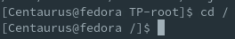

1. Pour afficher dossiers et fichiers on utilise `ls`, sous forme de liste on utilise le paramètre `-l`, on obtient ceci:
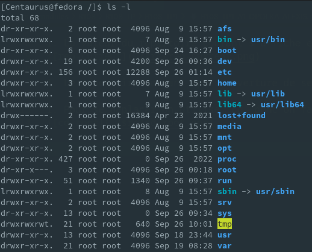\
On peut aussi afficher même les éléments cachés avec le paramètre `-a`:
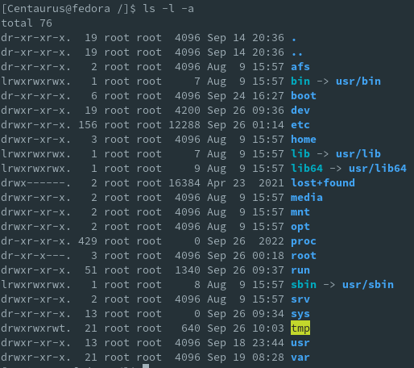

## 2. Editeurs de textes

1. Pour retourner au répertoire personnel on utilise la commande `cd ~`:
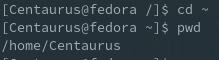

1. On peut utiliser plusieurs manières pour créer un fichier et donner du texte, on utilise `nano` en ce cas.\
Pour plus de facilité, on se repositionne dans un répertoire dédié au TP, on utilise `nano toto.txt`:
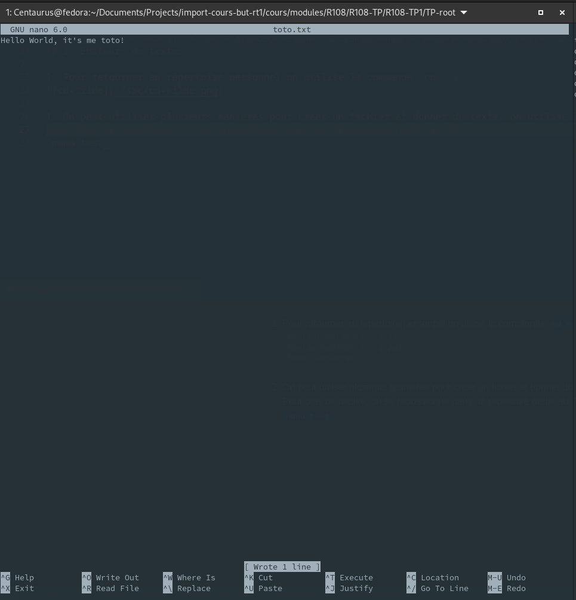

1. Pour vérifier la taille, on utilisera le paramètre `-s` de `ls` comme indiqué ci-dessous:
\
Ce qui nous donne 4 bloques d'unités donc 4 octets:\

Si ce n'est pas très parlant, on peut utiliser la version grapique (GNOME):
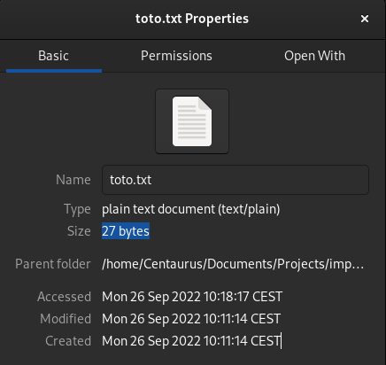
Cela correspond donc bien à ce que l'on s'attendait, avec 1 octet utilisé par caractère.

1. On utilise donc `cat` pour afficher le contenu de `toto.txt`:\


## 3. Création d'une arborescence donnée

1. On se déplace dans notre répertoire avec de nouveau `cd ~`
1. on affiche le contenu avec `ls -l -a`\
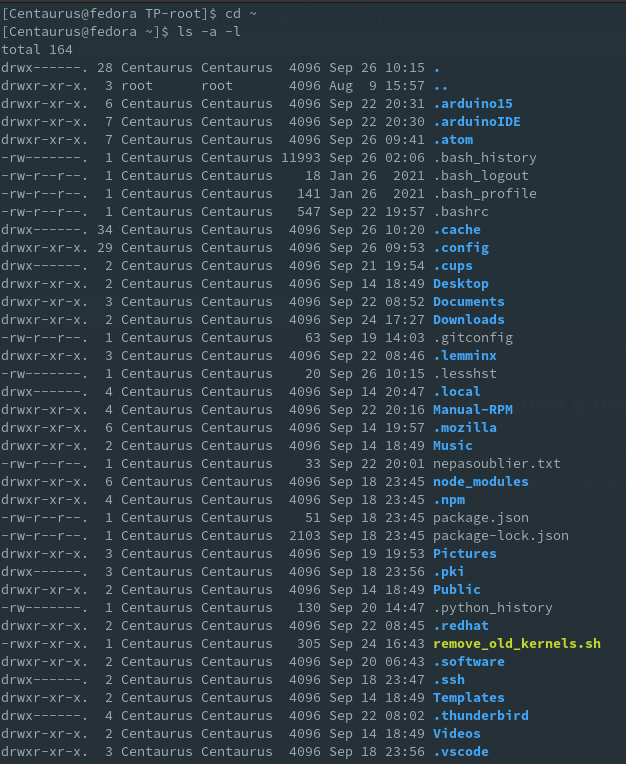\

1. On utilise la commande `rm` avec le paramètre `-r` pour les répertoires.

1. On a bien très peu de fichiers restants sur notre répertoire personnel.

<div style="page-break-after: always"></div>

1. Afin de créer l'arborescence demandée, voici les commandes que l'on utilise

    ```sh
    mkdir -p /tmp/rt1/xyz/public_html/docs /tmp/rt1/xyz/public_html/images
    mkdir -p /tmp/rt1/xyz/programmes/java /tmp/rt1/xyz/programmes/php /tmp/rt1/xyz/programmes/langage_c
    touch /tmp/rt1/xyz/public_html/index.htm /tmp/rt1/xyz/programmes/java/TP.java /tmp/rt1/xyz/programmes/langage_c/a.c
    ```

1. Pour modifier le contenu d'un fichier en ce cas, on utilise nano:
`nano /tmp/rt1/public_html/index.htm`\
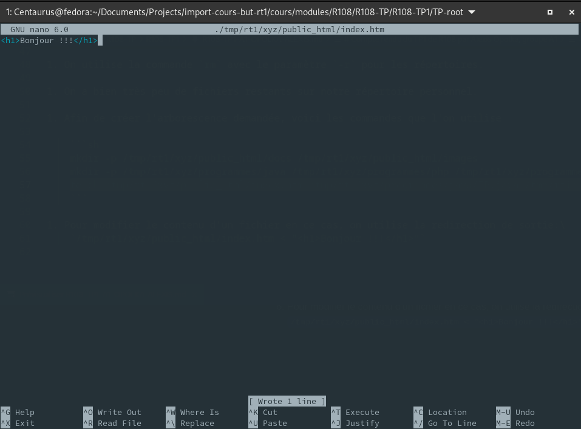\

1. On vérifie le contenu avec `cat`:
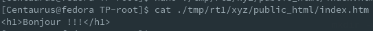

<div style="page-break-after: always"></div>

1. Pour copier, on utilise `cp` avec l'argument `-R` ou `-r`, on fait donc:\

    ```sh
    cp -R /tmp/rt1/xyz/programmes/* /tmp/rt1/xyz/public_html/images/
    ```

1. Pour déplacer, on utilise `mv`, on fait donc:\

    ```sh
    mv /tmp/rt1/xyz/programmes/ /tmp/rt1/xyz/public_html/docs/
    ```

1. On affiche le contenu détaillé du répertoire docs en utilisant les arguments suivants: `-l`, `-a` et `-R`\
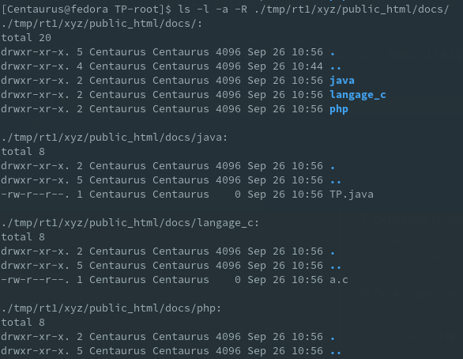\
Mais l'on pourrait aussi utiliser l'utilitaire `tree` comme ci-dessous, si l'on voulait n'avoir que l'arborescence des fichiers:\
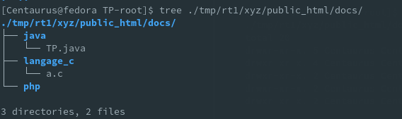
