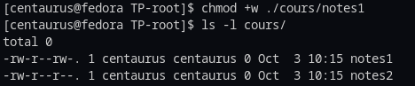
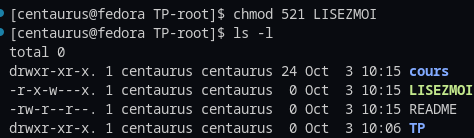
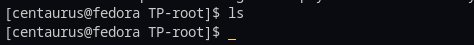
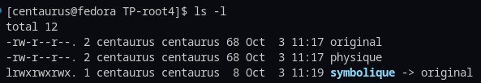

# Compte rendu du TP2 de R108 par Alexis Opolka, groupe A1

Information: Ce TP a été fait sur mon ordi personnel faisant tourner Fedora Workstation 36 en simulant un répertoire.

## Exercice 1 - Créations, suppressions et droits d'accès

1. Afin de créer l'arborescence demandée, nous devons utiliser `touch` et `mkdir` pour créer respectivement des fichiers et des dossiers. On fait donc:

    ```sh
    mkdir ~/cours/ ~/TP
    touch ~/cours/notes1 ~/cours/notes2 ~/README ~/LISEZMOI
    ```

    Comme l'on peut le voir, l'arborescence demandée a été créée.\
    

1. Les droits d'accès par défaut, comme on peut le voir ci-dessus sont lecture et écriture pour le créateur et lecture pour le reste du monde (groupes et autres).

1. Pour modifier les droits d'accès d'un fichier, on utilise `chmod`:

    ```sh
    chmod +w /cours/notes1
    ```

    Les droits d'accès ont bien été modifiés:\
    

1. On utilise de nouveau `chmod` pour modifier les droits d'accès avec l'argument `521` où c'est égal à:

    |   user   |   groups |   others |
    |----------|----------|----------|
    | 2² 2¹ 2⁰ | 2² 2¹ 2⁰ | 2² 2¹ 2⁰ |
    | R  W  X  | R  W  X  | R  W  X  |
    | 0  1  1  | 0  1  0  | 0  0  1  |
    | = 5      | = 2      | = 1      |

    ```sh
    chmod 521 /LISEZMOI
    ```

    On a bien les droits d'accès modifiés comme l'on veut:\
    

1. Afin de supprimer des répertoires et des fichiers, nous utilisons l'utilitaire `rm` avec l'argument `-r`:

    ```sh
    rm -r -d cours/ TP/ LISEZMOI README
    ```

    Nous avons plus rien:\
    

<div style="page-break-after: always"></div>

## Exercice 2 - Copies et déplacements de fichiers

1. On utilise l'utilitaire `mkdir` pour créer le répertoire `essai`

    ```sh
    mkdir ~/essai
    ```

1. Pour copier, on utilise la commande `cp`:

    ```sh
    cp /etc/passwd essai/passwords
    cp /etc/group essai/my_groups
    ```

    

1. On utilise de nouveau la commande `mkdir`:

    ```sh
    mkdir essai/copies
    ```

1. On utilise `mv` pour déplacer des fichiers:

    ```sh
    mv essai/passwords essai/copies/
    ```

1. De nouveau:

    ```sh
    mkdir essai/copies/titi
    ```

1. Comme précédemment, on utilise `chmod`:

    ```sh
    chmod -x essai/copies
    ```

    Comme l'on peut le voir, le droit d'exécution n'est plus présent:\
    

<div style="page-break-after: always"></div>

1. ```sh
    ls essai/copies
   ```

    On remarque que la commande s'est vue refusée le droit d'accès aux fichiers et sous-répertoires de `copies`:\
    

1. On utilise `rm`:

    ```sh
    rm -r essai/copies
    ```

    

1. On ajoute de nouveau le droit d'exécution:

    ```sh
    chmod +x essai/copies
    ```

1. On utilise l'option `-d` de l'utilitaire `rm` en plus de `-r` pour supprimer les sous-répertoires:

    ```sh
    rm -r -d essai/copies
    ```

<div style="page-break-after: always"></div>

## Exercice 3 - Visualisation de fichiers dans le terminal

1. Comme demandé, on utilise `cat`:

    ```sh
    cat /usr/include/dialog.h
    ```

1. On entre `cat` sans nom de fichier:

    ```sh
    cat
    ```

    On se retrouve "bloqués" sans aucun affichage et l'invite de commande indisponible. *On sort avec CTRL+D*

1. Comme demandé, on affiche le contenu du fichier `/etc/group` avec `cat`:

    ```sh
    cat /etc/group
    ```

1. On utilise `more` afin d'être capable de se balader dans l'affichage du fichier et qu'il ne s'affiche pas complètement dans le terminal:

    ```sh
    more /etc/group
    ```

1. ```sh
    whatis ls
    ```

    ressort une brève description de la commande.

    ```sh
    whereis ls
    ```

    ressort le chemin d'où se situe l'exécutable de la commande et le chemin de son manuel.

    ```sh
    which ls
    ```

    ressort l'alias de la commande avec de possibles options mises en plus du chemin de l'exécutable.

<div style="page-break-after: always"></div>

## Exercice 4 - Liens symboliques

1. On utilise touch pour créer les fichiers

    ```sh
    touch original
    ln original physique
    ```

1. On utilise l'utilitaire `cat`:

    ```sh
    cat original
    cat physique
    ```

    On constate que le contenu édité dans le lien physique , fichier `physique`, l'original est aussi modifié.

1. On utilise de nouveau `ln` avec  l'argument `-s`:

    ```sh
    ln -s original symbolique
    ```

1. Après avoir fait un `ls`, l'affichage du lien symbolique diffère avec notamment des droits complets donnés à tous.\

    

1. Après avoir modifié le contenu de l'original, le contenu des deux liens est mis à jour.

1. On efface avec `rm`:

    ```sh
    rm original
    ```

    On tombe maintenant sur une erreur:\
    

<div style="page-break-after: always"></div>

1. On l'ouvre avec `cat`:

    ```sh
    cat physique
    ```

    On a toujours le contenu de l'original.\
    **Quand on crée un lien symbolique, lorsque l'original est supprimé le lien symbolique perd son contenu alors qu'un lien "dur" garde son contenu.**

<div style="page-break-after: always"></div>

## Exercie 5 - La commande ls

1. Pour un listage simple, on fait:

    ```sh
    ls
    ```

1. Pour un listage avec les fichiers cachés, on fait:

    ```sh
    ls -a
    ```

1. Pour un listage avec descriptif détaillé, on fait:

    ```sh
    ls -l
    ```

1. Pour un listage récursif, on fait:

    ```sh
    ls -R
    ```

    Pour un listage récursif détaillé, on fait:

    ```sh
    ls -R -l
    ```

1. Pour un listage par ordre chronologique, on fait:

    ```sh
    ls -cl
    ```

    Pour un listage à l'inverse de l'ordre chronologique, on fait:

    ```sh
    ls -clt
    ```

1. Pour un listage simple, avec spécification du type de fichier, on fait:

    ```sh
    ls -F
    ```

<div style="page-break-after: always"></div>


## Exercice 6 - La commande grep

Le fichier `dico_francais.txt` a été téléchargé en amont sur MOODLE.

1. Pour lister les mots qui se terminent par les lettres "cot", on fait:

    ```sh
    grep -e 'cot$' dico_francais_sans_CR.txt
    ```

1. Pour lister les mots qui commencent par "ab" et se terminent par "t", on fait:

    ```sh
    grep '^ab.*t$' dico_francais_sans_CR.txt
    ```

1. Pour lister les mots qui commencent par une lettre dans l'intervalle [a-l], on fait:

    ```sh
    grep ^[a-l] dico_francais_sans_CR.txt
    ```

1. Pour compter le nombre de mots qui commencent par "V", on fait:

    ```sh
    grep -ic ^'V' dico_francais_sans_CR.txt
    ```

    On utilisera `-i` pour éviter que la commande casse et trouver V en majuscule ou minuscule.
