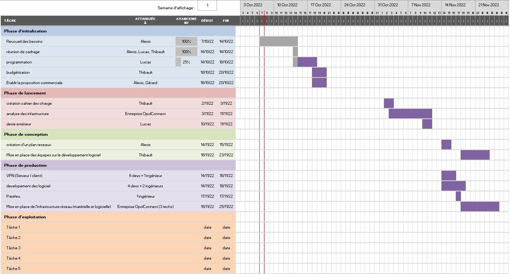

# R115-TP1 | Groupe 1

## Sujet

Vous êtes une entreprise informatique de type ESM (gestion de services d'entreprise)\
Vous êtes sollicité par la société Exper'com, entreprise de communication basée à Paris.\
Elle souhaite mettre en place le télétravail pour 80% de ses salariés d'ici 1 an. Aujourd'hui, tous les salariés travaillent sur site.\
Vous désirez répondre à cette demande. Comment allez-vous procéder ?

Décrire toutes les étapes de votre démarche

## Les étapes

- 1) Recueil des besoins (Appel avec l'entreprise)
- 2) Réunion de cadrage (Etude de faisabilitié)
- 3) Programmation (diagramme de Gantt)
- 4) Budgétisation
- 5) Etablir la proposition commerciale

## 1)

### Appel de l'entreprise émettrice de l'appel d'offre et discuter des informations suivantes

- préciser certains points possiblement ambigus ou nécessaires (voir Possible cahier des charges)
- la situation financière actuelle de l'entreprise (si le projet est à risque)
- leur situation matérielle (si une infrastructure réseau est présente) et logicielle (clés logiciels déjà en leur possession)
- Si un partie des besoins basiques ont déjà été comblés par une autre entreprise ou non
- Le nombre d'employés en question (montant total des employés à équiper)

### Les besoins receuillis

#### Coté entreprise

- VPN (serveur)
- MAJ du réseaux (update débit, serveurs/routeurs, pare feu, IP fixe (classe C))
- logiciels (système de log (intégré dans le VPN ?), système de communication)
- Redondance électrique (?)

#### Coté client

- VPN (client)
- matériel (pc fourni par entreprise (crypté ?), VPN, cryptage des comms, logiciel: gestion des heures )

## Budgetisation

| Nom de la tâche                                                       | Montant (HT) en € |
|-----------------------------------------------------------------------|-------------------|
| Recueil des besoins                                                   |       150         |
| Réunion de cadrage                                                    |       120         |
| Programmation                                                         |       240         |
| Budgétisation                                                         |       40          |
| Établissement de la proposition commerciale                           |       240         |
| Création cahier des charges                                           |       160         |
| Analyse des infrastructures                                           |       756         |
| Devis extérieur                                                       |       80          |
| Création d'un plan réseau                                             |       100         |
| Mise en place des équipes sur le développement logiciel               |       320         |
| VPN (Serveur / client)                                                |       2080        |
| Dévelopement des logiciels                                            |       3200        |
| Parefeu                                                               |       80          |
| Mise en place de l'infrastructure réseau (matérielle et logicielle)   |       1920        |
|                                                                       |                   |
| Total                                                                 |       9486        |

