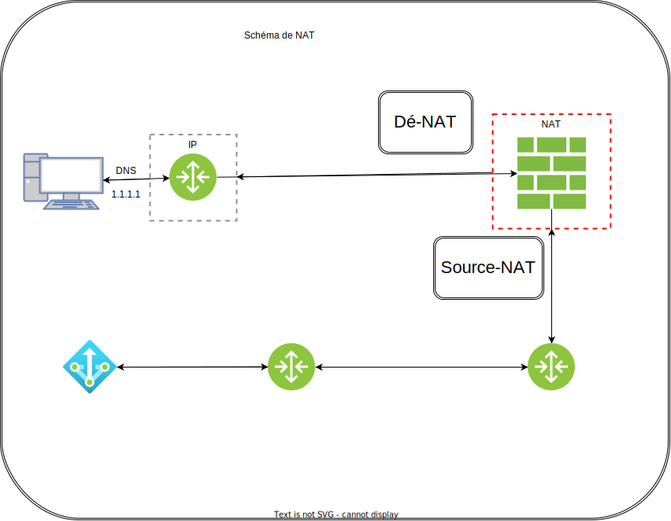

#

## Le NAT

Network Adress Translation



La table de NAT assemble port et addresse (IP).

Le routage est assymétrique.

Une solution du NAT est d'utiliser des routes statiques / par défaut.
Il faut par contre, ajouter une route de retour sur chaque machine.

## DNS

Requête DNS, c'est en UDP.

## Les adresses réseaux

```sh
  ipcalc <ip-address>/<submask>
```


Penser à prendre 3x/4x le nombre de machines.

### L'anycast

Des serveurs différents qui ont la même adresse IP, les routeurs savent gérer
de l'anycast.  
C'est donc le serveur le plus proche qui va répondre en premier.  

Un routeur sépare les domaines de broadcast et un switch sépare les domaines de collisions.

## Les routeurs

- RIB: Pour aller à tel réseau, je vais à telle addresse IP
- FIB: Pour aller à tel réseau, j'utilise telle interface

=> C'est stocké dans le routeur

```sh
  sh running-config
```

```sh
  ston-hit
```

```sh
  sh run | s interface # La section interface
  sh run | begin interface # Commence à afficher à partir de "interface"
  sh run | include inter # Les lignes contenant "inter"
```

```sh
  do wr mem
  copy running-config startup-config
  sh ip interface brief # A ne pas oublier
```

```sh
  sh ip route
  # -C: Connected
  # -R: RIP Protocol
```

### Cisco

- Cisco
  - ROM (Read-only memory)
  - FLASH: OS (IOS for Cisco)
  - NVRAM: Start-up config
  - RAM: running config

Un boitier firewall:

- ARM
- ASIC
- FGPA

Pourquoi du routage statique vers une interface et pas de next hop ? (Chez Cisco)

#### Routage Dynamique

- AS: Autonomous System

protocoles dynamiques:
  - BGP
  - OSPF

On mesure leurs éfficacité grâce au temps de convergence.  
Le temps mis par votre réseau pour corriger un problème au sein de celui-ci.

#### Routage statique

Le routage statique est le plus simple à faire.


> KISS: Keep it simple, stupid

### Routage Hardware ou Software

## Equilibrage de charge

Plusieurs chemins / routes pour la même destination.
L'équilibrage de charge transverse plusieurs domaines.

La table de routage appartient au routeur.  

QOS: Quality of Service

ifconfig: Interface configuration
=> Aucune perte sur une carte réseaux (< 0.5%)

Quand on parle de routage, on parle de "distance administrative".

IGP: Interior Gateway Protocol
EGP: Exterior Gateway Protocol

On va primer la plus petite distance administrative.

une loopback ne peut être cassée
Quand on fait du BGP, on utilise une loopback

## Traceroute

```sh
  mtr --tcp --port 443 --show-ips --mpls --aslookup --curses 8.8.8.8
```

MPLS: Multi Protocol Label Switching (?)

Métrique BGP: nbr d'AS traversées

ICMP: Internet Control Message Protocol

## Tables de routage

515000 entrées max

On agrège donc les routes
