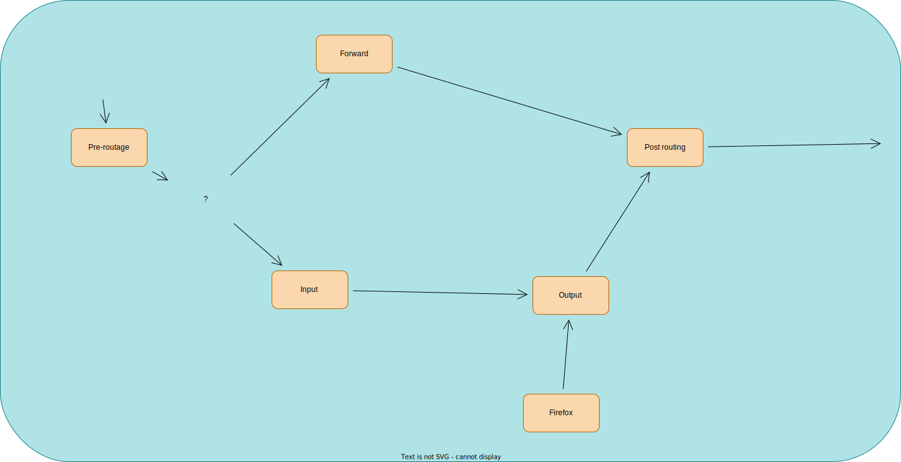

# R201-TD5

## Firewall

C'est plus sur BSD que sur Linux.

On a trois utilitaires principaux:

- Netfilter
- IPTables
- NFTables

```sh
lsmod
```

Schéma de fonctionnement du firewall:



## TD

1. Soit:

  - On accepte tout
  - On rejette tout

2. 5 chaînes présentes

  - INPUT
  - OUTPUT
  - FORWARD
  - PREROUTING
  - POSTROUTING

3. C'est un système d'évaluation de règles.
4. Il y a:

  - Conntrack
  - Mangle
  - Filter
  - NAT

5. On peut rajouter des tables
6. 

  - Mémoire (afin de faire du stateful)
  - Capacité à travailler du n2 ethernet au n7 de la couche OSI
  - capacité à reconnaître des protocoles

7. Il faut communiquer avec le kernel et netfilter depuis le userland

### 2. Quelques règles

```sh
iptables -L -n -v -t filter
```

- iptables -L
  - Liste les chaines
- iptables -F
  - flush une chaine
- iptables -t NAT -F
  - flush toues les chaines de la table NAT
- iptables --policy INPUT DROP
  - Par défaut, on droppe les paquets
- iptables -A INPUT -s 193.48.143.10 -j ACCEPT
  - On ajoute une règle dans la table INPUT qui consiste à accpeter tous les paquets de l'ip 192.48.143.10
- iptables -A INPUT -i lo -j DROP
  - On ajoute une règle dans la table INPUT qui va consister à dropper tous les paquets à destination de l'interface de loopback lo.
- iptables -A INPUT -p ICMP -j ACCEPT
- iptables -A INPUT -p udp --dport 22 -j ACCEPT
- iptables -A INPUT -p tcp --dport 22 -j ACCEPT
- iptables -A INPUT -p tcp --tcp-flags SYN,FIN,ACK SYN -j ACCEPT
- iptables -A INPUT -j LOG --log-level debug
  - On log tous les paquets entrants
- iptables -A INPUT -j LOG --log-level debug --log-prefix "PAQUET ENTRANT"
  - Comme au dessus mais avec un préfixe avant
  - Attention: le niveau debug plante la production
- iptables -A INPUT -m state --state ESTABLISHED,RELATED -j ACCEPT
  - C'est l'anciennce façon de faire du suivi de conneixon établie
- iptables -A INPUT -m conntrack --ctstate ESTABLISHED,RELATED -j ACCEPT
  - C'est la nouvelle façon de faire du suivi de conneixon établie

Dans le programme, on crée deux règles pour logger puis accepter et pour logger et
dropper.

### 5 - NAT

iptables -t nat -A POSTROUTING -p tcp -o eth0 -j SNAT --to 1.2.3.4:1-1023
iptables -t nat -A POSTROUTING -o eth0 -j SNAT --to-source 1.1.1.4-1.1.1.8
