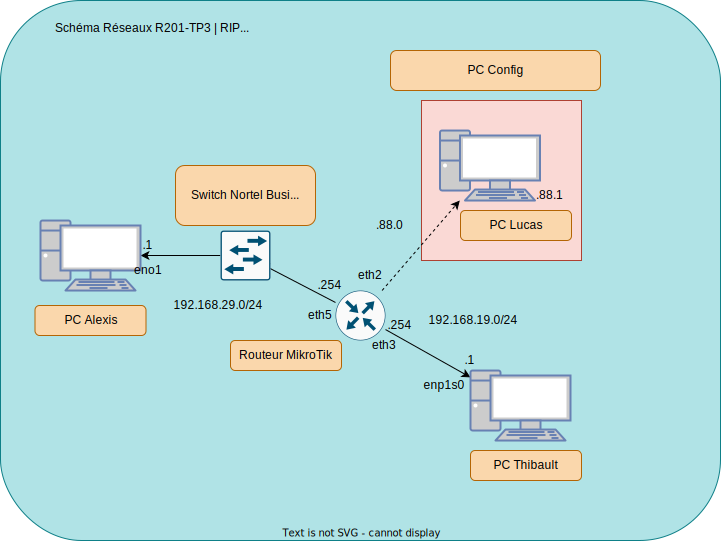
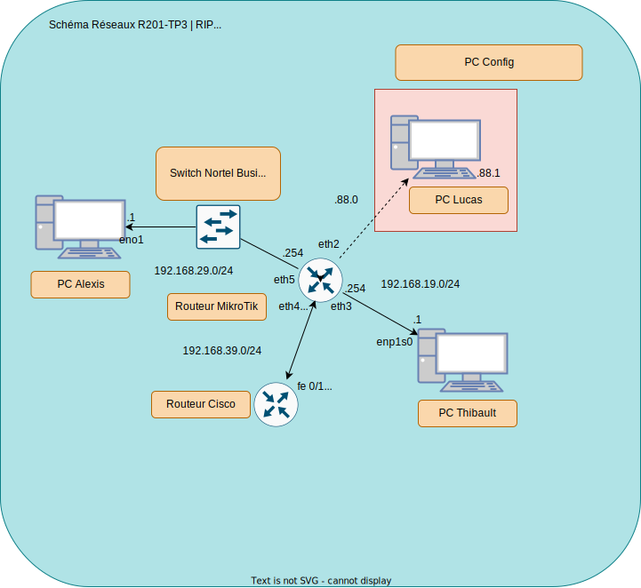

# Compte rendu de R201-TP3

Nous devions créer un réseau par groupe de 2/3 personnes puis utiliser un routeur Cisco afin de les interconnecter,
puis propager les routes propres à chaque réseau en utilisant RIP (v1 ou v2).

## Créer notre réseau - Une tâche pas si simple sans schéma réseau

Voici notre réseau:



Nous n'y sommes pas arrivés aussi rapidement que l'on ait esperé.  
Entre définir l'ip d'une interface comme étant celle du réseau, incrémenté les masques réseaux sans avoir ni la raison ni le besoin.  
Pas besoin d'être un génie pour comprendre que l'on a galéré pendant quelques temps, assez longtemps pour que l'on se rende bien compte 
que rien ne vaut mieux qu'un schéma réseau où l'on définit correctement les ip, les ports et les réseaux...

## Interconnecter deux réseaux - Tâche accomplie mais pas en totalié

Maintenant que nous avions un réseau structuré sur lequel nous pouvions communiquer correctement entre les machines,
nous devions l'interconnecter avec un autre réseau, lui-même construit par un autre groupe.  

Je n'ai pas à disposition le schéma du groupe avec lequel l'on a travaillé, mais voici comment nous avons adapté notre réseau:



### Manipuler un routeur Cisco - Minicom et ses commandes

> **Note**:  
> Le raccourcis clavier `Ctrl+A`+`x`+`Enter` permet de quitter minicom.


```sh
enable
conf t

interface F0/1 ### On accède à l'interface F0/1
ip address 192.168.39.1 255.255.255.0 ### On lui donne l'adresse 192.168.39.1/24
no shut ### On l'active
exit ### On sort de la configuration de l'interface

ip routing ### On active le routage
router rip ### On accède à la configuration du routeur en RIP
version 1 ### On lui dit qu'on veut utiliser la version 1 du protocole
network 192.168.39.0 ### On initialise le réseau, il sera capable d'être propagé
sh ip interface brief ### On affiche les interfaces IP de manière brèves (sauveur de vie, apparemment)
debug ip rip ### On active le débuggage du protocole RIP
sh run | s rip ### On affiche la configuration d'exécution en filtrant sur RIP
```

malgré toutes ces commandes, nous arrivions à communiquer entre les deux réseaux via les cisco mais
nous n'arrivions pas à faire propager les routes des réseaux MikroTik via RIP.
