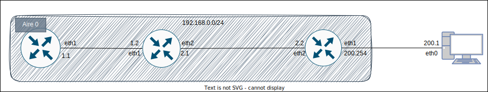

# Compte rendu de R201-TP4

## 1 - Construction OSPF mono-aire

> **Note**:  
> On utilise pour nos routeurs les MikroTik CHR 7.7

Nous devons construire un réseau OSPF mono-aire.



On configure le routeur 1 comme suit:

```sh
### On configure l'identité du routeur
/system identity
set name=R1

### On configure OSPF
/routing ospf instance
add name=v2inst version=2 router-id=1.1.1.1
/routing ospf area
add name=backbone_v2 area-id=0.0.0.0 instance=v2inst
/routing ospf interface-template
add interfaces=ether1 area=backbone_v2 type=ptp

### On configure les interfaces (adresses IP)
/ip address
add address=192.168.1.1/24 interface=ether1 network=192.168.1.0
```

Le routeur 2:

```sh
### On configure l'identité du routeur
/system identity
set name=R2

### On configure OSPF
/routing ospf instance
add name=v2inst version=2 router-id=2.2.2.2
/routing ospf area
add name=backbone_v2 area-id=0.0.0.0 instance=v2inst
/routing ospf interface-template
add area=backbone_v2 interfaces=ether1 type=ptp
add area=backbone_v2 interfaces=ether2 type=ptp

### On configure les interfaces (adresses IP)
/ip address
add address=192.168.1.2/24 interface=ether1 network=192.168.1.0
add address=192.168.2.1/24 interface=ether2 network=192.168.2.0
```

Le routeur 3:

```sh
### On configure l'identité du routeur
/system identity
set name=R3

### On configure OSPF
/routing ospf instance
add name=v2inst version=2 router-id=3.3.3.3
/routing ospf area
add name=backbone_v2 area-id=0.0.0.0 instance=v2inst
/routing ospf interface-template
add area=backbone_v2 interfaces=ether2 type=ptp
add area=backbone_v2 interfaces=ether1 type=ptp passive

### On configure les interfaces (adresses IP)
/ip address
add address=192.168.2.2/24 interface=ether2 network=192.168.2.0
add address=192.168.200.254/24 interface=ether1 network=192.168.200.0
```

## Copyright &copy; Alexis Opolka, Lucas Simpol, Thibault Garcia 2023 - All Rights Reserved
