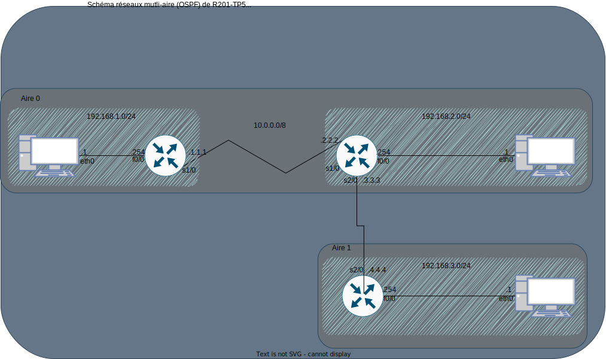
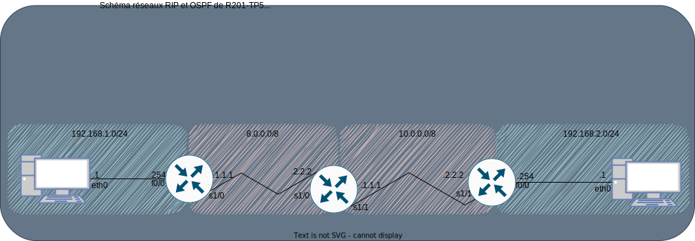
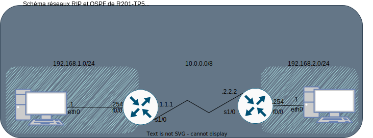
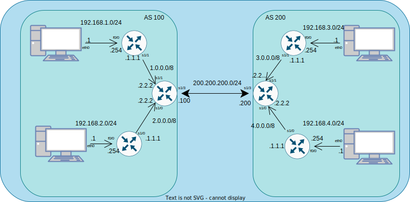

# Compte rendu de R201-TP5

## 1 - Routage dynamique et interconnexion


Questions de culture générale :

1. A quelle famille de routage dynamique appartient le protocole OSPF ?

Le protocole OSPF appartient à la famille de routage ...

2. A quoi correspond une « aire » dans la terminologie OSPF ?

Une aire, dans la terminologie OSPF, correspond à un réseau local.

3. Toujours dans la terminologie OSPF, qu'est ce qu'un routeur interne,  un routeur de bordure d'aire, un routeur de bordure de système autonome, un routeur d'épine dorsale ?

- Un routeur interne est un routeur qui se trouve dans un aire et est connecté à d'autres routeurs internes de cette même aire sur chaque pâte utilisée.
- Un routeur de bordure d'aire est un routeur qui se trouve dans une aire mais se trouve

La configuration du router 1:

```sh
enable
conf t

## Configuration de l'interface Ethernet 0/0
interface FastEthernet 0/0
ip address 192.168.1.254 255.255.255.0
no shut
exit

## Configuration de l'interface Serial 1/0
interface Serial 1/0
ip address 10.1.1.1 255.0.0.0
ip ospf network point-to-point
no shut
exit

## Configuration d'OSPF
router ospf 1
network 192.168.1.0 0.0.0.255 area 0
network 10.0.0.0 0.255.255.255 area 0
passive-interface FastEthernet 0/0
exit
```

### 1.2 - Schéma réseaux comprenant deux aires




## 2 - Interconnexion OSPF / RIP



La configuration du router 2:

```sh
enable
conf t

### Configuration de l'interface en OSPF
interface Serial 1/0
ip address 8.2.2.2 255.0.0.0
ip ospf network point-to-point
no shut
exit

### Configuration de l'interface en RIP
interface Serial 1/1
ip address 10.1.1.1 255.0.0.0
no shut
exit

### Configuration de l'OSPF
router ospf 1
network 8.0.0.0 0.255.255.255 area 0
redistribute rip subnets
exit

### Configuration du RIP
router rip
version 2
network 10.0.0.0
redistribute ospf 1 metric 10
exit
```

## 3 - Les AS et BGP



Configuration du routeur 1 avec BGP:

```sh
enable
conf t

### Configuration de l'interface VPC
interface FastEthernet 0/0
ip address 192.168.1.254 255.255.255.0
no shut
exit

### Configuration de l'interface inter-BGP
interface Serial 1/0
ip address 10.1.1.1 255.0.0.0
no shut
exit

router bgp 100
neighbor 10.2.2.2 remote-as 200
neighbor 10.2.2.2 update-source Serial 1/0
network 192.168.1.0 mask 255.255.255.0
exit
```

## 4 - OSPF et BGP



Configuration du router de jonction OSPF-BGP de l'AS 100:

```sh
enable
conf t

### Configuraton de l'interface 2.0.0.0/8
interface Serial1/0
ip address 2.2.2.2 255.0.0.0
ip ospf network point-to-point
no shut
exit

### Configuration de l'interface 1.0.0.0/8
interface Serial1/1
ip address 1.2.2.2 255.0.0.0
ip ospf network point-to-point
no shut
exit

### Configuration de l'interface 200.200.200.100/24
interface Serial1/3
ip address 200.200.200.100 255.255.255.0
no shut
exit

router ospf 1
network 1.0.0.0 0.255.255.255 area 0
network 2.0.0.0 0.255.255.255 area 0
redistribute bgp 100 subnets
exit

router bgp 100
neighbor 200.200.200.200 remote-as 200
neighbor 200.200.200.200 update-source S1/3
redistribute ospf 1
exit
```
