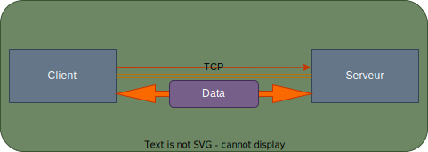

# Travaux Dirigés - R203

## Exercice 1

a. Expliquer ce qui peut pousser à utiliser une socket de commandes et une socket de données.

  Ce qui peut pousser à utiliser une socket de commandes et une 
  socket de données est la possibilité de transférer des données
  de manière asynchrone et en multiplexage.

b. En mode passif, représenter temporellement les données 
applicatives et les ports mis en jeu pour se connecter au serveur 
FTP et pour lister les fichiers.

- User + login
- 331
- Pass + password
- 230
- PASV
- 227 + port
- LIST
- 200 ok + files

c. Idem en mode actif

- User + login
- 331
- Pass + password
- 230
- PORT + IP + port
- 200 ok + files

d. Montrer que le protocole FTP permet, depuis un PC, de lancer un transfert de fichiers entre deux serveurs.
