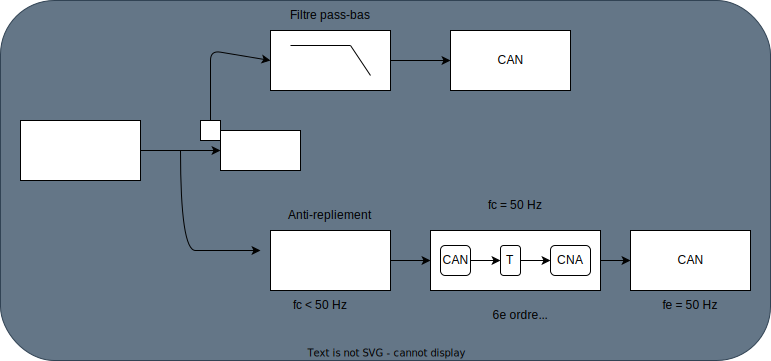

# R206-TD2

## Exercice 1 : Filtre anti-repliement

Il faut que la fréquence d'échantillonage du signal utile est de:

$F_e \geq 2 F_{max} (= 50Hz)$

Le filtre passe-bas nous permet de ne pas laisser passer
les fréquences supérieures à $F_{max}$.

Système de 1er ordre:

$\underbar{H}(f) = \frac{1}{1 + j \frac{f}{f_c}}$

### Filtre analogique

$$
\allowbreak

|\underline{H}(f)| = \frac{1}{\sqrt{1^2 + 100^2}} \approx \frac{1}{100}
\newline
\newline

Si f_c = 100 Hz \\
A 1000 Hz => gain = 0.1 \\
             attentuation = 10 \\

\newline

Exemple pour f_c = 50 Hz \\
|\underline{H}(500)| = \frac{1}{\sqrt{1 + (\frac{500}{50})}} \approx 0.1 \\
$$

### Filtre numérique

$F_c < 50 Hz$
On coupe au delà.

## Exercice 2 : Eléments de traitement du signal

## Copyright &copy; Alexis Opolka 2023 - All Rights Reserved
