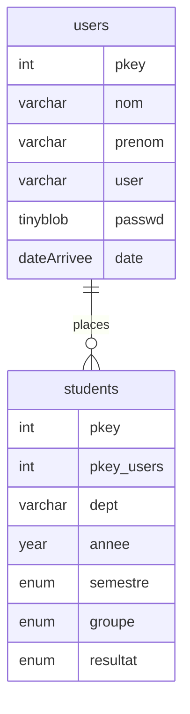

# TD 1 de R207

```mermaid
  erDiagram
    users ||--o{ students : places
    users {
      int pkey
      varchar nom
      varchar prenom
      varchar user
      tinyblob passwd
      dateArrivee date
    }
    students {
      int pkey
      int pkey_users
      varchar dept
      year annee
      enum semestre
      enum groupe
      enum resultat
    }

```
