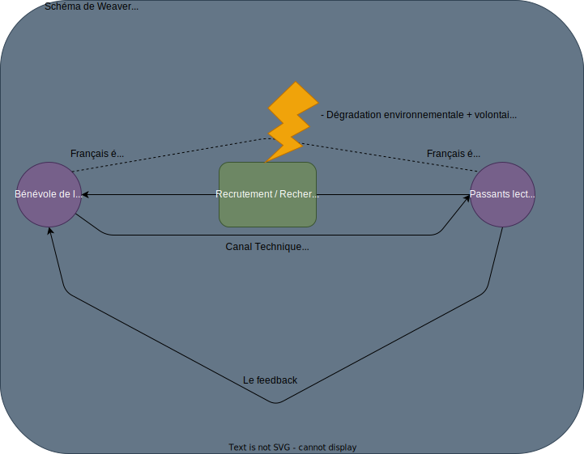

# R211 - S'informer de manière éclairée

## Sommaire

- I/ L'intention du message
- II/ Se documenter de manière éclairée
  1. Les types de documents
  2. La chauve-souris de Wuhan (2020)
  3. Désinformation et mésinformation
  4. Faits, opinions ou sentiments ?
  5. Vérifier ses sources
- III/ Méthodologie de l'expression orale
  1. Fiche "Mon mantra"
  2. Fiche "Je me remets en question"
  3. Fiche "Que du plaisir"
  4. Fiche "Voix"
  5. Fiche "Regard"
  6. Fiche "Posture"
- IV/ Présentation des sujets exposés
  > Evaluation orale n°1
- V/ Phase de recherches en classe et en autonomie en TP
- VI/ Présentation des exposés en TP

## I/ L'intention du message

> Figure 1: Intimidation
> Figure 2: Félicitation  
> Figure 3: Se marrer  
> Figure 4: Recherche de preuves  
> Figure 5: Attirer le client  
> Figure 6: susciter de la pitié

Pour que la communication soit fluide et efficace, il faut savoir distinguer action et intention, c'est à dire avoir en tête ses propres intentions dans l'acte de communication.  
On doit donc, forcément, détecter l'intention de l'autre.

## II/ Se documenter de manière éclairée

  On met en avant la raison de l'esprit loin des dogmes.

### 1. Les types de documents

Un auteur qui veut informer ses lecteurs sur un sujet précis va devoir présenter des faits de manière objective, c'est à dire exempt d'opinions personnels.  
L'intention va donc être double de renseigner, voir de sensibiliser le ou les récepteurs.

- Textes explicatifs
  - On va expliquer une situation, un événement.
  - C'est préciser les causes et les conséquences.
- Textes descriptifs
  - On decrit un objet, un animal, une personne.
  - On donne des détails.
- Textes comparatifs
  - On cherche une similitude et les resemblances
- Comptes rendus
  - Rapporter des évenements ou des paroles telles qu'elles ont été vues ou entendues

> L'intention: L'objectif du message que l'on transmet

### 2. La chauve-souris de Wuhan (2020)

> Chercher des Fake News sur le sujet  
> Et créer une citographie

- [lemediaen442.fr (27 février 2023)](https://lemediaen442.fr/le-renseignement-us-conclut-que-le-covid-19-a-probablement-fuite-du-laboratoire-de-wuhan-luc-montagnier-avait-raison/)
- Slate.fr

Il faut faire attention aux dates de publications et s'interroger aux sites sur lesquels nous sommes.

### 3. Fake-News, Désinformation et mésinformation

La Fake-News est une fausse information qui est inhérente à la politique et remonte à l'Antiquité.  
Les fausses informations appartiennent à deux catégories différentes parce qu'il n'y a pas la même intention derrière:

- La mésinformation:
  - Il s'agit d'une personne qui partage une information erronée sans le savoir, par erreur.  
    Soit, par manque de connaissances, soit parce que l'on fait confiance à la personne qui a publié. Mais on peut aussi mésinformer de manière intentionelle: Charlie Hebdo, le Gorafi, The Onion.
- La désinformation:
  - C'est le partage de manière volontaire et malveillante de fausses informations  
    Ca peut aussi être de la sélection d'informations.  
    Les intentions sont toujours liées à une cause qu'ils défendent, une idéologie ou à des enjeux financiers.

### 4. Faits, opinions ou sentiments ?

- Repérer l'info biaisée
  - l'info biaisée
    - Il s'agit d'un profil favorable à M. Dupont, il n'est donc pas étonnant que ce dernier soit contre l'adversaire.
  - l'info factuelle
    - Il s'agit d'une information qui a tout l'aire d'être fiable.
      Elle émane d'un média indépendant et se base sur un élément précis, que l'on peut vérifier.

  L'être humain exprime systématiquement et de manière simultanée des faits, des opinions et des sentiments. Ce qui veut dire que dans tous les messages que nous recevons de nos proches, des livres, des journaux, de la télévision, on nous propose un contenu où s'enmêlent faits, opinions et sentiments, et il n'est pas toujours simple de les distinguer.  
  Cette confusion entrain bien souvent des conflits, des situations de blocage et de la mésinformation.  
  Toute discussion ou recherche d'informations devraient avoir comme point de départ la distinction entre faits, opinions et sentiments.
- Définition de:
  - Fait
    - Une action, un événement ou une donnée qui peut être vérifiée, qui a vraiment eu lieu. On va donc trouver un vocabulaire neutre et ce sera rédigé à la troisième personne.
  - Explication
    - C'est l'éclaircicement d'un fait pour mieux comprendre, on va enrichir l'information de détails, ce sera un vocabulaire neutre et rédigé à la troisième personne.
  - Hypothèse
    - C'est une supposition qui est étaillée mais que peut se révéler, au final, vraie ou fausse. On va trouver des modélisateurs du doute.
  - Commentaire
    - C'est une remarque, une observation personelle que l'on va faire sur un sujet.
  - Opinions
    - On est dans le subjectif. On va utiliser un vocabulaire expressif et rédigé à la première personne.

**Pierre**: J'adore Picasso, c'est le plus grand peintre de sa génération !  
**Caroline**: Mais comment peux-tu dire ça ? Sa peinture ne ressemble à rien !  
**Pierre**: C'est toi qui n'y connais rien, tu n'aimes que les peintres classiques,
 mais ma pauvre elles sont complètement dépassées !  
**Ali**: Oh vous deux, ne vous énervez pas comme ça !  
**Pierre**:On ne s'énerve pas, mais cette idiote ne comprend rien à l'Art !  
**Caroline**: Moi, je ne connais rien à l'Art, mais c'est ton Picasso qui
dessine des femmes qui ne ressemblent à rien du tout, ce n'est pas un peintre
alors c'est encore moins le plus grand !  
**Ali**: Stop! On s'arrête et on recommence ! Pierre et Caroline,
vous n'aimez pas les mêmes choses, ni les mêmes peintres,
mais pourriez-vous discuter tranquillement et m'expliquer chacun ce que vous pensez.
Pour commencer, Caroline je sais que tu ne l'aimes pas,
mais es-tu d'accord si je dis que Picasso est un peintre reconnu
par les amateurs d'Art ?  
**Caroline**: Oui bien sûr, je me suis laissée emportée par mes sentiments,
bien sûr tu as raison Picasso est un peintre reconnu,
mais je ne l'aime pas du tout !  
**Pierre**: Bien sûr, mais....  
**Ali**: Et toi Pierre reconnais-tu que les peintres classiques sont des peintres
dont les œuvres et le talent sont reconnus ?  
**Pierre**: Oui bien sûr, mais...  
**Ali**: Et bien vous êtes au moins d'accord sur deux faits:
Picasso et les peintres classiques sont des peintres reconnus pour leur talent
dans le monde entier. Maintenant Pierre, peux-tu nous expliquer pourquoi tu penses
que Picasso est le plus grand peintre de sa génération ?  
**Pierre**: Pour moi c'est le plus grand car il est le premier à avoir osé
peindre des choses, des êtres qui dépassent la réalité, il ne s'est pas laissé
enfermer dans le monde réel, c'était un novateur !  
**Ali** : Et toi Caroline, ne partages-tu pas l'avis de Pierre ?  
**Caroline**: En fait je ne comprends pas comment on peut représenter
des personnes avec un oeil placé n'importe où, c'est vrai que c'est un grand
peintre reconnu dans le monde, mais je ne l'aime pas et pour moi il ne sera
jamais le plus grand peintre, je ne pourrais jamais être d'accord avec Pierre sur
ce point !

| Faits                                                         | Opinions                                           | Sentiments                            |
| :------------------------------------------------------------ | :------------------------------------------------- | :------------------------------------ |
|  | Mais comment peux-tu dire ça ? Sa peinture ne ressemble à rien ! | J'adore Picasso, c'est le plus grand peintre de sa génération !|

### 5. Vérifier ses sources

Qu'est-ce que cela veut dire ?

S'assurer de la véracité, de l'origine

Des réflexes à avoir:

- On favorise les sources reconnues (Agences de presse (AFP), sites institutionnels)
    Il faut aussi croiser l'information.
    Cela nous permet aussi
- On vérifie la date de publication et qu'elle coincide avec l'événement.
  - On cherche l'information la plus récente possible.
- On doit se méfier des images. (Google Lens)
- Des outils sont présents comme Decodex (Le Monde)
  - Ils jaugent les sites et donnent une note de fiabilité.
    - Exemples:
      - Spoutnik (Propagande Russe)
      - Gorafi (Humour)
  - France Info fait aussi un travail équivalent.
- Faire preuve de bon sens

## IV/ Présentation des sujets exposés

