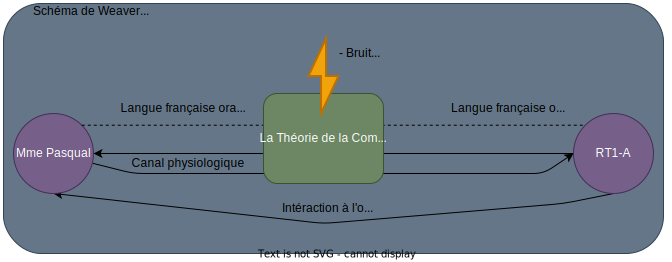

# R211 - Théories de la communication

## Sommaire

- I/ Définitions
- II/ Principaux schémas de la communication (page 1 à 5)
  1. Un modèle systématique Shannon / Waever (1948)
  1. Le modèle de Lasswell, analyser la communication de masse (1948)
  1. Le modèle de Jakobson (1960)
  1. Ecole de Palo Alto (année 50)
- III/ Objectifs de la communication
- IV/ Types de communications (page 6 à 8)
  1. Communication écrite
  1. Communication verbale
  1. Le paralangage
- V/ Les obstacles à la communication (pages 8 à 9)
  1. Le bruit
  2. les obstacles culturels et sociologiques
- Conclusion (page 9)
  - Pourquoi étudier la communication ?
  - L'importance de la Culture Générale en entreprise

## I/ Définitions

Communiquer, c'est intéragir avec une ou plusieurs personnes (humain), c'est à dire
transmettre une information, une pensée, un ressenti ou une donnée.  
Communiquer n'est donc pas informer parce que l'information est une transmission de donnée à sens unique.

3 éléments:

- Echanger entre plusieurs personnes afin de transmettre un message
- Tous les moyens utilisés, dont l'aspect technique, pour diffuser un message auprès d'un publique plus ou moins vaste, plus ou moins éthérogène
- Communiquer, c'est l'action de l'entreprise d'informer sur son activité et de la promouvoir.

## II / Principaux schémas de la communication

Peu importe la forme que prend la communication, elle respecte toujours les mêmes repères.

### 1. 1948 - Shannon et Weaver

Shannon était une ingénieur et Weaver un philosophe. Leur préoccupation 
essentielle était de résoudre des problèmes de transmission télégraphique parce 
que le signal puvait être affecté ou brouillé entre la source et la cible.

L'objectif était que le signal arrive de manière la plus identique possible de la source à la cible. D'où le lien avec l'être humain.

Ils ont montré que la communication repose sur 7 éléments:

- émetteur: la personne qui a la volonté de transmettre
- récepteur(s): la ou les personnes qui reçoivent l'information
- message: contenu 
- canal: le premier canal est le canal physiologique (i.e. le corps)
  - Tous les autres canaux techniques / technologiques
- code: linguistiques (Français), gestuels, iconographique, signaux
  - Pour communiquer, il faut que le récepteur et l'émetteur utilisent le même code
- Rétroaction (feedback): capacité de réponse
  - Pour être en communication, il faut que le récepteur soit en la capacité de répondre.
- Obstacles

Le schéma de Weaver:

Le schéma de Weaver un peu plus précis:

### 2. Analyser la communication de masse (Lasswell, 1948)

Chercheur américain en sciences politiques, en 1948 il s'intéresse à la communication de masse.  
Pionnier de l'étude de communication de masse et pour lui, à l'époque, on peut mesurer n'imoporte quelle prise de parole de masse
à "quatres" questions:

- A qui ?
  - C'est l'audience, le milieu professionnel, le milieu social, etc.
- Qui ?
  - Il faut prendre en compte le milieu sociologique du publique, et donc sa motivation à être là.
- Quoi ?
  - C'est le contenu.
- Par quel canal ?
  - Quel support de diffusion.
- Avec quel effet ?
  - C'est d'anticiper et mesurer l'influence des faits sur le publique.

Laswell montre que la communication est un processus d'influence et de persuasion.  
Analyser la communication va donc permettre de comprendre les ressorts de la propagande et de la publicité.

### 3. Jakobson et les fonctions du langage (1960)

Jakobson est donc un linguiste qui montre que chaque interaction à une fonction.

- La fonction référentielle
  - Elle permet au langage de donner des informations, on la retrouve autant dans les récits que dans les panneaux de signalisation.
- La fonction expressive
  - Le langage de l'émetteur va traduire ses émotions, il va donc adapter son intonation, le timbre de sa voix et son vocabulaire.
- La fonction impressive
  - Elle permet à l'émetteur d'agir sur le récepteur pour l'amener à réaliser une action.
  - L'émetteur emploie donc le vocabulaire de l'injonction mais aussi des procédés de manipulation.
- Phatique
  - Le langage qui permet uniquement à créer, assurer ou entretenir le langage.
  - Elle doit établir une connexion entre l'émetteur et le récepteur. Ex: "Allô" au téléphone
- Méta-linguistique
  La fonction méta-linguistique s'intéresse au fonctionnement de la langue elle-même.
  On la retrouve dans le cours de français, dans les dictionnaires.
- Poétique / Stylistique

### 4. L'école de Palo Alto (1950)

C'est un groupe de recherche pluri-disciplinaire, qui s'intéresse à la communication non verbale.  
Ils sont arrivés à la conclusion que: "Il est impossible de ne pas communiquer".

Quatres apports:

- La communication est une activité sociale permanente et c'est un processus par laquelle la culture se réalise (se réalise/se renouvelle).
- La communication sert d'avantage à appartenir à une communité/ à un groupe qu'à s'informer.
- La communication est principalement non verbale.
- La communication ne se résume pas à l'acte intentionnel de communiquer.

### 5. Les objectifs de la communication

Quand on communique, notamment dans le milieu professionel, il est important
de connaitre nos objectifs, nos intentions afin d'adapter notre stratégie de communications
(notre para-langage, notre niveau de langue, nos supports, etc.).  
Finalement, on communique soit pour informer, soit pour se positionner par
rapport à quelqu'un, soit pour avoir de l'influence sur l'autre, soit pour concrétiser une relation,
ou encore pour poser des règles, des normes.

## III/ Les différents types de communication

### 1. La communication verbale

La communication verbale, c'est tout les messages exprimés dans un langage naturel.  
On l'apprend parce que l'on doit être capable de s'adapter au récepteur et au contexte.

- Langage soutenu:
  - Discussion avec les supérieurs hiérarchiques
  - Requêtes
- Langage courant
  - Langage quotidien
  - On l'a avec des collègues, inconnus
- Langage familier
  - Amical, énervement, etc.
  - Langage du relachement, mais peut aussi être culturel

Le vocabulaire découle de ce niveau de langue, le choix du niveau de langue
dépend de notre intention et de l'enjeu.

### 2. La communication non verbale

- Les Gestes
  - Ponctuels, la transmission du message mais aussi manifeste les réactions à la réception du message.
  - Il est très difficile de contrôler nos gestes.
- Le Regard
  - Le regard est la première phase d'entrée en communication entre l'émetteur et le récepteur, surtout il traduit la sincérité de l'échange.
- Mimique
  - Les mimiques, dont les expressions du visage, elles sont essentielles dans la perception des émotions.
    - La peur
    - La tristesse
    - La joie
    - La colère
    - La surprise
    - Le dégoût
- Le Ton
  - Il peut être ferme, aimable, désagréable, etc.
  - Il va beaucoup transcrire ce que l'on ressent à l'intérieur.
- Le Silence
  - Il est puissant, notre langage est structuré par des silences, plus ou moins long.
  - Le silence est codifié par notre langage.
  - le silence plein, c'est un silence qui est riche, la médecine reconnait que le silence est indispensable à la santé.
  - Il faut apprendre a vivre les silences pleins.

Le sens donné d'une conversion repose à 55% sur les expressions visuelles (mimiques),  
à 38% sur l'éloculation et à 7% sur les mots que vous allez choisir.  

C'est ce que l'on appelle les para-langages.  
Si le langage n'est pas cohérent avec le para-langage, vous n'êtes pas crédible,
vous passez pour quelqu'un qui n'est pas sincère.

Dans le langage non-verbal, il ne faut pas oublier ce que l'on persoit d'autre,
tel que l'habillement, de l'ordre esthétique (maquillage, coiffure), l'odeur, etc.

## V / Difficultés de la communication

La communication dépend de la propention à percevoir les potentiels obstacles entre l'émetteur et le récepteur. Le premier obstacle est le bruit.

1. Le bruit  
  On vit dans une société tout le temps bruyante et on ne s'en rend plus compte. Le bruit va venir parasiter la transmission du message.  
  Il dénature le message, il va causer la perte partielle ou totale du contenu.  
2. Les obstacles culturels ou sociologiques du milieu socio-économique et au niveau éducatif  
  Ces obstacles sont difficiles à contourner parce qu'ils touchent à l'inconscient collectif parce qu'ils vont concerner les modes de pensée.  
  Ils vont toucher les valeurs reconnues et acceptées par un groupe mais aussi leur opinions, l'usage du langage et les préoccupations de chacun.  
  La communication entre l'émmetteur et le récepteur va potentiellement dépendre du milieu économique de chacun, l'éducation, les préoccupations, la culture va différer.  
  Ces différentes origines peuvent provoquer différentes interprétations du messsage et créer potentiellement une situation conflictuelle.  
  Le niveau d'éducation correspond au niveau de connaissance mais aussi à l'outillage intellectuel de chacun.  
  Les niveaux d'éducation peuvent aussi être des freins à la communication, l'émmeteur doit en prendre conscience et faire attention que l'usage de mots complexes ou pas assez courants peut être intrasequement un obstacle à la communication.  
3. Les obstacles physiologiques ou affectifs ou psychologiques  
  Les obstacles les plus difficiles à percevoir, et à anticiper, sont d'ordre psychologiques et affectifs, donc la gestion de conflits dans un groupe et d'autant plus dans le monde du travail, passe par un management qui tient compte de ces facteurs de mauvaise communication.

   1. La sympathie et l'antipathie peuvent avoir des conséquences similaires.
    L'attitude subjective de la sympathie peut avoir des conséquences sur la fluidité de la communication.  
    Elles se transmettent par le dialogue, le sourire, les gestes. On parle de différents degrés de sympathie.  
    On parle de la considération, de l'estime, de la considération ou de l'amitié.  
    A l'inverse, la communication peut-être alterée ou corrompue dû aux différents degrés d'antipathie que l'on peut ressentir pour l'autre.  
    Donc là, la communication n'est pas fluide et l'émetteur et le récepteur ne sont pas productifs.  

   1. Cette crainte ressentie vers sa hierarchie peut être un frein à la communication ou peut mener à une rupture de celle-ci. L'absence d'écoute peut être un frein à la communication et entraver la compréhension du message. Cela peut rendre la communication superficielle.

   Les obstacles physiques:

    L'état physique de l'émetteur comme du récepteur sont un élément essentiel de la transmission du message. Les connexions neuronales de l'être humain sont alterés par la fatigue, le stress, la maladie.

   La peur du jugement peut altérer la communication, la raison et quand on communique, on révèle une partie de notre personnalité. Cette peur peut altérer la communication parce que l'on a pas forcément envie de laisser paraître tel ou tel aspect de notre personnalité.

## Pourquoi étudier la communication ?

> Afin d'éviter ou de prendre en compte ce qui peut venir et altérer la communication entre deux ou plusieurs personnes.  
> Ainsi de pouvoir mieux collaborer que ce soit en société ou dans un contexte professionnel.
> 
> ***S'adapter***, ***NOUS***

Etudier la communication, c'est aller vers d'avantages de compréhension du monde et des individus qui le composent.  
Elle est donc source de connaissances, de compréhension, parce que c'est en communiquant que nous nous insérons dans une dynamique culturelle, mais aussi créer et maintenir des liens (sociaux).
Entrer dans une démarche analytique de communication, c'est s'intéresser à un champ qui n'est pas spécifique et donc il va vous apporter des connaissances à la jonction de multiples disciplines:

- La littérature
- L'histoire
- La sociologie
- La philosophie
- La psychologie
- Les sciences de l'éducation
- Les sciences de l'information
- La neuro-linguistique

mais aussi les sciences et techniques liés à la mécanique de la transmission.

L'essentiel, est qu'apprendre à communiquer est un outil de construction à la pensée.

L'étude de la communication est un outil de construction à la pensée individuelle, à la pensée citoyenne, etc.

La culture générale est quelque-chose à mettre en avant, c'est un cadre à l'intérieur duquel, un groupe ou une société va reconnaitre et accepter et exiger des savoirs et des opinions.

Importance de la culture générale en entreprise, la culture d'un groupe est indispensable à la compréhension entre ses membres qui amène à la communication efficace.
La culture générale valorise et renforce les compétences professionelles.

> glotographique - premier langage de l'humanité, ex: panneaux de signalisation  
> sémasiographique -
