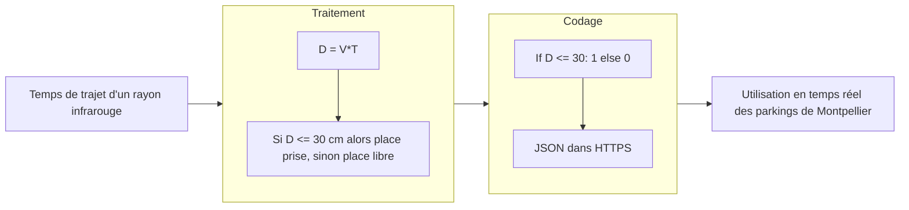

# Schémas Mermaid utilisés sur la présentation du 05/05/2023

```mermaid
flowchart LR

  infbr[Temps de trajet d'un rayon infrarouge] --> traitement
  subgraph traitement [Traitement]
  direction TB
  perception["D = V*T"] --> representation["Si D <= 30 cm alors place prise, sinon place libre"]
  end
  traitement --> codage
  subgraph codage [Codage]
  direction TB
  numerisation["If D <= 30: 1 else 0"] --> cryptographie["JSON dans HTTPS"]
  end
  codage --> infnet[Utilisation en temps réel des parkings de Montpellier]
```
