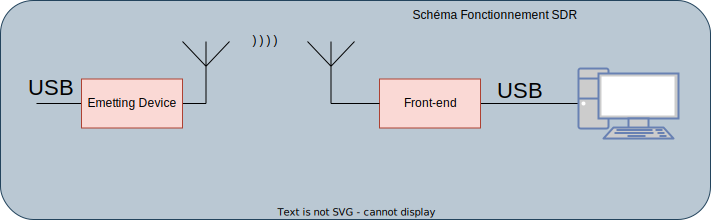

# R221 - Télécommunications spatiales

VAST: Very Small Aperture Terminal  
SNG: Satellite News Gathering  
DSNG: Digital Satellite News Gathering
SDR: Software Defined Radio

Flyaway: Satellite terminal that can be transported in a suitcase

## Pointage d'un satellite

Azimuth: Angle entre le satellite et le point de référence (Nord) (x)  
Elevation: Angle entre le satellite et l'horizon (y)

### Caractéristiques d'une orbite

- apogée, périgée
- 1/2 grand axe
- excentricité
- inclinaison par rapport
- à l'équateur
- Et d'autres angles

## Constellations

- Définition:
  - Groupe de satellites artificiels identiques travaillant de concert pour fournir un même service
  - Flotte de satellites: les satellites d'un même "armateur"
  - Série de satellites: une gamme, exemple Spot
- Objectif:
  - Rdondance
  - Densité de couverture
  - Couverture de la planète ou d'une région
  - Triangulation

## Modulations de signal

### Modulation de fréquence (FM)

$x_p(t) = A_p \cos{(2\pi f_p t + \varphi_p)}$

où $x_p$ est le signal porteur  
et $x_m(t)$ est le signal modulant (à transmettre)

### Modulation d'amplitude (AM)

$x(t) = (1 + m x_m(t)) \cos{(2\pi f_p(t) + \varphi_p)}$  
où $m$ est la profondeur de modulation, qui est la constante 
définissant l'écart entre le point le plus petit et le plus grand.
