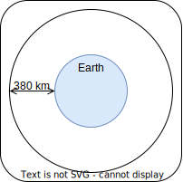
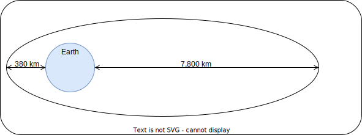

# Compte rendu de R221-TP3

## 1 - Présentation

1. Définitions des orbites

- GTO: Geostationary Transfer Orbit
- GEO: Geostationary Orbit
- LEO: Low Earth Orbit
- MEO: Medium Earth Orbit

2. Dessiner une orbite circulaire à 380 km d'altitude

3. Dessiner une orbite elliptique dont le périgée est à 380km d'altitude et l'apogée à 7800km d'altitude

4. Pour les orbites elliptique définir le demi-grand axe, le périapse, l'apoapse.  
  Donner la relation entre le demi-grand axe, l'apoapse et le périapse.

- Le demi-grand axe, pour une orbite elliptique, est la distance entre
  le centre de l'orbite et le point le plus éloigné de celle-ci.
- Le périapse, pour une orbite elliptique, est le point le plus proche du centre de l'orbite.
- L'apoapse, pour une orbite elliptique, est le point le plus éloigné du centre de l'orbite.

Donc, pour aller du périapse à l'apoapse, on parcours deux fois le demi-grand axe.

5. Définir l'excentricité d'une ellipse. Donner son expression en fonction de l'apoapse et du périapse.
  Donner son expression en fonction du périapse et du demi-grand axe.

Si c'est une ellipse, alors l'excentricité est comprise entre 0 et 1.:  
$0 < e < 1$

Son expression en fonction de l'apoapse et du périapse est:  
$e = \frac{r_a - r_p}{r_a + r_p}$
$<=> 1 - \frac{2}{(r_a / r_p)+1}$

où $r_a$ est le rayon à l'apoapse et $r_p$ est le rayon au périapse.

Son expression en fonction du périapse et du demi-grand axe est:

$e = \frac{2a-r_p - r_p}{2a}$  
$<=> \frac{2a}{2a} + \frac{-2r_p}{2a}$
$<=> 1 - \frac{r_p}{a}$

6. Donner les expressions de l'apoapse, du périapse et le demi-grand axe en fonction du rayon pour les orbites circulaires.

Avec une orbite cirulaire, il n'y a pas de différences entre le périapse, 
l'apoapse et le demi-grand axe, toutes les valeurs valent r.  
C'est à dire:  

$r_a = r_p = r$

- périapse: $r_p = r$
- apoapse: $r_a = r$
- demin-grand axe: $a = r$

7. Rappeler la loi de vitesse de Kepler pour les orbites elliptiques.

$\delta = \sqrt{\mu(\frac{2}{r}-\frac{1}{a})}$

où $\mu$ est la masse de la terre + la constante gravitationnelle de la terre.

8. En déduire l'expression du demi-grand axe lorsqu'on connaît la vitesse au périgée.  
  Idem lorsqu'on connaît la vitesse à l'apogée.

$\delta = \sqrt{\mu(\frac{2}{r}-\frac{1}{a})}$  
$\delta^2 = \mu(\frac{2}{r} - \frac{1}{a})$  
$\frac{\delta^2}{\mu} = \frac{2}{r} - \frac{1}{a}$  
$\frac{\delta^2}{\mu} - \frac{2}{r} = - \frac{1}{a}$  
$\frac{\delta^2 r - 2\mu}{\mu r} = - \frac{1}{a}$  
$\frac{\mu r}{\delta^2r-2\mu} = -a$

## 2 - Lancement

