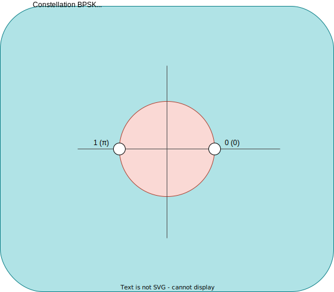

# R305-TP4 - Transmission en bande transposée

## Préparation

On utilise ici le module TIMS.

La carte Audio Oscillator (sortie TTL) commande la carte Sequence Generator (CLK) qui fournit un signal numérique aléatoire codé.

Nous avons donc le montage suivant:

- Visualiser à l'oscilloscope le signal codé (sortie TTL X).

    

- De quel code s'agit-il ? Relever le niveau haut et le niveau bas.

    Il s'agit d'un code `NRZ Unipolaire`, avec:

    - 0: valeur basse
    - 1: valeur haute

On peut modifier la rapidité de modulation du signal codé en tournant le bouton $\varDelta f$ de la carte Audio Oscillator.

- Déterminer la durée de l'ITE et la rapidité de modulation de ce signal si $\varDelta f$ est au minimum ? S'il est au maximum ?

    Si $\varDelta f$ est:

    - au minimum:
      - ITE: ~2.5 ms
      - Rapidité de modulation: 400 Bd

    - au maximum:
      - ITE: 50 $\mu$s
      - Rapidité de modulation: 20 kBd

Si rien n'est précisé, on réglera par défaut $\varDelta f$ au maximum.

1. ## Modulation FSK

    1. ### Réglages

        - Rappeler le principe de la modulation FSK.

          La modulation FSK est une modulation de fréquence.

        - Que signifie le sigle FSK ?

          Le sigle `FSK` signifie `Frequency Shift Keying`.

        On utilise la carte VCO du module TIMS.
        Le VCO est un Oscillateur Commandé en Tension
        (Voltage Controlled Oscillator) qui fournit une tension
        sinusoïdale dont la fréquence est proportionnelle à la
        tension d'entrée (Vin)

        - Brancher un signal continu (sortie DC de la carte variable 
          DC) en entrée du VCO. Quelle est la forme du signal de sortie ?

          On obtient donc le montage suivant:

          

          Le signal en sortie est:

          

          Le signal en sortie est donc une sinusoïdale.

        - Faire varier l'amplitude de ce signal, qu'observe-t-on en sortie ?

          Si l'on fait varier l'amplitude de ce signal, on observe en sortie
          que la fréquence varie, comme l'on peut le voir ci-dessous:

          

        - Conclure sur le fonctionnement du VCO.

          On peut donc en conclure que le VCO permet d'obtenir une modulation
          FSK d'un signal.

        > **Note:**  
        > Montrer vos résultats à l'enseignant (contrôle 1).

    1. ### Signal NRZ

      - Appliquer maintenant en entrée du VCO le signal codé ($\varDelta f_{max}$).

        On obtient maintenant le montage suivant: 

      - Relever le signal modulé.

        

      - En zoomant sur la base de temps, mesurer la période de la sinusoïde correspondant à un « 1 » et celle correspondant à un « 0 ».
        Déterminer les fréquences correspondantes ($f_1$ et $f_0$).

        - Les Périodes:
          - 1: 25 $\mu$s
          - 0: 6.25 $\mu$s

        - Les fréquences:
          - 1: 40 kHz
          - 0: 160 kHz

      - Observe-t-on de la discontinuité de phase ?
        Relever l'oscillogramme permettant de le montrer.

        Nous n'observons pas de discontinuité de phase, comme l'on peut le voir
        ci-dessous:

        

      - Relever le spectre du signal modulé. Retrouver les fréquences particulières.

        

        On retrouve bien les fréquences particulières à $\pm$ 10 kHz.

      - Déterminer son occupation spectrale ?
        De quelles grandeurs dépend-elle principalement ?
        Comment alors choisir $f_1$ et $f_0$ ?

        Son occupation spectrale est $\pm$ de `106` kHz.
        Elle dépend principalement du gain et de $f_0$.

        On choisit alors $f_0$ et $f_1$ relativement proches mais avec assez
        de différence afin qu'ils ne se chevauchent pas mais que l'on ait une
        OS la plus petite possible.  
        Cependant, nous devons aussi faire attention à la rapidité de modulation afin d'en utiliser
        une assez grande mais pas trop car sinon nous aurons du mal à retrouver $f_0$ et $f_1$.

        - OS avec $gain_{max}$:

          

      - Modifier la rapidité de modulation du signal codé.
        Qu'observe-t-on au niveau fréquentiel ?

        Lorsque l'on modifie la rapidité de modulation du signal codé, la puissance
        varie, comme l'on peut voir ci-dessous.

        - Rapidité de modulation minimale:

            

      - Conclure sur le choix de f1 et f0 en fonction de la bande passante du canal et de la rapidité de modulation.

        Si l'on veut obtenir un signal codé avec une OS faible mais
        avec assez de puissance, nous devons donc avoir une rapidité de modulation assez grande mais
        pas trop afin de tout de même pouvoir reconnaitre $f_0$ et $f_1$ ainsi que choisir $f_0$ et $f_1$
        assez proches mais pas trop afin qu'ils ne se chevauchent pas.

    > **Note:**  
    > Montrer vos résultats à l'enseignant (contrôle 2).

2. ## Modulation ASK

    1. ### Réglages

        - Rappeler le principe de la modulation ASK.

            C'est une modulation d'amplitude.

        - Que signifie le sigle ASK ?

            Le sigle `ASK` signifie Amplitude Shift Keying.

        - Proposer une méthode pour la réalisation de cette modulation.

            On utilisera un mutliplier afin de moduler l'amplitude de notre signal initial
            avec un signal sinusoidal de valeur constante.

        On utilisera la carte multiplieur et le générateur MASTER SIGNALS du module TIMS.

    1. ### Signal NRZ

         - On souhaite moduler le signal codé. Réaliser le montage.

            Nous avons donc le montage suivant: 

         - Relever le signal modulé. De quelle modulation s'agit-il ?

            Nous avons le signal suivant

            

            Nous pouvons constater que nous n'obtenons pas vraiment une modulation ASK, c'est une modulation OOK (On Off Keying).

         - Si l'on veut réaliser une « vraie » modulation ASK, quelle est l'étape nécessaire avant le multiplieur. Proposer le montage avec les cartes disponibles.

            Nous devons donc ajouter un adder avant le multiplieur.

            Nous obtenons donc le montage suivant:

            

         - Relever alors le signal modulé et retrouver la suite de bits envoyés et l'amplitude correspondante.

            Le signal modulé est donc le suivant:

            

            La suite de bits est:

            | 1   | 1   | 1   | 0   | 0   | 1   | 0   | 0   | 0   | 1   | 0   | 1   | 0   | 1   | 1   | 1   | 1   | 0   | 1   | 1   | 0   | 1   | 0   | 0   | 1   | 1   | 0   | 1   | 0   | 0   | 0   | 0   |
            | --- | --- | --- | --- | --- | --- | --- | --- | --- | --- | --- | --- | --- | --- | --- | --- | --- | --- | --- | --- | --- | --- | --- | --- | --- | --- | --- | --- | --- | --- | --- | --- |

            Avec:

            - 0: [0, -1.68] V
            - 1: [2.72, -4.24] V

         > **Note:**  
         > Montrer vos résultats à l'enseignant (contrôle 3).

         - Observer le spectre du signal modulant et celui du spectre modulé. Que remarque-t-on ? Expliquer alors le terme de déplacement de spectre.

            - Le spectre du signal modulant: 

            - Le spectre du signal modulé:

              

            On remarque que notre spectre s'est bien déplacé autour de $f_p$, notre fréquence de la porteuse, qui est à environ $100$ kHz.

            Le déplacement de spectre, qui est ce que l'on constate dans notre cas, est le fait que le spectre du signal modulant se déplace autour de la
            fréquence de la porteuse.

         - Comparer l'occupation spectrale du signal modulant et du signal modulé.

            L'OS du signal modulant est plus faible que l'OS du signal modulé, comme l'on peut le voir à la question
            précédente.

         - Sur quelle fréquence le spectre du signal modulé est-il centré ?

            Le spectre du signal modulé est centré sur $f_p$, dans notre cas, c'est $100$ kHz.

         - Modifier la rapidité de modulation. Qu'observe-t-on au niveau fréquentiel ? Conclure

            Lorsque l'on modifié la rapidité de modulation, on peut observer que la puissance du spectre varie elle aussi.

            - Rapidité de modulation minimale:

              

            On peut donc en conclure que lorsque la rapidité de modulation est à son minimum, nous avons un lobe plus petit car la puissance n'est pas répartie de la même manière, ce qui peut nous permettre d'obtenir un spectre beaucoup plus net.

         > **Note:**  
         > Montrer vos résultats à l'enseignant (contrôle 4).

    1. ### Modulation BPSK (Binary Phase Shift Keying)

        On utilise maintenant la sortie X jaune de la carte Sequence Generator.

        Nous avons donc le montage suivant: 

        - De quel type de signal s'agit-il ? De quel code ?

          

          Il s'agit d'un signal carré analogique et du code NRZ Bipolaire.

        - Appliquer ce signal en entrée du multiplieur (directement, sans l'étape additionneur). Observer le signal modulé.

          Nous obtenons donc le montage suivant: 

          Ce qui nous donne le signal suivant: 

        - En « zoomant » sur le début d'un ITE déterminer de quelle modulation il s'agit. Expliquer son nom : BPSK

          

          Il s'agit d'une modulation de phase binaire car nous
          avons un saut de phase de $\pi$ en plus d'avoir 2 valeurs
          de modulation.

        - Représenter sa constellation.

          Nous avons la constellation suivante:

          

        - Observer le spectre du signal modulé. Quelle est son occupation spectrale ?

          Nous avons le spectre du signal suivant: 

          Son OS est de $\pm$ 12.5 kHz.

        > **Note:**  
        > Montrer vos résultats à l'enseignant (contrôle 5).

## Copyright &copy; 2023 Alexis Opolka & Mathys Domergue - All Rights Reserved
