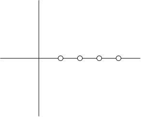
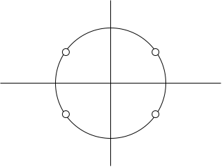
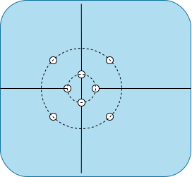

# R305 - Chaînes de transmissions numériques

Pourquoi numérique ?

- C'est + simple de le stocker
- C'est + facile de transmettre car le récepteur sait ce qu'il doit recevoir (0 ou 1),
  il pourra donc regénérer un signal "parfait" même en recevant un signal bruité.

## Cours

Dépend du canal de transmission:

- filaire
  Signal est électrique, la bande passante du canal est de la forme [0, $f_{max}$]
- hertzien

- Optique

Transmission en bande de base => sans modulation

### Notions élémentaires

Un bit est représenté par une tension, cette tension est maintenue pendant un certain temps.

- ITE: Intervall de Temps Elementaire
- R: Rapidité de modulation (en Baud)

$R = \frac{1}{ITE}$

### Classification des codes

|              | Unipolaire                                                                               | Bipolaire                                                                                                                                          | AMI[^3]                                                                                                                      |
| ------------ | ---------------------------------------------------------------------------------------- | -------------------------------------------------------------------------------------------------------------------------------------------------- | ---------------------------------------------------------------------------------------------------------------------------- |
| Code NRZ[^1] | Un seul niveau de tension                                                                | Deux niveaux de tension (e.g -5 => 0, +5 => 1), la valeur moyenne ~= 0                                                                             | On alterne, pour la valeur de 1, entre une valeur négative et une valeur positive. On a donc une valeur moyenne = 0          |
| Code RZ[^2]  | Un seul niveau de tension, remise à zéro à la moitié de l'ITE de toute valeur non nulle. | Deux niveaux de tension (e.g -5 -> 0 => 0, +5 -> 0 => 1). A nouveaux, nous avons une remise à zéro à la moitié de l'ITE de toute valeur non nulle. | On alterne entre une valeur positive et négative où l'on a une remise à zéro à la moitié de l'ITE de toute valeur non nulle. |
| Code Biphase |                                                                                          |                                                                                                                                                    |                                                                                                                              |

RZ, surtout bipolaire nous permet de garder l'horloge

Transmissions synchrone: transmission TV pendant longtemps et continuellement, le signal devrait pouvoir donner l'horloge.  
Transmission asynchrone: transmission courte et espacée dans le temps

[^1]: Non Remis à Zéro
[^2]: Remis à zéro
[^3]: Alternate Mark Inversion

#### Code Biphase

- ##### Biphase Unipolaire

  - 0: valeur constante
  - 1: front descendant[^4]

- ##### Biphase bipolaire (Manchester)

  - 0: front montant[^5]
  - 1: front descendant

  > **Note:**  
  > On change de tension pendant l'ITE, plus précisemment à sa moitié.

- ##### Manchester différentiel

  - 0: même symbol que l'ITE précédent
  - 1: symbole opposé au symbole de l'ITE précédent

  | 0   | 1   | 1   | 0   | 1   |
  | --- | --- | --- | --- | --- |
  | FM  | FD  | FM  | FM  | FD  |

[^4]: Valeur positive à valeur négative
[^5]: Valeur négative à valeur positive

#### Code à mémoire HDB3

- Bit de bourrage:
  - S'assure que la valeur moyenne du signal codé est nulle.
  - Il vaut 0, -5 ou +5 de manière à ce que la valeur moyenne du signal, après lui, soit nulle.
- Bit de viol:
  - Permet au récepteur de reconnaître la suite de 4 zéros
  - viole l'alternance
  - donc identique au dernier symbole non nul.

| 0     | 1   | 0    | 1   | 1   | 0 (Bit de Bourrage) | 0    | 0    | 0 (Bit de viol) |
| ----- | --- | ---- | --- | --- | ------------------- | ---- | ---- | --------------- |
| nulle | +5  | null | -5  | +5  | -5 (Valeur Bas)     | null | null | -5              |

On utilise le bit de bourrage et de viol dès qu'on a 4 zéros d'affilé, bourrage en première position, viol en dernière.

Le principe de ce code est qu'il soit tout le temps en valeur moyenne = 0.

##### Code à mémoire Miller

- 0:
  - pas de transition au milieu de l'ITE
  - au début de l'ITE, conserve le même niveau de tension si le symbole précédent était un 1
  - ne le conserve pas sinon
- 1:
  - transition au milieu de l'ITE
  - au début de l'ITE, conserve le même niveau de tension que le symbole précédent

### Choix d'un code

- Les critères dépendent principalement du support de transmission
- Il dépend ausis de contraintes économiques
  - facilité de mise en oeuvre
  - immunité aux bruits

Bande passante: Bande de fréquence - bande du canal

<details>

<summary>

## TD 1

</summary>

### 1. Code du RNIS

- NRZ AMI inversé
  - 0: +5 ou -5
  - 1: 0

1. Que vaut l'ITE ?

   ITE = $\frac{1}{64.10^3}$ = 15.625 ms

2. En mode DATA, tracer le signal correspondant à la transmission du mot "Hello" ("A"=65, "a"=97, en ASCII)

    | H   | e   | l   | o   |
    | --- | --- | --- | --- |
    | 72  | 101 | 108 | 111 |

    | 0   | 0   | 0   | 1   | 0   | 0   | 1   | 0   | 1   | 0   | 1   | 0   | 0   | 1   | 1   | 0   | 0   |
    | --- | --- | --- | --- | --- | --- | --- | --- | --- | --- | --- | --- | --- | --- | --- | --- | --- |
    | +5  | -5  | +5  | 0   | -5  | +5  | 0   | -5  | 0   | +5  | 0   | -5  | +5  | 0   | 0   | -5  | +5  |

3. Que vaut la valeur moyenne du signal pour ce mot ? Généraliser

    La valeur moyenne du signal = 0.

4. Reprendre la question précédente avec un code NRZ unipolaire inversé. Généraliser.

    - NRZ Unipolaire inversé
      - 0: +5
      - 1: 0

    La valeur moyenne vaut ~$\frac{0.75}{2}$.

### 2. Code HDB 3

1011 1000 0000 0001 0100 0011 0000 1010 0010 0001

1. Représenter cette suite en utilisant un codage NRZ AMI

    | 1   | 0   | 1   | 1   | 1   | 0   | 0   | 0   | 0   | 0   | 0   | 0   | 0   | 0   | 0   | 1   | 0   | 1   | 0   | 0   | 0   | 0   | 1   | 1   | 0   | 0   | 0   | 0   | 1   | 0   | 1   | 0   | 0   | 0   | 1   | 0   | 0   | 0   | 0   | 1   |
    | --- | --- | --- | --- | --- | --- | --- | --- | --- | --- | --- | --- | --- | --- | --- | --- | --- | --- | --- | --- | --- | --- | --- | --- | --- | --- | --- | --- | --- | --- | --- | --- | --- | --- | --- | --- | --- | --- | --- | --- |
    | +   | 0   | -   | +   | -   | 0   | 0   | 0   | 0   | 0   | 0   | 0   | 0   | 0   | 0   | +   | 0   | -   | 0   | 0   | 0   | 0   | +   | -   | 0   | 0   | 0   | 0   | +   | 0   | -   | 0   | 0   | 0   | +   | 0   | 0   | 0   | 0   | -   |

2. Quel est l'inconvéniant de ce codage ?

    On risque de perdre l'horloge.

3. On décide d'utiliser un code HDB3. Représenter le signal en utilisant ce codage.

    | 1011  | 1000 | 0000 | 0001 | 0100    | 0011    | 0000 | 1010  | 0010 | 0001   |
    | ----- | ---- | ---- | ---- | ------- | ------- | ---- | ----- | ---- | ------ |
    | +0-+  | -000 | -+00 | +00- | 0+-0    | 0-+-    | +00+ | -0+0  | 00-0 | 00-+   |
    | \____ | B___ | VB__ | V___ | \_\_B\_ | \_V\_\_ | B__V | \____ | ___B | _\_V\_ |

    > **Note:**  
    > Le bit de bourrage doit faire en sorte que la
    > valeur moyenne du bit suivant soit nulle, il
    > peut donc être null, si nécessaire.

4. Expliquer l'intérêt du bit de viol ?

    Il permet de retrouver la suite de 4 zéros sans avoir
    à envoyer une tension nulle trop longtemps.

5. Quel est l'intérêt du bit de bourrage ?

    Il permet d'avoir une valeur moyenne nulle.

### 3. Code RZ bipolaire

1. On considère le codage RZ bipolaire, rappeler son principe.

    On fait un retour à zéro à la moitié de l'ITE de chaque valeur non-nulle.

    - 0: +- 5 -> 0
    - 1: +5 -> 0

2. Représenter le signal-valeur absolue de ce code ?

    - 0: +5 -> 0
    - 1: +5 -> 0

3. A quel signal correspond-il ?

    Cela correspond à l'horloge.

4. Quel est l'intérêt de récupérer l'horloge en réception ?

    On sait comment décoder le signal.

### 4. Code Manchester

1. Préciser le problème que l'on peut rencontrer si on se trompe lorsqu'on connecte les paires d'émission et de réception.

    On recevra un 1 à la place d'un zéro et inversement.

2. Rappeler le principe du codage Manchester différentiel.

    La valeur moyenne = 0.
    Il garde l'horloge.

3. Montrer qu'il peut résoudre ce problème.

    Vu que l'on inverse tout, on pourra tout de même retrouver nos valeurs.

### 5. Code [Miller](#code-à-mémoire-miller)

Représenter la valeur 8AF3 avec le code Miller.

8    A    F    3  
1000 1010 1111 0011  

| 1   | 0   | 0   | 0   | 1   | 0   | 1   | 0   | 1   | 1   | 1   | 1   | 0   | 0   | 1   | 1   |
| --- | --- | --- | --- | --- | --- | --- | --- | --- | --- | --- | --- | --- | --- | --- | --- |
| FD  | B   | H   | B   | FM  | H   | FD  | B   | FM  | FD  | FM  | FD  | B   | H   | FD  | FM  |

> **Note:**  
>
> - FD: Front Descendant, voir [^4].
> - FM: Front Montant, voir [^5].
> - B: Niveau Bas
> - H: Niveau Haut

</details>

<details>

<summary>

## TD 2

</summary>

1. Décodage de codes numériques, tel un récepteur

    1. Signal 1: [HdB3](#code-à-mémoire-hdb3)
       - ITE: 1 carreaux
       - Rapidité de modulation: 500 000 bauds
       - Décodage:

          | 1   | 1   | 0   | 0   | 1   | 0   | 0   | 0   | 0   | 1   | 0   | 0   | 0   | 0   | 1   | 0   | 1   | 0   | 0   | 0   | 0   | 0   | 1   | 0   | 1   | 1   | 1   | 0   | 0   | 0   | 0   |
          | --- | --- | --- | --- | --- | --- | --- | --- | --- | --- | --- | --- | --- | --- | --- | --- | --- | --- | --- | --- | --- | --- | --- | --- | --- | --- | --- | --- | --- | --- | --- |
          |     |     |     |     |     | B   |     |     | V   |     | B   |     |     | V   |     |     |     | B   |     |     | V   |     |     |     |     |     |     | B   |     |     | V   |

    1. Signal 2: [Code de Miller](#code-à-mémoire-miller)

        - ITE: 2 carreaux
        - Rapidité de modulation: 1 / ITE = 250k bauds
        - Décodage:

          | 1   | 0   | 0   | 1   | 1   | 1   | 0   | 0   | 0   | 1   | 0   | 1   | 0   | 0   | 1   | 1   |
          | --- | --- | --- | --- | --- | --- | --- | --- | --- | --- | --- | --- | --- | --- | --- | --- |
          |     |     |     |     |     |     |     |     |     |     |     |     |     |     |     |     |

    1. Signal 3: [Code Manchester Différentiel](#manchester-différentiel)

        - ITE:
        - Rapidité de modulation: bauds
        - Décodage:

          | 1   | 0   | 0   | 1   | 1   | 1   | 1   | 0   | 0   | 1   | 1   | 1   | 0   | 1   |
          | --- | --- | --- | --- | --- | --- | --- | --- | --- | --- | --- | --- | --- | --- |
          |     |     |     |     |     |     |     |     |     |     |     |     |     |     |

1. Coder le signal 3 avec le code RZ unipolaire puis Manchester

    - [RZ Unipolaire](#classification-des-codes)

    - [Manchester](#biphase-bipolaire-manchester)

</details>

<details>
<summary>

## TD 3

</summary>

1. Exercice 1

   1. Donner les caractéristiques électriques du signal

       - Niveau haut: 0
       - Niveau bas: -4
       - tension de repos: 0

   2. Cela ne peut pas être du NRZ AMI car l'on a pas 3 niveaux de tension.

   3. Peut-il alors s'agir des codes: Pourquoi ?

      - RZ Bipolaire: :x:

        Le signal n'a pas 3 niveaux de tensions

      - RZ AMI: :x:

        Le signal n'a pas 3 niveaux de tensions.

      - Biphase Unipolaire: :x:

        Le signal n'a pas 3 niveaux de tensions.

   4. Si l'on sait que le débit est égal à 10Mbits/s, pourquoi peut-on dire qu'il ne s'agit pas des codes NRZ Unipolaire ou Bipolaire ?

      D = 10 Mbits/s
      ITE = $\frac{1}{D}$ = $0.1\mu$s

      Ce n'est pas possible que ce soit du NRZ unipolaire, il ne pourrait pas changer de débit durant la transmission.  
      Ainsi donc, le RZ Unipolaire et le NRZ Bipolaire ne peuvent pas marcher pour la même raison.

      Il nous reste donc le [Biphase Bipolaire](#biphase-bipolaire-manchester).

      Si on suit les schémas, le Biphase Bipolaire semble être le signal que l'on cherche.

1. Exercice 2

   1. Quelle est la durée du préambule ? Quelle est la durée du délimiteur de trame ?

       - Préambule: 7*8 bits = 56 bits soit $5.6\mu$s.
       - Délimiteur: 8 bits = $0.8\mu$s.

   2. Pourquoi envoie-t-on cette suite de bits en début de transmission ?

      Pour obtenir l'horloge du signal.

   3. Décoder le signal reçu.

      | 1   | 0   | 1   | 0   | 1   | 0   | 1   | 0   | 1   | 0   | 1   | 0   | 0   | 0   | 0   | 0   | 0   | 0   |
      | --- | --- | --- | --- | --- | --- | --- | --- | --- | --- | --- | --- | --- | --- | --- | --- | --- | --- |
      |     |     |     |     |     |     |     |     |     |     |     |     |     |     |     |     |     |     |

   4. Comment est codé le 1 ? le 0 ?

      - 1: front montant
      - 0: front descendant

   5. Quelle est l'adresse MAC destinataire ?

      C'est l'adresse de broadcast: `ffffff`

</details>

## Cours (suite)

### Choix d'un code, partie 2

- Dépend principalement de la Bande Passante du canal.
- On étudie donc **la densité spectrale de puissance** du code: répartition moyenne de la puissance en fonction de la fréquence.
  Elle indique *l'occupation spectrale*[^6] du code.

[^6]: Bande de fréquence qui transporte 90% de la puissance totale du code.

### Densité spectrale de différents codes

- #### Code NRZ Unipolaire

  - Une raie à f=0
    - Beaucoup d'énergie en très basse fréquence
      et pas du tout à la fréquence de l'horloge
  - Pas d'énergie pour f = R
  - OS[^6] faible
    - Beaucoup d'énergie, à nouveau, dans les très basses fréquences
    - L'OS occupe 1R

- #### Code Manchester

  - Pas d'énergie à f = 0
  - De l'énergie pour f = R
    - Le récepteur pourra reconstituer l'horloge
  - OS[^6] plus large
    - L'OS occupe 2R

  Dans le cas où l'on veut faire du manchester mais que notre canal est trop petit,
  on peut diminuer R (R = $\frac{1}{ITE}$), c'est à dire augmenter l'ITE, donc aller moins vite dans la transmission
  du signal, donc la rapidité de modulation est diminuée.

### Caractéristiques importantes des codes

- #### Occupation Spectrale

  - Largeur de la bande de fréquence occupée
  - amplitude des composantes basse fréquence et f = 0

- #### Densité des

### Transmission asynchrone

Chaque caractère est émis de façon irrégulière dans le temps.  
Transmission qui n'est pas en continu.

### Transmission synchrone

Émetteur et récepteur sont cadencés à la même horloge:

- nécessité donc pour le récepteur de "recevoir" l'horloge du signal

$P_{BF}$: part de la puissance totale contenue

<details>
<summary>

## TD 4

</summary>

1. Exercice 1
   1. Axe horizontal: fréquence

   2. Axe vertical: Puissance

   3. Si la rapidité de modulation augmente, le débit augmente car l'on transmet les information plus rapidement (diminution ITE).

   4. ...

   5. ...

   6. Que constate-t-on ?

      - Comme la densité spectrale est plus petite, moins la densité spectrale est déformée.
      - La rapidité de modulation est trop grande, on perd beaucoup de puissance et on risque de ne pas pouvoir regénérer le signal en sortie du canal.

   7. Sur le graphe est également représentée (en pointillé) la bande passante B d'un canal de transmission.  
      Que peut-on alors conclure sur le choix de la rapidité de modulation d'un signal ?

      - Comme la densité spectrale est plus petite, moins la densité spectrale est déformée.
      - La rapidité de modulation est trop grande, on perd beaucoup de puissance et on risque de ne pas pouvoir regénérer le signal en sortie du canal.

1. Exercice 2

   - Rappel des codes:

      1. [Le code NRZ](#code-nrz-unipolaire)

         - Un petit spectre (R)
         - Pas d'énergie en R
         - f = 0

      2. [Le code RZ Bipolaire](#classification-des-codes)

         - Spectre plus grand (2R)
         - Energie en R
         - f != 0

      3. [Le code Biphase](#code-biphase)

         - Spectre plus grand (2R)
         - Energie en R
         - f = 0

      4. [Le code AMI](#manchester-différentiel)

         - Un petit spectre (R)
         - Pas d'énergie en R
         - f = 0

   - Le canal ne laisse pas passer la composante continue:

     - Biphase
     - AMI

   - La transmission est synchrone (nécéssiter de reconstruire l'horloge en réception):

     - Biphase
     - RZ Bipolaire

   - La transmission est asynchrone:

     - Tous

   - Le canal ne laisse pas passer la componsante continue et la transmission est synchrone:

     - Biphase

   - Le fichier est lourd et on souhaite une vitesse de transmission la plus grande possible (aucune autre contrainte):

     - NRZ
     - AMI

1. Exercice 3

   1. Pour chaque canal et pour chaque code, préciser si c'est un code adapté et alors, avec quelle rapidité de modulation.

        |         | Canal 1    | Canal 2    |
        | ------- | ---------- | ---------- |
        | NRZ     | Non        | R = 20k Bd |
        | RZ Bip  | Non        | R = 10k Bd |
        | Biphase | R = 5k Bd  | R = 10k Bd |
        | AMI     | R = 10k BD | R = 20k Bd |

   2. Si on rajoute qu'il est nécessaire de reconstruire l'horloge en réception, quel(s) code(s) peut-on utiliser ?

      On utilisera le RZ Bipolaire et le Biphase.

1. Exercice 4

   1. Expliquer rapidement ce tableau

      On voit la puissance des différents codes:

        - Entre 0 et 0.1R
        - À 10% de la puissance
        - À 90% de la puissance

   1. Parmi les codes proposés, qules sont les candidats pour la transmission ?  
      Justifier votre réponse.

      | NRZ-Unip. | NRZ-Bip. |      NRZ-AMI       | RZ-Unip. | RZ-Bip. |       RZ-AMI       |   Biphase-Unip.    |    Biphase-Bip.    |
      | :-------: | :------: | :----------------: | :------: | :-----: | :----------------: | :----------------: | :----------------: |
      |    :x:    |   :x:    | :white_check_mark: |   :x:    |   :x:   | :white_check_mark: | :white_check_mark: | :white_check_mark: |

   1. Peut-on choisir le code NRZ AMI ?

      Oui.

   1. Si on impose que la perte en hautes fréquences soit exactement de 10% de la puissance totale, quelle est la rapidité de modulation convenable si on choisit le code NRZ AMI ?

      $R_{max}$ = $\frac{f_{max}}{2.29}$ pour que, en HF[^7], on perde exactement 10\% de la puissance totale ($P_{tot}$).

   1. Si on impose que la perte en hautes fréquences soit au plus de 10% de la puissance totale, toujours pour le code NRZ AMI, comment doit-être la rapidité de modulation ?

      R = < $\frac{f_{max}}{2.29}$ pour que, en HF[^7], on perde plus de 10% de $P_{tot}$.

   1. En vous appuyant sur le tableau, quel est le code qui permet la plus grande rapidité

      RZ AMI parce que = $\frac{f_{max}}{1.73 R}$

   1. Donnez les valeurs limites

      $R_{min} = \frac{f_{max}}{2.29} = \frac{10 000}{2.29}$

      On ne perdra pas plus de 10% si $f_{min} = 0.28 R_{min}$  
      où $R_{min} = \frac{f_{min}}{0.208}$.

   [^7]: i.e: Hautes Fréquences

1. Exercice 5

    On étudie un signal de débit $D = 1200\text{ bits/s}$ et on va comparer les codages [NRZ](#classification-des-codes) et [Manchester](#biphase-bipolaire-manchester)

    1. Quelle est la durée d'un bit ?

       La durée d'un bit est de $\frac{1}{1200}$s donc $8.33\times10^{-4}$s = $0.833$ms.

    1. Représenter la suite de bits: 0 1 1 0 0 0 1

       | 0    | 1   | 1   | 0    | 0    | 0    | 1   |
       | ---- | --- | --- | ---- | ---- | ---- | --- |
       | -2.5 | 2.5 | 2.5 | -2.5 | -2.5 | -2.5 | 2.5 |

    1. Pour une longue suite de 0:

       Signal continu -2.5V, soit f = 0.

    1. Représenter la suite de bits: 0 1 1 0 0 0 1

       | 0   | 1   | 1   | 0   | 0   | 0   | 1   |
       | --- | --- | --- | --- | --- | --- | --- |
       | FD  | FM  | FM  | FD  | FD  | FD  | FM  |

    1. Pour une longue suit de 0:

       Signal carré +-2.5V à une fréquence de 1200Hz.

    1. Estimer graphiquement l'encombrement spectral dans chaque cas:

       - $B_{NRZ}$ pour le codage NRZ

         [0; 1200]

       - $B_{MAN}$ pour le codage manchester

         [0; 2400]

    1. Le critère de choix pour le système étudié est de minimiser l'encombrement en fréquence; quel est alors le codage le plus adapté ?

       Le codage le plus adapté est NRZ.

    1. Si le critère de choix avait été la DSP doit être minimale en basses fréquences; quel codage serait le plus adapté ? Justifier la réponse.

       Le codage le plus adapté serait Manchester car f = 0 P = 0.

    1. Si le critère de choix avait été la DSP doit avoir un certain niveau à la fréquence d'horloge; quel codage serait le plus adapté ? Justifier la réponse.

       Ce serait Manchester car à la fréquence, 1200, Manchester est le seul à avoir de la puissance.

    1. Quel est l'intérêt d'avoir une DSP ayant un certain niveau à la fréquence d'horloge ?

       Pour que le récepteur puisse reconstituer l'horloge à partir du signal reçu.

1. Exercice 6

    Un signal échantillonné à $f_c = 10kHz$ et quantifié sur 8 bits doit passer à travers un canal permettant
    une rapidité de modulation maxiamel égale à $50\times10^3$ Bd.

    On considère un code NRZ unipolaire utilisé en valence 4

    | 00  | 01  | 10  | 11  |
    | --- | --- | --- | --- |
    | 0   | +1  | +2  | +3  |

    > **Note**:  
    > Les valeurs de la deuxième lignes sont en volts.

    1. Quelle solution proposez-vous pour la transmission ?

        Pour un canal donné, on a une R maximale.

        $f_e = 10$kHz, m = 8 bits $\rArr$ D = $80 000$ bits/s.

        canal $R_{max} = 50 000$ Bd.

        $ITE_{min} = \frac{1}{50000} = 20 \mu s$  
        $t_{bit} = \frac{1}{80000} = 12.5 \mu s$  
        $t_{2bits} = 25 \mu s$

        $R = \frac{1}{25\times10^{-6}} = 40 000$ Bd

        D = nR  
        $R = \frac{1}{ITE}$ nombre de symboles/s  
        D nombre de bits/s

    1. Que vaut l'ITE ?

        $$ITE = 25 \mu s$$

    1. Faire un schéma mettant en oeuvre un registre à décalage et une horloge et expliquant la transmission des octets `00101101 11100001`

        | Tops d'horloge |     |     |     |     |     |     |     |     |
        | -------------- | --- | --- | --- | --- | --- | --- | --- | --- |
        | 0              | 1   | 1   | 1   | 0   | 0   | 0   | 0   | 1   |
        | 1              |     |     | 1   | 1   | 1   | 0   | 0   | 0   |
        | 2              |     |     |     |     | 1   | 1   | 1   | 0   |
        | 3              |     |     |     |     |     |     | 1   | 1   |
        | 4              | 0   | 0   | 1   | 0   | 1   | 1   | 0   | 1   |

    1. Quel est le type de modem utilisé ?

        C'est toujours un modem en bande de base, un modèle en basse fréquence.

    1. Quelle est la fréquence de l'horloge ?

        La fréquence de l'horloge est toujours R, soit 40 000 Hz.

    1. Tracer le signal correspondant aux deux octets précédents.

</details>

## Cours (Suite 2)

### Valence

  Valence = $2^n$ Symboles

  Valence / bruit

  Si l'on augmente la valence, on rend plus sensible le signal au bruit.  
  Ce qui va donc nous limiter.  
  Pour un canal donné, j'aurais un débit maximal.

<details>
<summary>

## TD 5

</summary>

1. Exercice 1

   1. On transmet une information binaire sur un temps de symboles $T_s = 2 \mu$s, calculer la rapidité de modulation et le débit D de la transmission.

      $D = R = \frac{1}{2\times10^-6} = 500$ kBits/s

   1. Comment peut-on augmenter la rapidité de modulation ? Est-ce toujours possible ? Quelle grandeur limite cette augmentation ?

      Oui, non, la bande passante du canal nous limite.

   1. De quelle façon peut-on alors augmenter le débit de la transmission ?

      D = nR

   1. Que devient le débit si la valence est de 4 ? Si elle est de 8 ?

      - Si valence = 4:
        - D = 2R = 1 MBits/s
      - Si valence = 8:
        - D = 3R = 1.5 MBits/s

   1. On choisit une valence de 8 mais le canal est bruité. Le niveau de tension maximal du bruit de canal est statistiquement $V_{bcc}$ = 0.5 V. Quel est le niveau de tension minimum du symbole requis qui permet de coder un bit sans erreur ? Quelle est alors la plage de variation en tension du signal ?

      Le niveau de tension minimum du symbole doit être de $V_{bcc}$[^8].  
      On doit avoir une plage de variation en tension de 4V.

   [^8]: $V_{bcc}$ = 0.5 V

   1. Faire une conclusion sur l'influence du bruit sur la valence et la puissance nécessaire pour la transmisson du signal.

      On ne peut pas trop augmenter la valence dans un canal car l'on
      toucherait le palier du canal et la puissance se rétrograderait, signifiant un bruit plus grand durant la transmission.

   1. Faire une conclusion générale sur les grandeurs qui limitent la capacité d'un canal de transmission.

      C = $D_{max}$ = f(B, $R_{\frac{s}{b}}$)[^9]

      [^9]: $R_{\frac{S}{B}} = 10 \log(\frac{P_s}{P_b})$

1. Exercice 2
   1. Quel est le débit pour une chaîne ?

      $D_{1 chaine}$ = $\frac{27.5}{8}$ = $3.44$ Mbits/s

   1. Si la définition d'une image est de 576 lignes de 756 points chacune, que l'on transmet 25 images par seconde; quel est le taux de compression nécessaire pour correspondre au débit de transmission ?

      $1_p = 24$ bit  
      $P_{tot}$ = $576*756$ = $435 456$  
      $\frac{bit}{image} = 24 \times 435 456 = 10 886 400$  
      bits/s = $261\times10^6$

      $D = 261$ MBits/s

      $T_{compression} = \frac{261}{3.44} = 76$

   1. Le signal numérique transmis est tétravalent[^10]; calculer la rapidité de modulation.

      $R = \frac{D}{2} = 1.72 \times 10^6$ Bd  

      [^10]: Tétravalant -> Tétra (du grec) et valant -> valance, soit, valance de 4

   1. D'après le premier critère de Nyquist, la rapidité de modulation, pour un canal de largeur de bande passante B, doit être inférieure à 2B.  
   Quelle est alors l'expression de la capacité d'un canal (débit maximum théorique) en fonction de la valence ?

      $R <= 2B$
      $V = 2^n$  
      $n = log_2(V)$

      $C = D_{max} = n_{max} \times R_{max}$  
      $C = 2 log_2(V) \times B$

   1. Shannon a démontré que le nombre maximal d'états discernables d'un signal (valence maximale) est fonction du rapport signal à bruit: **$V_{max} = (1 + R_{\frac{s}{b}})^{\frac{1}{2}}$**

      $C = B log_2(1 + R_{\frac{s}{b}})$

      $27.5 \times 10^6$ = $33 \times 10^6 *\log_2(1 + R_{\frac{s}{b}})$  
      $\frac{27.5}{33} = \log_2(1 + R_{\frac{s}{b}})$  
      $1 + R_{\frac{s}{b}} = 2^{\frac{27.5}{33}}$  
      $R_{\frac{s}{b}} = 10 \log(2^{\frac{27.5}{33}} - 1)$

      $C = D_{max} = f(B, R_{\frac{s}{b}})$  
      $R_{\frac{s}{b}} = 10 \log(\frac{P_s}{P_b})$ i.e [^9]  
      $R_{\frac{s}{b}} = - 1 dB$  

   1. Si le $R_{\frac{s}{b}}$ valait 30dB ...

      $R_{\frac{s}{b}}$ = 30 dB = $10 \log(\frac{P_s}{P_b})$[^9]$\rArr \frac{P_s}{P_b} = 10^{\frac{30}{10}} - 1$  
      C = $33 \times 10^3 \log_2(1001)$  
      C = $33 \times 10^3 \frac{\log(1001)}{\log(2)}$  
      C = $329$ Mbits/s

1. Exercice 3

   1. Quel est le débit binaire de la ligne ?

      $D = nR = \log_2(16) \times 1200 = 4 \times 1200 = 4800$  
      $V = 16 = 2^n$  

      4800 bits/s

   2. On suppose que la ligne présente un rapport S/B de 24 dB.  
      Quelle est la capacité théorique de cette ligne ?

      C = $B \times log_2(1 +$ [^9]$)$  
        = 3000 $\frac{\log_2(1 + 10^{})}{\log(2)}$  
        = 24 kbit/s

</details>

## Cours (suite)

### Transmission en bande transposée

La modulation a pour rôle d'adapter l'occupation spectrale.

- Modulation FSK:
  - Principe: On transmet une sinusoïde d'amplitude constante et dont la fréquence varie selon la valeur des bits à transmettre.

  - Modulation:
    - Commutateur + différents oscillateurs
    - OCT commandé par un CNA en paliers (pas de discontinuité de phase)
  - Démodulation
    - PLL
    - Filtrage passe-bande

- Modulation ASK:
  - Modulation:
    - Multiplication du signal codé par la porteuse
  - Démodulation:
    - Détection d'enveloppe
    - Multiplication par la porteuse + filtre passe-bas
- Modulation PSK:
  - Elle consiste à transmettre une sinusoïde de fréquence $f_p$ et d'amplitude A constante **dont on fait varier la phase**.
- Modulation A+PSK:

   - ... nous permet d'agrandir la valence

<details>
<summary>

## TD 7

</summary>

1. Exercice 1
   1. Avec quelle valence le signal est-il modulé ?

      Valence = 2: 0.5V et 1.5V

   2. Quelle est la durée d'un ITE ?
      ITE = $\frac{1}{200\times10^6} = 5\times10^{-9}$
      $\frac{1}{2\times10^8} = 0.5 \times 10^{-8}$
   3. ...
      T = $\frac{1}{5\times10^9}$ = $0.2 \times 10^{-9}$

      $\frac{\text{ITE}}{\text{T}}$ = $\frac{50}{0.2}$ = 25T dans 1 ITE

   4. ...

      ...

   5. ...

      Offset de +0.5

      $\cos(2 \pi \times 5 \times 10^9 t + \varphi)$

   6. Modulation OOK
      OOK: On Off Keying

      Valeur nulles => non émission du signal

      S'il y a une longue suite de 0, on risque de perdre l'horloge.
      On utilise alors le code HDB3.

   7. Bande passante ne permettant pas une rapidité de modulation supérieure à $140.10^6$ Bd

      - $D = 200$Mbits/s
      - $R_{max}$ = 140 MBd
      - $D = nR \rArr R = \frac{D}{n}$

      n = 2, V = 4
      R = 100 MBd < $R_{max}$

2. Exercice 2

   1. ...
      - 8PSK
      - V = 8
      - D = 3R

   1. ...
      - 16 QAM

      Les points les plus éloignés demandent plus de puissance
      et ont une immunité au bruit qui est égal à tous.

      Au moment où, dans le système, des points sont rapprochés,
      et donc, plus sensibles au bruit, tout le signal est sensible au bruit.

   1. Représenter la constellation d'une modulation:

      - ASK valence 4

         

      - PSK valence 4

         

      - A+PSK valence 8

         

      - QAM valence 32

         

3. Exercice 3

   1. Le principe de la modulation DPSK
      1. La modulation DPSK:
         - Déphasage par rapport à l'ITE précédent.
      1. La modulation PSK:
         - Saut de phase par rapport à une horloge référentielle.
   1. ...
   1. Rapidité de modulation

      D = 728 kbit/s
      R = $\frac{D}{2} = 364 000$ Bd = $364$ kBd

      ITE = $\frac{1}{R} = \frac{1}{364 000} = 2.75 \mu$s

   1. Son occupation spectrale est équivalente au ASK, soit 2R.

      $OS = 2R$  
      $= 728$ kHz

4. Exercice 4

   1. UIT-T Rec. V29

      Le modem V29 possède les caractéristiques suivantes : valence 16, porteuse 1700 Hz, rapidité de modulation 2400 Bd, modulation A+PSK.

      Les amplitudes et les sauts possibles sont :

         - $A=0.5 \sqrt{2}, \phi = \pi/4, 3\pi/4, 5\pi/4, 7\pi/4;$
         - $A=1.5, \phi = 0, \pi/2, \pi, 3\pi/2;$
         - $A=1.5 \sqrt{2}, \phi = \pi/4, 3\pi/4, 5\pi/4, 7\pi/4;$
         - $A=2.5, \phi = 0, \pi/2, \pi, 3\pi/2.$

      1. Tracer la constellation
      2. Quelle est la distance minimum entre deux points de la constellation ?

            $d^2 = (0.5 \sqrt{2})^2 + (0.5 \sqrt{2})^2$
            $= 1$

      3. Quelle est la puissance moyenne émise: $P = \frac{1}{V}*\sum \frac{A^2}{2}$

            $P = \frac{1}{16}(4*\frac{(0.5 \sqrt{2})^2}{2} + 4 \times \frac{1.5^2}{2} + 4 \times \frac{(1.5 \sqrt{2})^2}{2} + 4 \times \frac{2.5^2}{2})$  
            $= \frac{1}{16}(4 \times 0.25 + 2 \times 1.5^2 + 4 \times 1.5^2 + 2 \times 2.5^2)$  
            $= 1.6875$

   1. UIT-T Rec. V32

      Le modem V32 possède les caractéristiques suivantes : valence 16, porteuse 1800 Hz, rapidité de modulation
      2400 Bd, modulation QAM. Les amplitudes et les sauts possibles sont équirépartis $( \pm 1/2 ; \pm 3/2)$.

      1. Quel est le débit de ce modem ?

         $D = nR = 4 * 2400$
         $= 9600$ bits/s

      2. Tracer la constellation.
      3. Quelle est la distance minimum entre deux points de la constellation ?

         $P = \frac{1}{16} (4 \times \frac{0.5^2 + 0.5^2}{2} + 8 \times \frac{0.5^2 + 1.5^2}{2} + 4 \times \frac{1.5^2 + 1.5^2}{2})$
         $= 1.25$

      4. Quelle est la puissance moyenne émise.

         De manière générale, en utilisant une modulation QAM, je vais consommer moins de puissance
         tout en étant aussi sensible au bruit. La modulation QAM est donc plus intéréssante.

      5. Comparer les modem V29 et V32 en déduire l'intérêt des modulations QAM.

5. Exercice 5

   - R = 5 000 Bd
   - ITE = 0.2 ms

   On choisit 4-PSK, son principe est de "shifter" (i.e moduler) la phase.

   

6. Exercice 6

   On donne ci dessous la représentation temporelle d’un message numérique transmis ainsi que du signal modulé correspondant. En déduire :

   - le type de modulation (bande de base ou fréquence porteuse) ;
   - le temps bit et le débit binaire ;
   - la durée d’un symbole et la rapidité de modulation ;
   - le nombre de symboles de la modulation ;
   - la fréquence de la porteuse.

   Donc:

   - $t_{bit}$ = 0.5 ms
   - $D$ = 2 kbits/s
   - $ITE$ = 1 ms
   - $R$ = 1000 Bd
   - $V$ = 4, $n$ = 2
   - $f_p$ = 5 kHz

   Puis:

   - $t_{bit}$ = 0.25ms
   - $D$ = 4 kbits/s
   - $ITE$ = 1 ms
   - $R$ = 1000 Bd
   - $V$ = 16, $n$ = 4
   - $f_p$ = 2 kHz

7. Exercice 7

   1. Rappeler le principe de la modulation QPSK.
   2. Tracer la constellation d'une modulation QPSK.
   3. En utilisant le code de Gray, placer les symboles correspondant à chaque point.

      ```txt
      01
      10
      11
      00
      ```

   4. Quel est le point commun des symboles d'une même ligne ? D'une même colonne ?

   5. Mettre alors en place la modulation IQ – In phase/Quadrature ; on pourra par exemple l'expliquer sur la suite de bits 01001101110010.

      | 0   | 1   | 0   | 0   | 1   | 1   | 0   | 1   | 1   | 1   | 0   | 0   | 1   | 0   |
      | --- | --- | --- | --- | --- | --- | --- | --- | --- | --- | --- | --- | --- | --- |

      de

      | $\frac{\pi}{4}$ | $\frac{\pi}{4}$ | $\frac{5 \pi}{4}$ |                           |     |
      | --------------- | --------------- | ----------------- | ------------------------- | --- |
      | 01              | 00              | 11                | 00                        | 00  |
      | 0               | 0               | 1                 | $\times \cos(\omega_p t)$ |     |
      | 1               | 0               | 1                 | $\times \sin(\omega_p t)$ |     |

   6. Représenter, en concordance de temps avec le signal numérique, le signal qui commande l'oscillateur I.
   7. Expliquer de la même façon la modulation IQ sur une modulation 16-QAM.

      

</details>

<details>
<summary>

## TD 6 - DS de N-1

</summary>

1. Exercice 1

   1. ITE, rapidité de modulation

      - ITE: 2$\mu$s
      - Rapidité de modulation:

   1. Décoder alors les deux signaux

      - [Code Miller](#code-à-mémoire-miller)

         | 0   | 0   | 1   | 1   | 0   | 1   | 1   | 0   | 0   | 0   |
         | --- | --- | --- | --- | --- | --- | --- | --- | --- | --- |
         |     |     |     |     |     |     |     |     |     |     |

      - [Code Manchester Différentiel](#manchester-différentiel)

         | 1   | 0   | 0   | 0   | 0   | 0   | 0   | 0   | 0   | 0   | 1   | 1   | 0   | 0   | 0   |
         | --- | --- | --- | --- | --- | --- | --- | --- | --- | --- | --- | --- | --- | --- | --- |
         |     |     |     |     |     |     |     |     |     |     |     |     |     |     |     |

   1. Coder la suite de bits trouvée pour le signal 1 avec le code [Manchester](#biphase-bipolaire-manchester)

      | 0   | 0   | 1   | 1   | 0   | 1   | 1   | 0   | 0   | 0   |
      | --- | --- | --- | --- | --- | --- | --- | --- | --- | --- |
      | FM  | FM  | FD  | FD  | FM  | FD  | FD  | FM  | FM  | FM |

   1. Coder la suite de bits trouvée pour le signal 2 avec le [code HdB3](#code-à-mémoire-hdb3). Expliquer le principe du bit de bourrage, à quoi sert-il ?
      Expliquer le principe du bit de viol, à quoi sert-il ?

      | Bits        | 1   | 0   | 0   | 0   | 0   | 0   | 0   | 0   | 0   | 0   | 1   | 1   | 0   | 0   | 0   |
      | ----------- | --- | --- | --- | --- | --- | --- | --- | --- | --- | --- | --- | --- | --- | --- | --- |
      | Valeurs (V) | 1   | -1  | 0   | 0   | -1  | 1   | 0   | 0   | 1   | 0   | -1  | 1   | -1  | 0   | 0   |
      | Fonction    | 1   | B   | 0   | 0   | V   | B   | 0   | 0   | V   | 0   | 1   | 1   | B   | 0   | 0   |

1. Exercice 2
   1. On étudie la densité spectrale de deux codes (NRZ Unipolaire et RZ AMI). Quelle grandeur est représentée sur l'axe horizontal ? Sur l'axe vertical ?

      - L'axe vertical: La puissance
      - L'axe horizontal: La fréquence

   2. Que représente la densité spectrale d'un code ?
   3. Quels sont les points importants à étudier sur une densité spectrale ?
      1. Puissance à R
      2. Puissance à f=0

   4. On simplifie le problème et on suppose que, pour que le signal soit peu déformé en hautes fréquences, il suffit que le premier lobe "passe" à travers la bande passante du canal.

      |          | Canal 1 | Canal 2     |
      | -------- | ------- | ----------- |
      | NRZ Unip | 50 kBd  | NON         |
      | RZ AMI   | 50 kBd  | R = 100 kBd |

   5. Ces codes pourraient-ils convenir pour une transmission synchrone ? Pourquoi ?

      Non, car aucun des deux n'ont d'énergie en f=R donc l'horloge ne pourrait
      être reconstituté à la réception du signal.

1. Exercice 3
   1. Si la définition de l'image est de 720 lignes de 1280 points chacune, calculer le débit nécessaire à la transmission.

      $720$ \* $1280 = 921 600$ \* $30$ \* $8 = 221$ Mbits/s

   2. Ce signal est compressé avec un taux de compression égal à 35; quel sera alors le débit dans le canal ?

      $D_{canal} = \frac{D}{35} = \frac{221}{35} = 6.32$ Mbits/s

   3. Proposer une solution (valence, rapidité de modulation, niveaux de tension) pour coder ce flux de bits.

      - Théorème de Nyquist:

         $B >= \frac{R}{2} \rArr R <= 2B$

         soit $R_{max} = 4$ MBd

      - V = 4
      - n = 2
      - R = $\frac{D}{2} = 3.16$ MBd < $R_{max}$

      | Niveaux de tension  | 1    | 1    | 2   | 3   |
      | ------------------- | ---- | ---- | --- | --- |
      | Valeurs de tensions | 0    | 1    | 2   | 3   |
      |                     | -1   | 0    | 1   | 2   |
      |                     | -1.5 | -0.5 | 0.5 | 1.5 |
      |                     | -3   | -1   | 1   | 3   |

   4. Représenter le signal codé pour la suite `001001110100`

      | 00  | 10  | 01  | 11  | 01  | 00  |
      | --- | --- | --- | --- | --- | --- |
      | 0   | 2   | 1   | 3   | 1   | 0   |

</details>

<details>
<summary>

## TD 8

</summary>

1. Modulation MSK
   1. Rappeler le principe de la modulation QPSK et de la modulation IQ.
   2. Une variante de la modulation QPSK, utilisée en GSM, est la modulation MSK (Minimum Shift Keying).
      Cette modulation est basée sur un changement de phase "continu".
      Quel est alors l'avantage de cette modulation ? On s'appuiera, pour répondre à cette question,
      sur le graphe ci-dessous.
   3. Quelle méthode proposez-vous pour obtenir un changement de phase "continu" ?
      On obtient alors ces oscillogrammes:

      Filtre passe-base, filtre Gaussien pour la GSM

   4. Expliquer pourquoi, en GSM, le spectre du signal émis doit être contenu dans un masque spectral prédéfini.

1. Multiplexage fréquentiel
   1. Quelles sont les 2 bandes de fréquences utilisées pour le GSM ?
   2. Chaque bande de fréquence est partagé en 2 bandes: sens montant et sens descendant ([890; 915] et [935; 960] par exemple pour la bande 900 MHz). Sachant que l'occupation spectrale pour une porteuse est confinée dans une bande de 20 kHz, combien peut-on disposer de canaux ?

         Largeur 25 MHz
         $$N = \frac{25 . 10^6}{200. 10^3} = 125 canaux$$

   3. Rappeler le principe du multiplexage fréquentiel.
   4. En fait, ici, le multiplexage fréquentiel mis en oeuvre est un multiplexage par saut de fréquence. Pourquoi ce procédé est-il mis en oeuvre ?

1. Multiplexage Temporel
   1. Rappeler le principe du multiplexage temporel.
      On accélère l'envoi des bits pour en envoyer plus.
   1. s
   1. s
   1. s
   1. s
   1. s
      1. bits de synchronisation
      2. pourqoi rajoute-t-on des bits fixes
      3. débit utile d'une voie
         $$D_{u 1 voie} = \frac{114}{4.616 . 10^{-3}} = 24.8 \text{ kbits/s}$$
      4. débit utile global
         $$D_u = \frac{114}{577.10^{-6}} = \frac{114*8}{4.616 . 10^{-3}} = 198.2 \text{ kbits/s}$$
      5. débit de la porteuse
         $$D_{part} = \frac{114 + 3 + 1 + 26 + 3 + 1}{(577 . 10^{-6} - 29.6 .10^{-6})} = 256 \text{ kbits/s}$$
   1. s
   1. s

1. Entrelacement
   1. Le signal échantillonné à 8kHz et quantifié sur 13 bits. Quel est le débit de numérisation ?

         $$D = 13 \times 8$$
         $$= 104 kbits/s$$

   2. Ces bits de numérisation sont regroupés par paquets de 20ms, à combien de bits cela correspond-il ?

      Cela correspond à 2080 bits.

   3. A partir de ces bits, on définit les coefficients de deux filtre et d'un signal d'excitation qui permettront au récepteur de reconstruire la voix.

         - Filtre LPC: 36 bits
         - Filtre LTP: 4*9 bits
         - RPE: 4*47 bits

         Quel est le taux de compression réalisé ?

   4. A ce paquet de bits, ...

</details>

<details>
<summary>

## TD 9

</summary>

1. Etude de la DTM

   1. Faire un schéma expliquant ce principe
   2. Si, chaque sous-canal était "parfait"

      $$D_{max 1 canal} = 15 * 4000 = 60 kbits/s$$

      $$D = 256 * 15 * 4000$$
      $$= 256*60.10^3 = 15.36 Mbits/s$$

      1. 20k + 20*4
      2. 236*4 + 100
      3. $$D_{\nearrow}$$

1. Etude du bruit

   1. $R_{\frac{S}{B}} = 40 dB$

      $$C = B \log(1 + \frac{S}{B})$$

   1. s

      $$n = 13$$
      $$D_{\nearrow} = 384 kbits/s$$
      $$= N \times 13 \times 4000$$
      $$N = \frac{384.10^3}{13 \times 4000} = 7.3$$
      $$\textsf{Il faudra donc 8 canaux.}$$

   1. s

      $$A = k L \sqrt{f}$$
      $$k = \frac{A}{L \sqrt{f}}$$

   1. s

      |          | 100m | 1km | 2km | 4km | 10km |
      | -------- | ---- | --- | --- | --- | ---- |
      | 10 kHz   | 0.2  | 2   | 4   | 8   | 20   |
      | 100 kHz  | 0.6  | 6   | 12  | 24  | 60   |
      | 1000 kHz | 2    | 20  | 40  | 80  | 200  |ss

</details>

## Cours (suite p.2)

$$\textsf{OH} = \frac{\textsf{longueur oeil ouvert}}{ITE} \times 100$$
$$\textsf{OV} = \frac{\textsf{hauteur oeil ouvert}}{\delta U} \times 100$$

<details>
<summary>

## TD 10

</summary>

1. Exercice 1

   $$P_s = \frac{V_s^2}{R}$$
   $$A = 10 \log(\frac{P_s}{P_e}) = 10 \log(\frac{V_s}{V_e})^2$$
   $$= 20 \log(\frac{V_s}{V_e})$$
   $$= 20 \log(\frac{3.5}{5})$$
   $$= - 3.1 dB$$

      1. $t_d = \textsf{1 ITE}$ et $S_d = 1.7V$

1. Exercice 2

   - R: $\frac{1}{0.1} = 10 Bd$
   - D: 20 bits/s
   - V: 4 = $2^2$
   - n: 2

   - $OV =60\%$
   - $OH =70\%$

</details>

$$\textsf{IES: Interférences Entre Symboles}$$

### Code correcteurs d'erreur

- #### Bit de parité

   Il va ajouter un bit afin d'avoir une parité de
   `1` dans l'octet, permettant au récepteur de savoir
   si il y a eu une erreur durant la transmission.

   - Si nombre impair de `1` => Une erreur constatée
   - Si nombre pair de `1` => Aucune erreur constatée

   Il y a par contre une limite au fait qu'il y ait
   plusieurs erreurs et ainsi faire en sorte qu'il
   y ait un nombre pair de `1`.

<details>
<summary>

## TD 11

</summary>

10100110
1100<error>1<error>011 --> 1100<error>0<error>011
11011000
11101011
11101000
10111110

- $D_{u} = 7* 8 kHz$ = 56 kbits/s
- $D_{réel} = 8 \times 10 = 80 kbits/s$

| $D_6$ | $D_5$ | $D_4$ | $D_3$ | $D_2$ | $D_1$ | $D_0$ | $C_0$ | $C_1$ | $C_2$ |
| ----- | ----- | ----- | ----- | ----- | ----- | ----- | ----- | ----- | ----- |
| 0     | 0     | 0     | 0     | 0     | 0     | 0     | 0     | 0     | 0     |
| 1     | 1     | 1     | 1     | 1     | 1     | 1     | 1     | 1     | 1     |
| 1     | 1     | 0     | 1     | 0     | 0     | 1     | 0     | 1     | 0     |

- $C_0 = D_6 \textsf{ ou } D_5 \textsf{ ou } D_4$
- $C_0 = 1 \textsf{ ou } 1 \textsf{ ou } 0$

</details>

## Copyright &copy; 2023 Alexis Opolka - All Rights Reserved
