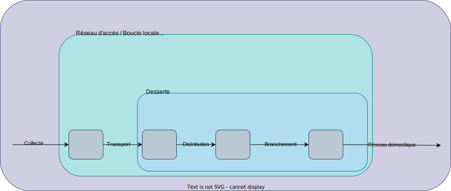

# Etude du réseau d'accès optique en France

1. ## I - Aspects structurels

    1. Question très générale pour commencer : faire les recherches adéquates afin de pouvoir faire
      un schéma faisant apparaître les différents segments du réseau de manière générale :
      collecte, transport, distribution, branchement, desserte, réseau domestique.
      Et indiquer sur votre schéma ce qu’on appelle réseau d’accès. Trouver l’autre nom du réseau d’accès.

        Le `réseau d'accès` est aussi appelé `boucle locale`, il est définit
        par le segment NRO-Abonné.

        

    1. Décrire rapidement les réseaux d’accès xDSL.

        Le terme xDSL est un terme référrant plusieurs technologies dont deux familles
        de technologies étant:

        - La [SDSL (Symmetric Digital Subscriber Line)](https://en.wikipedia.org/wiki/Symmetric_digital_subscriber_line)
        - L'[ADSL (Asymmetric Digital Subscriber Line)](https://www.arcep.fr/la-regulation/grands-dossiers-reseaux-fixes/le-haut-debit-fixe-cable-adsl-vdsl/lacces-haut-debit-via-ladsl.html)

        Les réseaux d'accès xDSL sont des réseaux cuivrés étant principalement soit asymétriques, soit symétriques.

    1. Rechercher les différents acronymes FTTxx et ce qu’ils signifient (jusqu’où arrive la fibre).
        Il n’est pas nécessaire d’être exhaustif.

        - [FTTH `Fiber To The Home`](https://en.wikipedia.org/wiki/Fiber_to_the_x#FTTS,_FTTH_and_FTTB): Approche Réseaux où la fibre arrive à une boxe ou aux murs de la maison d'un particulier.
        - [FTTE `Fiber To The Edge`](https://en.wikipedia.org/wiki/Fiber_to_the_telecom_enclosure): Approche Réseaux éliminant le besoin d'une grille intermédiaire d'interconnexion entre les appareils `edge` et la grille principale du réseau.
        - [FTTB `Fiber To The Building` ou `Fiber To The Business`](https://en.wikipedia.org/wiki/Fiber_to_the_x#FTTS,_FTTH_and_FTTB): Approche Réseaux où la fibre arrive à la limite d'un batiment, la connexion des clients est faite avec des technologies alternatives.

    1. Dans   le   cas   de   la   fibre   optique,   expliquer   ce   qu’est   une   architecture   point   à   point,   et   une architecture point multipoint.

        - Une architecture P2P: C'est une architecture réseau ne nécessitant pas de NRO et est un lien direct FAI-Client. L'architecture de l'infrastructure peut sembler être plus distribuée.
        - Une architecture P2MP: C'est une architecture réseau plus centralisée où un point centrale dessert une multitude d'autres points. Elle se décline en architecture active et passive.

    1. Les boucles locales optiques sont mutualisées (BLOM) ou dédiées (BLOD). Expliquer.
        Dans la suite, on ne s’intéressera pas aux BLOD.

        - [BLOM](https://www.gersnumerique.fr/harmonisation-des-reseaux/architecture-et-terminologie-du-reseau.html): C'est le réseau d'infrastructures (passives) qui permet de connecter l'ensemble d'habitations et d'entreprises d'une zone définie.
        - [BLOD](https://www.arcep.fr/actualites/actualites-et-communiques/detail/n/zonage-fibre-dediee-211021.html): C'est le réseau dédié du FAI au Client, elle peut être considérée comme l'infrastructure privée du FAI et du Client.

            > **Note:**  
            > Il y a aussi cette [source](https://smart-city.cerema.fr/mots-cles/blod).

    1. On considère un réseau GPON.  
        Que veut dire le sigle GPON ?
        Qu’est-ce qu’un réseau GPON ?
        Préciser quelle est la norme des réseaux GPON.

        Le sigle [GPON](https://www.tp-link.com/fr/blog/289/qu-est-ce-que-gpon-et-pourquoi-le-choisir-/) signifie la version
        "grand public" du PON (Passive Optical Network) qui fait partie des infrastructures P2MP, elle est aussi la version au Gigabit.

        Un réseau GPON se compose de l'ONU (Optical Network Unit), l'ODN (Optical Distribution Network) et l'OLT (Optical Line Terminal).

        Ci-dessous la structure typique d'un GPON:

        

        La norme pour les réseaux GPON est la norme [T-G.652](https://www.itu.int/rec/T-REC-G.652-201611-I/en) de l'[ITU](https://www.itu.int/en/Pages/default.aspx)

    1. Faire un schéma représentatif d’un réseau GPON avec : un NRO, plusieurs SRO, plusieurs PBO, plusieurs PTO, des clients.

        Le but est de visualiser l’architecture globale : un NRO peut-il être relié à un seul SRO ou plusieurs, etc.
        Les différents segments de réseau vus question 1 doivent apparaître.
        Pour chaque élément (NRO, SRO, PBO, PTO) donner une description rapide et significative pour vous.

        ```mermaid
        flowchart LR

        NRO --- SRO1[SRO]
        NRO --- SRO2[SRO]
        NRO --- SRO3[SRO]

        SRO1 --- PBOS1[PBO]
        SRO1 --- PB0S2[PBO]
        SRO1 --- PBOS3[PBO]

        SRO2 --- PBOR1[PBO]
        SRO2 --- PBOR2[PBO]
        SRO2 --- PBOR3[PBO]

        SRO3 --- PBOO1[PBO]
        SRO3 --- PBOO2[PBO]
        SRO3 --- PBOO3[PBO]

        PBOS1 --- PTOS1[PTO]
        PBOS1 --- PTOS2[PTO]
        PBOS1 --- PTOS3[PTO]

        PB0S2 --- PTOS4[PTO]
        PB0S2 --- PTOS5[PTO]
        PB0S2 --- PTOS6[PTO]

        PBOS3 --- PTOS7[PTO]
        PBOS3 --- PTOS8[PTO]
        PBOS3 --- PTOS9[PTO]

        PBOR1 --- PTOR1[PTO]
        PBOR1 --- PTOR2[PTO]
        PBOR1 --- PTOR3[PTO]

        PBOR2 --- PTOR4[PTO]
        PBOR2 --- PTOR5[PTO]
        PBOR2 --- PTOR6[PTO]

        PBOR3 --- PTOR7[PTO]
        PBOR3 --- PTOR8[PTO]
        PBOR3 --- PTOR9[PTO]

        PBOO1 --- PTOO1[PTO]
        PBOO1 --- PTOO2[PTO]
        PBOO1 --- PTOO3[PTO]

        PBOO2 --- PTOO4[PTO]
        PBOO2 --- PTOO5[PTO]
        PBOO2 --- PTOO6[PTO]

        PBOO3 --- PTOO7[PTO] & PTOO8[PTO] & PTOO9[PTO]

        PTOS1 --- C1[Client] & C2[Client] & C3[Client]
        PTOS2 --- C4[Client] & C5[Client] & C6[Client]
        PTOS3 --- C7[Client] & C8[Client] & C9[Client]
        PTOS4 --- C10[Client] & C11[Client] & C12[Client]
        PTOS5 --- C13[Client] & C14[Client] & C15[Client]
        PTOS6 --- C16[Client] & C17[Client] & C18[Client]
        PTOS7 --- C19[Client] & C20[Client] & C21[Client]
        PTOS8 --- C22[Client] & C23[Client] & C24[Client]
        PTOS9 --- C25[Client] & C26[Client] & C27[Client]
        PTOR1 --- C28[Client] & C29[Client] & C30[Client]
        PTOR2 --- C31[Client] & C32[Client] & C33[Client]
        PTOR3 --- C34[Client] & C35[Client] & C36[Client]
        PTOR4 --- C37[Client] & C38[Client] & C39[Client]
        PTOR5 --- C40[Client] & C41[Client] & C42[Client]
        PTOR6 --- C43[Client] & C44[Client] & C45[Client]
        PTOR7 --- C46[Client] & C47[Client] & C48[Client]
        PTOR8 --- C49[Client] & C50[Client] & C51[Client]
        PTOR9 --- C52[Client] & C53[Client] & C54[Client]
        PTOO1 --- C55[Client] & C56[Client] & C57[Client]
        PTOO2 --- C58[Client] & C59[Client] & C60[Client]
        PTOO3 --- C61[Client] & C62[Client] & C63[Client]
        PTOO4 --- C64[Client] & C65[Client] & C66[Client]
        PTOO5 --- C67[Client] & C68[Client] & C69[Client]
        PTOO6 --- C70[Client] & C71[Client] & C72[Client]
        PTOO7 --- C73[Client] & C74[Client] & C75[Client]
        PTOO8 --- C76[Client] & C77[Client] & C78[Client]
        PTOO9 --- C79[Client] & C80[Client] & C81[Client]
        ```

        Trouver où se trouvent les PM (Points de mutualisation) sur le schéma et expliquer ce que cela signifie
        (pourquoi on les appelle ainsi).  

        - Les PM (Point de mutualisation) se trouvent entre le NRO et le SRO, ils permettent le partage
            d'une même infrastructure technique par plusieurs opérateurs.

        Chercher ensuite ce qu’est un OLT et préciser sur le schéma où il sera.  

        - Un [OLT](https://www.tp-link.com/fr/blog/289/qu-est-ce-que-gpon-et-pourquoi-le-choisir-/) est l'équipement qui va finir le protocole PON au niveau des équipements centraux.
          Il se retrouvera donc avant le NRO.

        Chercher aussi ce qu’est un ONU et préciser sur le schéma où il sera.

        - Un [ONU](https://www.tp-link.com/fr/blog/289/qu-est-ce-que-gpon-et-pourquoi-le-choisir-/) est l'Unité de réseau optique (Optical Network Unit), il se situe au niveau du client mais juste avant le [CPE](https://www.tp-link.com/fr/blog/289/qu-est-ce-que-gpon-et-pourquoi-le-choisir-/).

    1. Toujours dans le cas d’un réseau GPON, on considère une fibre qui arrive sur un SRO depuis
        le NRO. Quel est l’équipement qui va permettre à partir de cette fibre de desservir plusieurs PBO ?

        - L'équipement qui va nous permettre de faire la connexion sera un coupleur.

    1. On distingue les zones de déploiement très denses (ZTD) des zones de déploiement moins
        denses (ZMD). De plus, dans les ZTD sont définies des zones de basse densité, ZTD-BD. Trouver
        comment, en France, se répartit le nombre total de lignes entre les trois types de zones.

        - ZTD:
          - PM: PM multi-fibres en pied d'immeubles, ou PM de 300 lignes en mono-fibre
        - ZMD:
          - PM: 1000 lignes en mono-fibre
        - ZTD-BD:
          - PM:

        > **Note:**  
        > Source: [lafibre.info](https://lafibre.info/arcep/differences-ztd-zmd/msg252260/#msg252260)

    1. Ordres de grandeur :

        Un NRO peut desservir combien d’abonnés ?
        Le segment de fibre NRO-SRO peut faire jusqu’à quelle longueur en ZTD ? Et en ZMD ?
        Un PM peut desservir combien de lignes ?

        Un NRO peut desservir entre [24 000 et 67 000](https://fr.wikipedia.org/wiki/N%C5%93ud_de_raccordement_optique#NRO_Orange) d'abonnés.

    1. Expliciter ce que veulent dire le sens montant et le sens descendant (utiliser votre schéma pour être précis).

        ```mermaid
        flowchart LR

        Client -- Sens Montant --> FAI
        FAI -- Sens Descendant --> Client
        ```

    1. En réseau FTTH, la desserte peut être mono-fibre (1 seule fibre est affectée par client)  ou
        multi-fibres (pour chaque client, 1 fibre est dédiée à chaque opérateur).  
        Faire   un   schéma   au   niveau   du   PM   avec   des   fibres   arrivant   d’un   coté,   provenant   de   plusieurs
        opérateurs, et des fibres repartant de l’autre coté, vers plusieurs clients, lorsque la desserte est mono-
        fibre puis recommencer lorsque la desserte est multi-fibres.  
        La desserte multi-fibres est intéressante lorsqu’un abonné change d’opérateur. Expliquer.

        ```mermaid
        ---
        title: Schéma au niveau du PM lors d'une desserte mono-fibre
        ---
        flowchart LR

        FAI1[FAI 1] -- Fibre 1 --- PM
        FAI2[FAI 2] -- Fibre 2 --- PM

        PM -- Fibre 1 --- C1[Client 1]
        PM -- Fibre 2 --- C2[Client 2]
        ```

        ```mermaid
        ---
        title: Schéma au niveau du PM lors d'une desserte multi-fibre
        ---
        flowchart LR

        FAI1[FAI 1] -- Fibre 1 --- PM
        FAI2[FAI 2] -- Fibre 2 --- PM
        FAI1[FAI 1] -- Fibre 3 --- PM
        FAI2[FAI 2] -- Fibre 4 --- PM

        PM -- Fibre 1 & 2 --- C1[Client 1]
        PM -- Fibre 3 & 4 --- C2[Client 2]
        ```

    1. En réseau FTTH, il existe différentes situations réglementaires :

        En ZTD, cas des immeubles de plus de 12 logements
        En ZTD, cas général des immeubles de moins de 12 logements
        En ZTD, cas particulier des immeubles isolés de moins de 12 logements
        En ZTD, poches de basse densité
        En ZMD

        Pour chacune de ces 5 situations, trouver où sera situé le PM, ainsi que le PBO, combien de lignes le
        PM peut desservir, et si la desserte est  mono-fibre ou multi-fibres.

        Pour les situations où la desserte est  multi-fibres, trouver pourquoi.

        - ZTD:
          - < 12 logements: Desserte monofibre avec PM jusqu'à 300 fibres.
          - \> 12 logements: Desserte multifibre avec PM jusqu'à 100 fibres.
          - isolé de < 12 logements: Desserte monofibre, à nouveau jusqu'à 300 fibres.
        - ZMD: Desserte monofibre, jusqu'à 1000 fibres.

    1. Dans quel type de situation la fibre multimode est-elle utilisée ?
        Trouver également les différentes qualités de fibres multimodes qui existent.

        La fibre multimode sera utilisée durant des situations où [la communication se fait sur une courte distance](https://community.fs.com/fr/article/advantages-and-disadvantages-of-multimode-fiber.html).

2. ## II - Spécifications télécoms du réseau GPON

    1. Quels sont les débits nominaux possibles dans le sens descendant ? Dans le sens montant ?

        - Sens Descendant: [1244.160 Mbits/s](https://moodle-but.iutbeziers.fr/moodle/pluginfile.php/30665/mod_resource/content/1/T-REC-G.984.2-201908-I!!PDF-E.pdf#page=3) et [2 488.320 Mbit/s](https://moodle-but.iutbeziers.fr/moodle/pluginfile.php/30665/mod_resource/content/1/T-REC-G.984.2-201908-I!!PDF-E.pdf#page=3)
        - Sens Montant: [155.520 Mbit/s](https://moodle-but.iutbeziers.fr/moodle/pluginfile.php/30665/mod_resource/content/1/T-REC-G.984.2-201908-I!!PDF-E.pdf#page=3), [622.080 Mbit/s](https://moodle-but.iutbeziers.fr/moodle/pluginfile.php/30665/mod_resource/content/1/T-REC-G.984.2-201908-I!!PDF-E.pdf#page=3), [1 244.160 Mbit/s](https://moodle-but.iutbeziers.fr/moodle/pluginfile.php/30665/mod_resource/content/1/T-REC-G.984.2-201908-I!!PDF-E.pdf#page=3) et [2 488.320 Mbit/s](https://moodle-but.iutbeziers.fr/moodle/pluginfile.php/30665/mod_resource/content/1/T-REC-G.984.2-201908-I!!PDF-E.pdf#page=3)

    1. En vous appuyant sur la question précédente, donner un exemple de transmission symétrique et de transmission asymétrique.

        - En ce qui concerne la transmission symétrique, on peut qualifier la [conversation téléphonique](https://en.wikipedia.org/wiki/Telecommunications).
        - En ce qui concerne la transmission asymétrique, on peut qualifier les systèmes de communications distribués tels que les talkie-walkie.

    1. Quelle est la situation la plus fréquemment rencontrée ?

        La situation la plus fréquemment rencontrée est la transmission asymétrique.

    1. Quelles sont les deux méthodes possibles pour transmettre dans les deux sens ?

        Pour transmettre dans les deux sens, on peut faire en sorte d'utiliser des
        canaux de transmission différents.

    1. Quelle est la méthode de codage des bits ? Qu’est-ce que cela signifie en termes de signal ?

        La méthode de codage est du [NRZ](https://moodle-but.iutbeziers.fr/moodle/pluginfile.php/30665/mod_resource/content/1/T-REC-G.984.2-201908-I!!PDF-E.pdf#%5B%7B%22num%22%3A72%2C%22gen%22%3A0%7D%2C%7B%22name%22%3A%22XYZ%22%7D%2C54%2C379%2C0%5D)
        où le niveau haut est égal à 1 et le niveau bas est égal à 2.

    1. Quelle est la plage de longueurs d’onde réservée au sens descendant ? Donner aussi la valeur médiane.
        Calculer la bande de fréquences correspondante (en prenant un indice égal à 1).

        Le sens descendant:

        - Une fibre: [1480-1500 nm](https://moodle-but.iutbeziers.fr/moodle/pluginfile.php/30665/mod_resource/content/1/T-REC-G.984.2-201908-I!!PDF-E.pdf#%5B%7B%22num%22%3A72%2C%22gen%22%3A0%7D%2C%7B%22name%22%3A%22XYZ%22%7D%2C54%2C240%2C0%5D)
            - Valeur médiane: 1490 nm
        - Deux fibres: [1260-1360 nm](https://moodle-but.iutbeziers.fr/moodle/pluginfile.php/30665/mod_resource/content/1/T-REC-G.984.2-201908-I!!PDF-E.pdf#%5B%7B%22num%22%3A72%2C%22gen%22%3A0%7D%2C%7B%22name%22%3A%22XYZ%22%7D%2C54%2C240%2C0%5D)
            - Valeur médiane: 1310 nm

    1. Quelle est la plage de longueurs d’onde réservée au sens montant ? Donner aussi la valeur médiane.
        Donner la bande de fréquences correspondante (en prenant un indice égal à 1).

        Le sens montant:

        - Deux fibres: [1260-1360 nm](https://moodle-but.iutbeziers.fr/moodle/pluginfile.php/30665/mod_resource/content/1/T-REC-G.984.2-201908-I!!PDF-E.pdf#%5B%7B%22num%22%3A72%2C%22gen%22%3A0%7D%2C%7B%22name%22%3A%22XYZ%22%7D%2C54%2C151%2C0%5D)
            - Valeur médiane: 1310 nm

    1. Citer la norme qui définit les fibres qui peuvent être utilisées dans un réseau GPON (d’après la norme ITU-T G.984.2).

        C'est la norme [G.652](https://moodle-but.iutbeziers.fr/moodle/pluginfile.php/30665/mod_resource/content/1/T-REC-G.984.2-201908-I!!PDF-E.pdf#page=16).

    1. Ces fibres peuvent être du type SM, MM ou les deux ?

        C'est du [SM](https://moodle-but.iutbeziers.fr/moodle/pluginfile.php/30665/mod_resource/content/1/T-REC-G.984.2-201908-I!!PDF-E.pdf#%5B%7B%22num%22%3A59%2C%22gen%22%3A0%7D%2C%7B%22name%22%3A%22XYZ%22%7D%2C54%2C718%2C0%5D).

    1. Dans la norme ITU-T G.984.2 on lit qu’en sortie de l’OLT, dans le sens descendant, l’ORL doit être d’au moins 32 dB.
        Expliquer ce que cela veut dire. Soyez précis. Traduire le nombre en pourcentage de puissances.

        Cela veut dire que pour avoir une perte minimale du retour Optique, [on doit recevoir plus de 32dB en entrée](https://moodle-but.iutbeziers.fr/moodle/pluginfile.php/30665/mod_resource/content/1/T-REC-G.984.2-201908-I!!PDF-E.pdf#page=16).

    1. Quelle est la distance couverte maximale dans un réseau GPON ?

        La distance maximale entre les points de S/R et R/S est de [20 km](https://moodle-but.iutbeziers.fr/moodle/pluginfile.php/30665/mod_resource/content/1/T-REC-G.984.2-201908-I!!PDF-E.pdf#page=16).

    1. Il existe 3 classes d’atténuation, les classes A, B et C. Selon la classe, la plage d’atténuation n’est pas la même.
        Noter les valeurs et expliquer ce qu’elles veulent dire.

        - Classe A: [5-20](https://moodle-but.iutbeziers.fr/moodle/pluginfile.php/30665/mod_resource/content/1/T-REC-G.984.2-201908-I!!PDF-E.pdf#page=16)
        - Classe B: [10-25](https://moodle-but.iutbeziers.fr/moodle/pluginfile.php/30665/mod_resource/content/1/T-REC-G.984.2-201908-I!!PDF-E.pdf#page=16)
        - Classe C: [15-30](https://moodle-but.iutbeziers.fr/moodle/pluginfile.php/30665/mod_resource/content/1/T-REC-G.984.2-201908-I!!PDF-E.pdf#page=16)

        Les classes d'atténuation sont présentes afin de différencier certains types de systèmes (voir [IUT-G.982](https://www.itu.int/rec/dologin_pub.asp?lang=e&id=T-REC-G.982-199611-I!!PDF-E&type=items) section 11.3).

    1. Dans la norme ITU-T G.984.2 on lit par exemple les spécifications suivantes : en sortie de l’OLT, dans le sens descendant, et pour un débit de 1 244 Mbits/s.
        Interpréter ce que ces données veulent dire (il n’est pas nécessaire de convertir en W).

        Ces spécifications nous informent des cas spécifiques d'un lien, en l'occurence du lien sortant de l'OLT,
        de son sens ainsi que son débit afin de s'assurer d'avoir une valeur hypothétique mais concrète
        dans le sens que le lecteur sache de quelle valeur l'on parle et de pouvoir suivre correctement
        les informations supplémentaires données.

    1. Toujours dans le sens descendant et pour un débit de 1244 Mbits/s, lorsqu’on lit que la sensibilité minimum du récepteur (au niveau de l’ONU) est de -25 dBm, qu’est-ce que cela veut dire ?
        Ici la conversion dans l’unité adéquate est demandée.

    1. Définir le "Bit error ratio" (ne pas confondre avec le Bit error rate).
        Comment doit-il être pour respecter la norme ?
        Donner une réponse claire si vous avez compris.

        C'est le "pourcentage" d'erreur et non sa fréquence d'apparition.  
        Afin de [respecter la norme](https://moodle-but.iutbeziers.fr/moodle/pluginfile.php/30665/mod_resource/content/1/T-REC-G.984.2-201908-I!!PDF-E.pdf#page=18), il doit être inférieur à $10^{-10}$ et
        est calculé en divisant le nombre de bits erronés au nombre de bits total.

3. ## III - Perspectives d'évolution

## Sources

- [](https://www.fftelecoms.org/nos-travaux-et-champs-dactions/reseaux/tout-savoir-deploiement-fibre-optique-ftth/)
- [](https://www.arcep.fr/cartes-et-donnees/nos-publications-chiffrees/qualite-des-reseaux-ftth/derniers-chiffres.html)

## Copyright &copy; 2023 Alexis Opolka - All Rights Reserved
