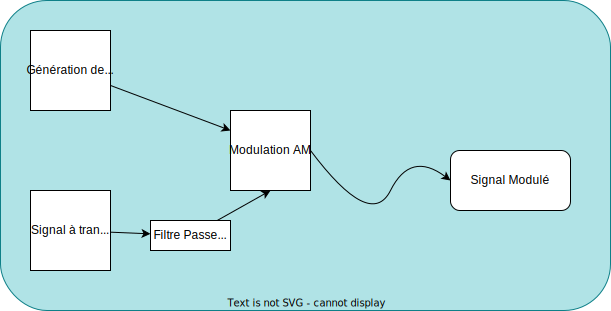

# R314 - Analyse de Fourier

## Cours

### Types de signaux

- #### Signal aléatoire

  Signal dont l'évolution dans le temps ne peut pas être prédite.

  > **Note**:  
  > Exemple: bruit.

- #### Signal déterministe

  Signal dont l'évolution dans le temps peut être prédite.

  > **Note**:  
  > Exemple: signal sinusoïdal.

- #### Signal continu

  Signal dont la valeur peut être déterminée à tout instant.

- #### Signal discret

  signal dont la valeur n'est connue qu'à des instants privilégiés.

  > **Note**:  
  > Exemple: signal échantillonné

### Quelques signaux typiques

- #### Impulsion de Dirac

  Signal non réalisable (mais on peut s'en approcher !).  
  Il peut être modélisé par un signal porte dont la largeur tend
  vers 0 et dont l'amplitude tend vers l'infini.
  C'est un signal très bref mais à très forte énergie.

  C'est la limite d'un signal porte quand $T \rArr \infty$

  Dans un système électrique, l'impulsion de dirac peut être
  matérialisée comme une tension très haute durant un moment très bref.

- #### Fonction d'Heaviside (ou fonction échelon unitaire)

  Nul pour les temps négatifs et de valeur 1 pour les temps positifs.

- #### Signaux périodiques

  Signaux répétitifs (à chaque période T).

  - Sinus
  - Triangle
  - Rectangle
  - Dent de Scie

- #### Signal sinusoïdal (un signal particulièrement important)

  $x(t) = A \sin(\omega t + \varphi)$

  > **Note**:  
  > $\omega t + \varphi$ est la phase du signal

  > **Note**:  
  >
  > - $\omega = 2 \pi f$ en rad/s ou $\text{rad}*\text{s}^{-1}$
  >
  > - $f = \frac{1}{T}$
  >
  >   La période T d'un signal est le plus petit / court motif qui se répète.
  > - Valeur moyenne: $X = \frac{1}{T}\int\limits_0^T x(t)dt = 0$
  >
  >   La valeur moyenne d'un signal sinusoïdal est nulle.
  >
  > - Valeur efficace: $X_{eff} = \sqrt{\frac{1}{T}\int\limits_0^T x^2(t) dt = \frac{A}{\sqrt{2}}}$

### Représentation d'un signal

- Un signal quelconque peut être représenté de deux façons:

  - #### représentation temporelle

    Il s'agit de la représentation de son évolution en fonction du temps

  - #### représentation fréquentielle

    Il s'agit de son évolution en fonction de sa fréquence

    La représentation fréquentielle nécessite 2 courbes, le spectre
    d'amplitude et du spectre de phase.

    Dans le cas d'un signal quelconque, on va devoir faire une
    [décomposition en série de Fourier](#décomposition-en-série-de-fourier)

### Décomposition en série de Fourier

> **Note**:  
> Introduite par Joseph Fourier en 1822.

$x(t)$: Signal périodique de période $T$, de fréquence $f$ = $\frac{1}{T}$
et intégrable sur l'intervalle $T$.

On peut toujours remplacer $x(t)$ par son développement en série de Fourier qui s'écrit comme suit:

$$x(t) = a_0 \sum_{n=1}^{+\infty} (a_n \cos(2 \pi \frac{nt}{T}) + b_n \sin(2 \pi \frac{nt}{T}))$$

Ce développement est constitué de:

- Une composante continue $a_0$ qui constitue la **valeur moyenne par défaut**.
- Un ensemble ...

En posant $\omega = \frac{2 \pi}{T}$

$$\text{...}$$

Pour obtenir:

- $a_0$ = $\frac{1}{T} \int\limits_{0}^{T} x(t) dt$, C'est la valeur moyenne de x(t).
- $a_n$ = $\frac{2}{T} \int\limits_{0}^{T} x(t) \cos(\frac{2 \pi nt}{T}) dt$
- $b_n$ = $\frac{2}{T} \int\limits_{0}^{T} x(t) \sin(\frac{2 \pi nt}{T}) dt$

## TD 1

1. Exercice 1
   - Déterminer:

     - ### Amplitude

      4

     - ### Fréquence

       $f = \frac{w}{2\pi} = \frac{6283}{6.283}$ = 1000 Hz

     - ### Période

       T = $\frac{1}{f} = \frac{1}{1000} = 1$ms

     - ### Pulsation

       6283 rad/s

     - ### Phase

       $6283t + 0.785$ rad

       - #### Phase à l'origine

         $0.785$

   - Déterminer:

     - ### Valeur Moyenne

       $X = X = 0$

       > **Note**:  
       > Car c'est un signal sinusoidal.

     - ### Valeur efficace

       $X_{eff} = \sqrt{\frac{1}{T} \times \int\limits_0^{T} x^2(t) dt}$

       Pour un signal sinus $X_{eff} = \frac{A}{\sqrt{2}} = 2\sqrt{2} = 2.82$

   - Pourrait-on l'entendre ?

     Oui car il est dans la plage audible de l'être humain.

     > **Note**:  
     > La plage audible de l'être humain est: [20 Hz, 20 kHz]

1. Exercice 2

TODO: Copy Spectres from papers
TODO: Following the workflow required for R305, R306 and R314.

La transposition spectrale est fondamentale car elle permet le
multiplexage des signaux sur différents spectres.

## Cours (suite)

Dans le cas:

- d'une fonction paire, les coefficients $b_n$ sont nuls
- d'une fonction impaire, les coefficients $a_n$ sont nuls

$\sin$ et $\cos$ sont à la même vitesse.
Ils n'ont pas non plus de phase à l'origine.

$$x_n(t) = a_n \cos(n \omega t) + b_n \cos(n \omega t)  \rArr x_n(t) A_n \cos(n \omega t - \varphi_n) $$

avec:

$$A_n = \sqrt{a_n^2 + b_n^2}$$
$$\cos(\varphi_n) = \frac{a_n}{\sqrt{a_n^2 + b_n^2}}$$
$$\sin(\varphi_n) = \frac{b_n}{\sqrt{a_n^2 + b_n^2}}$$

Vérifier que les cos et sin sont à la même fréquence  
On doit trouver $\varphi_n$ et non $- \varphi_n$, sinon
il faut inclure le signe, dans le calcul.

### Puissance moyenne d'un signal périodique

La puissance: $\frac{\text{L'énergie}}{\text{Le temps}}$

La puissance moyenne est une caractéristique importante d'un signal
périodique car elle caractérise l'énergie de ce signal.

\+ Puissance -> + distance parcourure

$$P = \frac{1}{T}\int\limits_0^T x^2(t) dt$$

- La puissance moyenne est le carré de la valeur efficace
- Pour un signal sinusoidal:

  - $x(t) = A \sin(\omega t + \varphi)$
  - $P = (\frac{A}{\sqrt{2}})^2 = \frac{A^2}{2}$

- Pour une composante continue:

  - $x(t) = a_0$
  - $P = a_0^2$

#### Formule de Bessel-Parseval

$$ \frac{1}{T} \int\limits_0^T x^2(t) dt = a_0^2 + \frac{1}{2} \sum_{n=1}^{\infty} (a_n^2 + b_n^2)$$

où:

- $$\frac{1}{T} \int\limits_0^T x^2(t) dt \text{: Puissance moyenne du signal (d'origine)}$$
- $$a_0^2 \text{: Puissance composante continue}$$

- $$\sum_{n=1}^{\infty} (a_n^2 + b_n^2)\text{: Somme des puissances moyennes des harmoniques}$$

On veut toujours réduire la bande passante afin de faire
passer plusieurs signaux en même temps.

## TD 2

1. Exercice 1

    1. Mettre ces signaux sous la forme:

          $$x(t) = A.\cos(\omega t - \varphi)$$

        - $x_1(t) = 2.\sin(200 \pi t)$

          $0 * \cos(200 \pi t) + 2 \sin(200 \pi t)$

          - $A_n = 2$
          - $\cos(\varphi_n) = \frac{0}{2} = 0$
          - $\sin(\varphi_n) = \frac{2}{2} = 1$
          - $\varphi = \frac{\pi}{2}$

          Donc $x_1(t) = 2 \cos(200 \pi t - \frac{\pi}{2})$.

        - $x_2(t) = 2.\cos(200 \pi t) - 3.\sin(200 \pi t)$

          - $A_n = \sqrt{a_n^2 + b_n^2} = \sqrt{2^2 + (-3)^2} = \sqrt{13}$
          - $\cos(\varphi_n) = \frac{2}{\sqrt{13}} = 0.55$
          - $\sin(\varphi_n) = \frac{-3}{\sqrt{13}} = -0.83$
          - $\varphi = \arccos(0.6) = 0.98$ et $\arcsin(-0.83) = -0.98$

          Donc $x_2(t) = \sqrt{13} \cos(200 \pi t + 0.98)$.

        - $x_3(t) = - \cos(100 \pi t)$

          $-1 \cos(100 \pi t) + 0 * \cos(100 \pi t)$

          - $A_n = \sqrt{a_n^2 + b_n^2} = \sqrt{1} = 1$
          - $\cos(\varphi_n) = \frac{-1}{1} = -1$
          - $\sin(\varphi_n) = \frac{0}{1} = 0$
          - $\varphi = 3.1416 = \pi$

          Donc $x_3(t) = \cos(100 \pi t - \pi)$.

    1. Pour chacun de ces signaux, tracer le spectre d'amplitude et le spectre de phase.

2. Exercice 2

    1. Représenter graphiquement l'évolution temporelle de cette fonction
    2. Cette fonction est-elle paire ?
    3. Cette fonction est-elle impaire ?
    4. Calculer le développement en série de Fourier de cette fonction

        $a_n$ = $\frac{2}{4} \int\limits_0^4 x(t) \times \cos(\frac{2 \pi nt}{4}) dt$  
        $= [(\int\limits_0^2 \times 1 \times \cos(\frac{2\pi nt}{2})) + (\int\limits_2^4 \times 0 \times \cos(\frac{2\pi nt}{4}))]$

        $a_n = \frac{1}{n \pi} \sin(n \pi)$

        $b_n = \frac{2}{T} \int\limits_0^T x(t) \sin(\frac{2 \pi n}{T}t) dt$  
        $= \frac{1}{2} \int \limits_0^4 x(t) \sin(\frac{\pi n}{2}t) dt$  
        $= \frac{1}{2} [- \frac{2}{n \pi} \cos(\frac{n \pi}{2}t)]_0^2$  
        $= - \frac{1}{n \pi} [ \cos(\frac{n \pi}{2}t)]_0^2$  
        $= - \frac{1}{n \pi} \times [cos(n \pi) - 1]$  
        $= \frac{1}{n \pi} \times [1 - \cos(n \pi)]$

        - Si n est pair: $b_n = 0$
        - Si n est impair: $b_n = \frac{2}{n \pi}$

        $x(t) = \frac{1}{2} + \sum_{n = 1}^{+ \infty} + ( 0 + \frac{1}{n \pi} \times (1 - \cos(n \pi) \times \sin(\frac{2 \pi nt}{T})))$  
        $x(t) = \frac{1}{2} + \frac{2}{\pi} \times \sin(\frac{2}{\pi}t) + \frac{2}{3 \pi} \times \sin(\frac{3\pi}{2}t) + \frac{2}{5 \pi} \times \sin(\frac{5 \pi}{2} t) + ...$

    5. Réécrire ce développement en utilisant des termes de la forme:

       $$x_n(t) = A_n . \cos(n \omega t - \varphi_n) $$

       On fait donc:

       - $A_n = \sqrt{a_n^2 + b_n^2}$  
         $= \sqrt{0^2 + \frac{2}{\pi}^2}$  
         $= \sqrt{\frac{2}{\pi}^2}$
         $=  \frac{2}{\pi}$

       - $cos(\varphi_n) = \frac{a_n}{\sqrt{a_n^2 + b_n^2}}$  
         $= \frac{0}{A_n} = 0$

       - $sin(\varphi_n) = \frac{b_n}{\sqrt{a_n^2 + b_n^2}}$  
         $= \frac{\frac{2}{\pi}}{\frac{2}{\pi}} = 1$

       On obtient:

       - $a_n = 0$
       - $b_n = \frac{2}{\pi}$
       - $\varphi_n = \frac{\pi}{2}$

       Ce qui fait que:

       $$x_n(t) = \frac{2}{\pi} \cos(\frac{\pi}{2}t - \frac{\pi}{2})$$

    6. Tracer le spectre d'amplitude ainsi que le spectre de phase de cette fonction.

       $\omega t = 2 \pi f$  
       $f = \frac{\omega}{2 \pi}$  

        

        

## Cours (suite pt.2)

### Signaux non périodiques

- #### Analyse des signaux non périodiques

  - Constat: plus la période T d'un signal est grande, plus les raies de sa représentation spectrale sont "serrés".
  - Un signal non périodique peut être assimilé à un signal périodique de période infinie. Dans ce cas, le spectre obtenu est continu.

#### Transformation de Fourier

- Elle permet d'obtenir la représentation fréquentielle d'un signal non périodique.
- La transformée d'une fonction $x(t)$ est donnée par:

  $$X(f) = \int\limits_{- \infty}^{+ \infty} x(t) . e^{-i2 \pi f t} . dt $$

- Le graphe $|X(f)|$ représente le spectre d'amplitude
- Le graphe $arg(X(f))$ représente le spectre de phase

> **Rappel**:
> $$ \text{La formule d'Euler: } e^{ix} = \cos(x) + i.\sin(x)$$

- Si $x(t)$ est **pair**:

    $$X(f) = 2 \int\limits_0^{+ \infty} x(t).\cos(2 \pi ft).dt $$

- Si $x(t)$ est **impair**:

    $$X(f) = -2i \int\limits_0^{+ \infty} x(t).\cos() $$

##### Exemple de calcul direct: soit à calculer le transformée de Fourier de la fonction porte

...

### Transformation de Fourier inverse

$$x(t) = \int\limits_{- \infty}^{+ \infty} X(f).e^{i2 \pi ft}.df $$

## TD 3

1. Exercice 1

    1. Rappeler la formulation de la série de Fourier calculée

         $$x(t) = a_0 \sum_{n=1}^{+\infty} (a_n \cos(2 \pi \frac{nt}{T}) + b_n \sin(2 \pi \frac{nt}{T}))$$

         $$x(t) = \frac{1}{2} + \frac{2}{\pi} \sin(\frac{\pi}{2} t) + \frac{2}{3 \pi} \sin(\frac{3 \pi}{2} t) + \frac{2}{5 \pi} \sin(\frac{5 \pi}{2} t) + \frac{2}{7 \pi} \sin(\frac{7 \pi}{2} t) + ...$$

    1. On souhaite transmettre ce signal à travers un canal de transmission.
        La décomposition en série de Fourier donnant une infinité d'harmoniques, nous considèrerons que les harmoniques
        dont l'amplitude est inférieure à 0.05 ont un effet négligeable. La série pourra donc être tronquée.
        Indiquer alors quels harmoniques doivent être transmis ?

        - $\frac{2}{11 \pi} = 0.058$
        - $\frac{2}{ 13 \pi} = 0.049$

        $$x(t) = \frac{1}{2} + \frac{2}{\pi} \sin(\frac{\pi}{2} t) + \frac{2}{3 \pi} \sin(\frac{3 \pi}{2} t) + \frac{2}{5 \pi} \sin(\frac{5 \pi}{2} t) + \frac{2}{7 \pi} \sin(\frac{7 \pi}{2} t) + \frac{2}{9 \pi} \sin(\frac{9 \pi}{2} t) + \frac{2}{11 \pi} \sin(\frac{11 \pi}{2} t)$$

        On tronque la série et on s'arrête à $h_{11}$.

    1. Quelle est alors la largeur de spectre de ce signal ?

        $\frac{11 \pi}{2} = 2 \pi f_{max} \lrArr f_{max} = \frac{11}{4} = 2.75$ Hz

        On occupe donc une BP de l'ordre de 3 Hz.

    1. Pour la transmission de ce signal, nous utiliserons la technique de modulation d'amplitude. Expliquer ce principe de transmission.

        MODULATION AM

    1. Tracer le spectre du signal modulé. On notera $F_p$ la fréquence de la porteuse utilisée.

        TODO: Tracer le spectre du signal modulé autour de $F_p$.

    1. Quelle est la fréquence minimale de cette porteuse ?

        $F_p > 2.75$ Hz
        $F_{p_{min}} = 3 Hz$

    1. Quelle est la largeur de spectre du signal modulé ?

        Largeur de spectre du signal modulé: $2 \times 2.75 = 5.5$ Hz.

    1. Pour éviter toute interférence avec les canaux adjacents (canaux transmis à des fréquences proches)
        il convient, avant de procéder à la modulation, de supprimer les haromniques négligés.
        Quelle fonction permet de réaliser cette action ? Donner ses caractéristiques.

        Filtrage: passe bas  
        $f_{h_{11}} < F_c < f_{h_{13}}$

    1. Enfin, donner un schéma de principe général de la transmission de ce signal.

        

    1. Pour information: voici la répartition légale (en Europe) des canaux radiophoniques en modulation d'amplitude (AM)
        dans la bande 5200 kHz - 1600 kHz.
        Cette bande est, de nos jours, très peu utilisée au profit de la modulation de fréquence (FM) dans la bande
        88 MHz - 108 MHz, en attendant la généralisation des modes de transmission numériques.

## TD 4

1. Exercice 1

    Soit la fonction périodique $x(t)$ dont l'évolution temporelle est représentée sur la figure suivante:

    $x(t) = \frac{A}{T} . t$ entre les instants $t = 0$ et $t = T$

    1. Calculer la valeur moyenne de ce signal.

        valeur moyenne de $x(t)$:

        - $\bar{x} = \frac{1}{T} \int\limits_0^T x(t) . dt = \frac{1}{T} \int\limits_0^T t dt$  
          $= \frac{A}{T^2} \int\limits_0^T t.dt$
          $= \frac{A}{T^2} [\frac{t^2}{2}]_0^T$
          $= \frac{A}{T^2} [\frac{T^2}{2} - 0] = \frac{A}{2}$

    2. La décomposition en série de Fourier permet d'aboutir à la forme suivante:

        $$x(t) = \frac{A}{2} - \frac{A}{\pi} \sin( \omega t) - \frac{A}{2 \pi} \sin(2 \omega t) - \frac{A}{3 \pi} \sin(3 \omega t) - ...$$

    3. Calculer la puissance véhiculée par la composante continue ainsi que par chacun des 5 premiers harmoniques.

        $P_0 = \frac{A}{\sqrt{2}} = (\frac{A}{2})^2 = \frac{A^2}{4}$  
        $P_{h_1} = \frac{(\frac{A}{\pi})^2}{2} = \frac{A^2}{2 \pi^2}$  
        $P_{h_2} = \frac{(\frac{A}{2 \pi})^2}{2} = \frac{A^2}{8 \pi^2}$  
        $P_{h_3} = \frac{(\frac{A}{3 \pi})^2}{2} = \frac{A^2}{18 \pi^2}$  
        $P_{h_4} = \frac{(\frac{A}{4 \pi})^2}{2} = \frac{A^2}{32 \pi^2}$  
        $P_{h_5} = \frac{(\frac{A}{5 \pi})^2}{2} = \frac{A^2}{50 \pi^2}$  

    4. On souhaite véhiculer ce signal à travers un canal de transmission. On considère que pour éviter de dénaturer
        ce signal, il est nécessaire de transmettre au moins 92% de sa puissance. Déterminer alors la bande passante nécessaire
        sachant que sa période T est égale 1 $\mu$s et que son amplitude $A$ vaut 1.

        - A = 1
        - T = 1 $\mu$s

        Calculons la puissance moyenne du signal $x(t)$:

        $P_{moy} = \frac{1}{T} \int \limits_0^T x^2(t) dt$  
        $P_{moy} = \frac{1}{T} \int  \limits_0^T (\frac{A}{T} \times t)^2 dt$
        $= \frac{1}{T} \int \limits_0^T \frac{A^2}{T^2} t^2 dt$  
        $= \frac{A^2}{T^3} \int \limits_0^T t^2 . dt$
        $= \frac{A^2}{T^3} [\frac{1}{3} t^3]_0^T$  
        $= \frac{A^2}{3 T^3} [T^3 - 0]$

        $P_{moy} = \frac{A^2}{3} = \frac{1}{3}$ W

        - $P_0 = \frac{1}{4}$ W
        - $P_1 = 0.05$ W
        - $P_2 = 0.012$ W
        - $P_3 = 0.005$ W
        - $P_4 = 0.003$ W
        - $P_5 = 0.002$ W

2. Exercice 2

    Soit la fonction non périodique $y(t)$ dont l'évolution temporelle est représentée sur la figure suivante:

    1. Cette fonction est-elle paire ? Est-elle impaire ?

        s

    2. Rappeler l'expression de sa transformée de Fourier.

        s

    3. Calculer sa transformée de Fourier.

        s

    4. Tracer l'allure de sa représentation spectrale.

        s

## Copyright &copy; 2023 Alexis Opolka - All Rights Reserved
