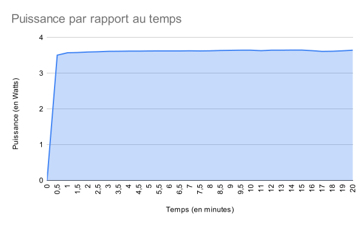
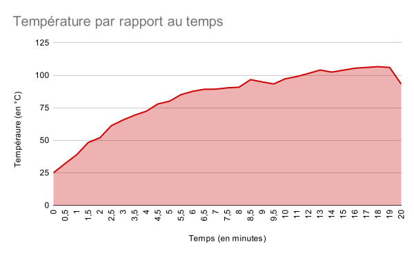
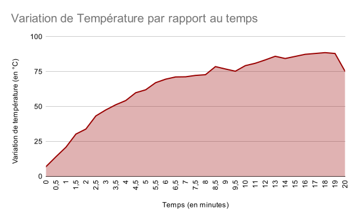
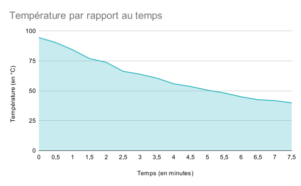

# TP 1 de R320

1. ## Stockage de l'énergie

    1. Relever les caractéristiques de la batterie

        | Capacité           | Entrée      | Sortie      | Charge |
        | ------------------ | ----------- | ----------- | ------ |
        | 4000 mAh - 14.8 Wh | 5V, 1000 mA | 5V, 1000 mA | 5h     |

    1. Faire le lien avec les notions physiques étudiées dans cette ressource.

        On peut voir que l'énergie de la batterie, que l'on considère système isolé,
        est transformée entre énergie chimique et énergie électrique et inversement.

        Donc $14.8Wh \rArr 14.8\times3600 = 53 280 \text{ J}$  
        Et on a 5 Watts en sortie.

1. ## Charge d'une batterie

    1. Compte tenu des caractéristiques de charge (5V, 1A), pendant combien de temps faut-il charger la batterie pour emmagasiner les 7000 J requis pour ce TP ?

        $5h \rArr 60\times5 = 300 \text{ min}$  
        $\frac{300 \times 7000}{53 280} = 39.41$ min

    2. D’après les caractéristiques de la batterie, quelle est la charge maximale théorique que pourrait emmagasiner la batterie. Exprimer cette charge en Coulomb.

        La capacité maximale théorique de la batterie est de:

          - $4 000 \text{ mAh} * 3600 = 14 400$ c

    3. En déduire l’énergie maximale théorique que peut délivrer la batterie en Joule et en Watt-heures.

          - $5 * 4 = 20$ Wh
          - $72 000$ J

    4. En déduire le temps nécessaire pour la charger entièrement.

        $\frac{300 \times 72 000}{53 280} = 405\text{ min} \rArr 6.75\text{h} \rArr$~$7h$

    5. D’après les caractéristiques de la batterie, quelle est l’énergie maximale qu’elle peut réellement restituer ?

    6. Expliquer l’écart avec la théorie.

    7. A partir des caractéristiques de la batterie, déduire la valeur de la puissance maximale qu’elle peut délivrer.

    8. Régler l’alimentation de laboratoire Rhodes et Schwarz pour délivrer 5V et au moins 1 A.

        $$\text{\bf SURTOUT NE PAS BRANCHER LE PORT MICRO-USB SUR LA BATTERIE.}$$

    9. Préparer la connectique coté alimentation faire très attention à la polarité !

        $$\text{\bf MONTRER LE CÂBLAGE À L’ENSEIGNANT QUI VOUS AUTORISERA À BRANCHER LE PORT MICRO USB.}$$

    10. Relever la puissance effectivement envoyée à la batterie par l’alimentation de laboratoire.

    11. Dans ces conditions, déterminer le nouveau temps nécessaire pour charger la batterie avec 7000 J.

    12. Programmer un timer sur votre téléphone et laisser à la batterie le temps d’emmagasiner les 7000 J.

1. ## Conversion de l'énergie chimique d'une batterie

    1. En vous basant sur les caractéristiques de la batterie et de la résistance, montrer que cette batterie peut être branchée sur la résistance sans risque. Expliquer pourquoi.

        s

    1. On sait intuitivement que la batterie va se décharger. Où va passer l’énergie chimique stockée dans la batterie ? Par quoi va être caractérisée cette conversion ?

    1. Préparer le tableau de valeurs : un point toutes les 30s pendant 10 minutes puis un point toutes les minutes pendant encore 10 minutes. Vous allez mesurer la tension, le courant et la température, vous devrez calculer la puissance échangée, l’énergie restituée et la charge véhiculée.

       |                     | 0   | 30s  | 1min | 1min30s | 2min | 2min30s | 3min  | 3min30s | 4min  | 4min30s | 5min  | 5min30s | 6min | 6min30s | 7min | 7min30s | 8min | 8min30s | 9min | 9min30s | 10min |
       | ------------------- | --- | ---- | ---- | ------- | ---- | ------- | ----- | ------- | ----- | ------- | ----- | ------- | ---- | ------- | ---- | ------- | ---- | ------- | ---- | ------- | ----- |
       | courant (en mA)     | 0   | 835  | 841  | 842.7   | 844  | 845.6   | 846.6 | 847     | 847.8 | 848     | 848.9 | 849     | 849  | 849     | 850  | 849     | 850  | 850     | 851  | 852     | 852   |
       | tension  (en V)     | 0   | 4.2  | 4.25 | 4.25    | 4.26 | 4.26    | 4.27  | 4.27    | 4.27  | 4.27    | 4.27  | 4.27    | 4.27 | 4.27    | 4.27 | 4.27    | 4.27 | 4.28    | 4.28 | 4.28    | 4.28  |
       | température (en °C) | 25  | 32.1 | 38.9 | 48.3    | 51.9 | 61.3    | 65.6  | 69.3    | 72.3  | 77.9    | 80    | 85.1    | 87.6 | 89.2    | 89.3 | 90.3    | 90.8 | 96.6    | 94.9 | 93.3    | 97.3  |

       |                     | 11min | 12min | 13min | 14min | 15min | 16min | 17min | 18min | 19min | 20min |
       | ------------------- | ----- | ----- | ----- | ----- | ----- | ----- | ----- | ----- | ----- | ----- |
       | courant (en mA)     | 851   | 851.9 | 852   | 852.7 | 852   | 851   | 848   | 849   | 850   | 852   |
       | tension (en V)      | 4.27  | 4.28  | 4.28  | 4.28  | 4.28  | 4.27  | 4.26  | 4.26  | 4.27  | 4.28  |
       | température (en °C) | 99    | 101.4 | 104   | 102.4 | 103.9 | 105.4 | 106   | 106.6 | 106   | 93.3  |

    1. Préparer un second tableau de valeur pour la mesure du refroidissement : un point toute les 30s, on ne donne pas le temps (environ 15mn ±5mn). Pour ce tableau vous relèverez seulement la température.

       |                     | 0    | 30s  | 1min | 1min30s | 2min | 2min30s | 3min | 3min30s | 4min | 4min30s | 5min | 5min30s | 6min | 6min30s | 7min | 7min30s | 8min | 8min30s | 9min | 9min30s | 10min |
       | ------------------- | ---- | ---- | ---- | ------- | ---- | ------- | ---- | ------- | ---- | ------- | ---- | ------- | ---- | ------- | ---- | ------- | ---- | ------- | ---- | ------- | ----- |
       | Température (en °C) | 94.5 | 90.4 | 84.3 | 77      | 73.8 | 66.3    | 63.9 | 60.6    | 55.9 | 53.6    | 50.6 | 48.2    | 45   | 42.6    | 41.8 | 39.9    | N/A  | N/A     | N/A  | N/A     | N/A   |

        Dans une salle à 18°, il a fallu 8 min pour refroidir de 93.3°C à 40°C.

    1. Préparer le câblage de la batterie avec la résistance et les appareils de mesure.

    1. Faire les mesures : une mesure toutes les 30s pendant 10 mn puis une par minute pendant 10mn.

    1. Dès la fin de cette partie, débrancher le port USB et continuer l’expérience avec la dynamique de refroidissement : 1 mesure toutes les 30s jusqu’à ce que la résistance soit à 40°C.

1. ## Exploitation des mesures

    1. Tracer la courbe de puissance consommée par la résistance en fonction du temps.

        Nous avons d'abord le tableau suivant:

        | Temps           | 0min | 30s   | 1min  | 1min30s | 2min  | 2min30s | 3min  | 3min30s | 4min  | 4min30s | 5min  | 5min30s | 6min  | 6min30s | 7min  | 7min30s | 8min  | 8min30s | 9min  | 9min30s | 10min |
        | --------------- | ---- | ----- | ----- | ------- | ----- | ------- | ----- | ------- | ----- | ------- | ----- | ------- | ----- | ------- | ----- | ------- | ----- | ------- | ----- | ------- | ----- |
        | Puisance (en W) | 0    | 3.507 | 3.574 | 3.581   | 3.595 | 3.602   | 3.614 | 3.616   | 3.620 | 3.620   | 3.624 | 3.625   | 3.625 | 3.625   | 3.629 | 3.625   | 3.629 | 3.638   | 3.642 | 3.646   | 3.646 |

       | Temps            | 11min | 12min | 13min | 14min | 15min | 16min | 17min | 18min | 19min | 20min |
       | ---------------- | ----- | ----- | ----- | ----- | ----- | ----- | ----- | ----- | ----- | ----- |
       | Puissance (en W) | 3.633 | 3.646 | 3.646 | 3.649 | 3.646 | 3.633 | 3.612 | 3.616 | 3.629 | 3.646 |

        On obtient donc la courbe suivante:

        

    1. Théoriquement la puissance qui sort de la batterie est entièrement consommée par la résistance.
        Pour 3 points de mesure vérifier cette identité et expliquer les écarts si vous en constatez.

        Nos valeurs:

        - La $1^{\text{ère}}$:

            - Puissance consommée par la résistance: $P = RI^2 = 3.635$ W
            - Puissance en sortie de la batterie: $P = 3.649$ W

            C'est la valeur à 14 min.

        - La $2^{\text{e}}$:

            - Puissance consommée par la résistance: $P = 3.550$ W
            - Puissance en sortie de la batterie: $P = 3.581$ W

            C'est la valeur à 1min30s.

        - La $3^{\text{e}}$:

            - Puissance consommée par la résistance: $P = 3.612$ W
            - Puissanc en sortie de la batterie: $P = 3.629$ W

            C'est la valeur à 8min.

        D'après les points de mesure utilisés, on peut constater un écart entre la puissance en sortie
        de la batterie et la puissance consommée par la résistance, cela est probablement dû à la perte entre ces deux composants du système.

    1. Peut-on considérer que la puissance électrique apportée à la résistance par la batterie est constante durant toute la durée de l’expérience ?

        Elle n'est pas constante, car l'intensité et le courant varient en fonction du temps.  
        De ce fait, le graphe précédent nous permet de constater que notre puissance varie elle aussi en fonction du temps.

    1. Tracer la courbe de température en fonction du temps : $\theta(t)$

        

    1. Tracer la courbe de la variation de température en fonction du temps : $\varDelta \theta (t) = \theta(t) - \theta_0$

        Nous avons d'abord le tableau suivant:

        | Temps                             | 0min | 30s  | 1min | 1min30s | 2min | 2min30s | 3min | 3min30s | 4min | 4min30s | 5min | 5min30s | 6min | 6min30s | 7min | 7min30s | 8min | 8min30s | 9min | 9min30s | 10min |
        | --------------------------------- | ---- | ---- | ---- | ------- | ---- | ------- | ---- | ------- | ---- | ------- | ---- | ------- | ---- | ------- | ---- | ------- | ---- | ------- | ---- | ------- | ----- |
        | Variation de températeure (en °C) | 7    | 14.1 | 20.9 | 30.3    | 33.9 | 43.3    | 47.6 | 51.3    | 54.3 | 59.9    | 62   | 67.1    | 69.6 | 71.2    | 71.3 | 72.3    | 72.8 | 78.6    | 76.9 | 75.3    | 79.3 |

        | Temps                             | 11min | 12min | 13min | 14min | 15min | 16min | 17min | 18min | 19min | 20min |
        | --------------------------------- | ----- | ----- | ----- | ----- | ----- | ----- | ----- | ----- | ----- | ----- |
        | Variation de températeure (en °C) | 81    | 83.4  | 86    | 84.4  | 85.9  | 87.4  | 88    | 88.6  | 88    | 75.3  |

        On obtient la courbe suivante:

        

    1. Modélisation : Rappeler l’équation du bilan de puissance qui explique l’augmentation de température de la résistance.
       Rappeler la solution de cette équation.

        $$P_f = P_p + P_a$$

        Sa solution générale est:

        $$Ri^2 = R_{th} \varDelta \theta (t) + m c_p \frac{d \varDelta \theta (t)}{d t}$$

        Sa solution, dans notre cas précis est:

        $$\varDelta \theta (t) = P_f R_{th} (1 - e^{\frac{-t}{\tau}}) $$

    1. En utilisant la valeur maximale de la variation de température déterminer la valeur de la
        résistance thermique équivalente entre le composant et son environnement.

        $$ \varDelta \theta (t) = P_f R_{th} (1 - e^{\frac{-t}{\tau}}) $$
        $$ R_{th} = \frac{\varDelta \theta (t)}{P_f} $$
        $$ R_{th} = \frac{88.6}{3.616} = 24.5$$

    1. En utilisant la courbe $\varDelta \theta (t)$ déterminer la constante thermique du composant et sa capacité thermique.

        $\tau = R_{th} mc_p$

        Dans notre cas, notre $\tau$ est égal à $55.81$, on en déduit donc que $m c_p$ est égale à $\frac{\tau}{R_{th}} = 2.28$ J/K.

    1. Déterminer par le calcul la température du composant correspondante à $t=\tau$, le vérifier sur la courbe $\varDelta \theta (t)$.

        $$\varDelta \theta (t) = P_f R_{th} (1 - e^{\frac{-t}{\tau}})$$

    1. Tracer la courbe de refroidissement.

        

    1. Réécrire l’équation de bilan thermique lorsque la batterie est débranchée et donner sa solution.

    1. A partir de l’identification des paramètres thermique déterminer par le calcul le temps nécessaire au composant pour descendre à 40°.

    1. Comparer avec la mesure.

## Copyright &copy; 2023 Alexis Opolka, Mathys Domergue - All Rights Reserved
