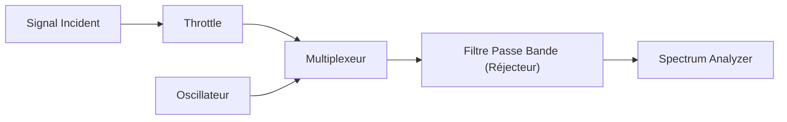

# R321-TP1 - Etude de la fonction mélangeur

## Introduction

Sous Gnu Radio vous produirez un schéma permettant d'étudier les différents cas de figures vus en cours. Vous devrez préciser vos paramètres (fréquences, etc.) ainsi que relever les spectres.

Dans le compte rendu vous rappellerez également, en vous les appropriant, les éléments théoriques vus en cours.

- Signal incident sinusoïdal
- Signal incident de spectre connu de la forme [0,Fmax] (onde sonore par exemple)
- Signal incident dans un canal de la forme [F1, F2]
- F0-F1>0
- F0-F1<0

> **Note:**  
> Il faudra modifier la fréquence de l'oscillateur local lors des cas
> `F0-F1>0` et `F0-F1<0`

Vous illustrerez également l'utilisation d'un mélangeur pour placer un signal modulé dans un canal donné

Pour les plus aguerri, vous utiliserez le modulateur IQ avec Q=0 d'un adalm pluto, qui est en fait un mélangeur, pour émettre un signal dans un canal à 455MHz en partant d'un signal modulé autour de 100kHz.

On devra donc faire un système tel que:

## Construction du système sur GnuRadio

1. ### Un signal incident sinusoïdal

    On doit donc créer le système ci-dessus sous GnuRadio.

    En prenant les valeurs suivantes:

    - $f_0$ = 400 kHz
    - $f_{osci}$ = 100 kHz
    - $f_e$ = 2 MHz

    Ce qui nous donne le schéma suivant:

    

    Ainsi donc, le spectre de notre signal incident sinusoïdal est:

    

    On peut donc voir que notre signal initial a été multiplexé
    à -100 et +100.

2. ### Un signal incident de spectre connu de la forme [0, $F_{max}$]

    On modifie notre système afin d'avoir un système équivalent:

    

    En prenant les valeurs suivantes:

    - $f_0$ = [0, 20] kHz
    - $f_{osci}$ = 100 kHz
    - $f_e$ = 2 MHz

    Ainsi donc, le spectre de notre signal incident est:

    

    Et notre waterfall est:

    

    On a notre lobe initial de -150 à 150 kHz,  après le multiplexage,
    on remarque bien qu'il s'est "agrandi" de -250 à 250.

    Cependant, cela peut être une mauvaise représentation du fait
    car nous nous retrouvons dans un cas ou nous n'avons pas
    qu'un seul lobe mais deux qui se chevauchent et donnent cette
    "illustion d'optique" de lobe unique.

3. ### Un signal incident dans un canal de la forme [F1, F2]

4. ### Quand $F_0$ - $F_1$ > $0$

5. ### Quand $F_0$ - $F_1$ < $0$

## Copyright &copy; 2023 Alexis Opolka, Mathys Domergue - All Rights Reserved
