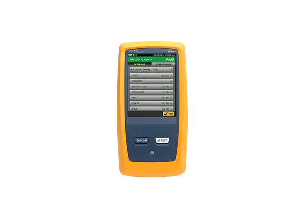

# Rapport d'activité - Alexis Opolka, Lucas Simpol

Cable: 7 - F/FTP Cat.6a 550 MHz 4P LSOH-FR TOURET 500m IVOIRE

Vendu par le fabriquant par 500m mais est disponible en plus petite taille.
C'est du fil de cuivre, l'isolant est polyétilène

LSOH-FR: Low Smoke "Zero" Halogen Retardateur de flamme

| Donnée                                  | Valeur                  |
|-----------------------------------------|-------------------------|
| Diamètre                                | 7,30mm                  |
| Poids/Km                                | 53 Kg/Km                |
| Tension max de pose                     | 98 Newton               |
| Application (max)                       | 10G Base-T              |
| Résistance                              | 146,4 &ohm;/Km          |
| Vitesse de propagation nominale (NVP)   | 78%                     |
| Affaiblissement de couplage             | &lt;= 70 dB             |

## mise en garde pour l'utilisation

| &nbsp;                                | &nbsp;                                                                              |
|---------------------------------------|-------------------------------------------------------------------------------------|
|  | avertissement : risque d'incendie, d'électrocution ou de dommage corporels.         |
|  | avertissement : risque de dommage ou de destruction de l'équipement ou du logiciel. |
|  | avertissement : consultez la documentation destinée a l'utilisateur.                |
| &nbsp;                                | &nbsp;                                                                              |

## Mode D'emploi

Avant de mettre en route l'appareil, vérifier dans le sac que l'ensemble est complet, cela comprend:

- 1 unité principale
- 1 unité distante
- 2 cordon de charge
- 2 adaptateurs de lien permannent (pour prise femelle)
- 2 adaptateurs de canau
- 1 cordon de référence
- 2 pairs d'écouteurs
- 1 cable USB AB / USB A
- 1 mode d'emploi

### utilisation

démarer les 2 aparreil en appuis le bouton "power" puis laisser-les démarré.

avant de réalisé un test de ligne il faut mettre le valeur de référence.
Pour cela il faut branché les apareil celon l'un des branchement de la figure 1.
Une fois fait, sur l'accueil du menus appuisé sur le bouton option puis sur apuis
sur le bouton "définir valeur de référence" ensuite suivé les instrucion le l'unité principale.

mise en place des diférente information a propo du projet

avant tout changement, vérifié que le projet n'ai pas déja enregisté, si il est déjà enregisté vérifié toute les information, si il n'est pas enregisté *(fleche 1)* appuié le la fleche, vous changerait de page (*image 3*), pour changé de projet appuié sur le bouton "modifier projet", vous changerai a nous de page, parcouré la liste, si votre projet a déjà enregistré il vous suffit de le sélectionné, si n'est pas enregistré, appuié sur le bouton "nouveau projet".  

un fois sur le rapport de test donné par l'appareil *(voir figure 4)*
vous pouvez accéder... (TODO: A compléter)

## Certification du cable

## Analyse de la certification

### Les informations qui sautent aux yeux

Au dessus le d'encadré bleu on peut voir que le cable testé est OK,
on le voie grace l'encadré vert avec la coche.
Dans l'encadré bleu on peut voir les infomation du cables et les information des l'appareil.  

### L'analyse des courbes

| Catégorie             | Image                                                                                                                                    | Analyse        |
|-----------------------|------------------------------------------------------------------------------------------------------------------------------------------|----------------|
| Wire Map              |                 | grace a image on pour vérifier si le cable est cablé corectement sur les prise femelle, on peut voir aussi il une des paire est casé car elle ne s'affichera pas. 
| Insertion loss (dB)   | ")     | représente la perte de dB sur les différente paire. la ligne rouge représent la limite maximale de perte que l'on peu admettre. la dexième ligne, n'est pas une ligne mais plusieur, elle représente la perte de chaque paire de cable en fonction de la féquence. sur se test on peut voir que le test est valide car on ne dépasse pas la limite maximal fixé donc sur se test le cable est valide
| NEXT (dB)             | ")               | vgfgfg
| NEXT @ Remote (dB)    | ")      |
| ACR-F (dB)            | ")              |
| ACR-F @ Remote (dB)   | ")     |
| ACR-N (dB)            | ")              |
| ACR-N @ Remote (dB)   | ")     |
| RL (dB)               | ")                 |
| RL @ Remote (dB)      | ")        |

## Copyright Alexis Opolka, Lucas Simol &copy; 2022 - All Rights Reserved
