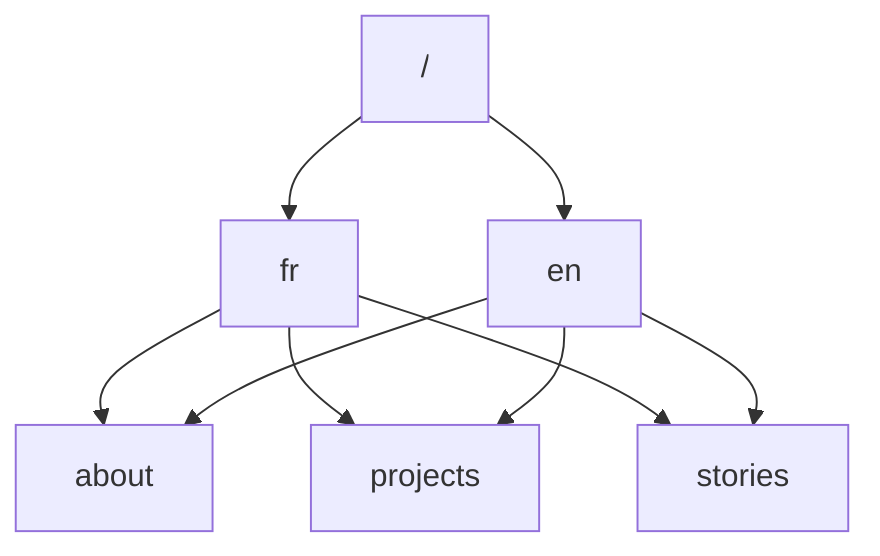

# Portfolio de Présentation - SAE 14

Après avoir fait une étude comparative de portfolios présents sur le web, accessible [ici](./src/etude-comparative-sae-14.pdf). Nous devons faire notre portfolio sous forme de site web.

Le site est [alexis-opolka.github.io](https://alexis-opolka.github.io)

Voici les schémas qui m'ont permis de le réaliser puis le rendu du site.

Le brouillon de la page à propos de moi était:

Après un peu de travail, le résultat est:

Le CV intéractif a été enlevé des fichiers (commenté), car le système n'était
pas bien designé dès le départ, faisant ainsi des erreurs dès qu'une multitude
d'éléments commencent à apparaître.

Les onglets "Histoires" et "Mes projets" ont été aussi mis en pause dû à des problèmes
de version entre la librairie que j'utilisais (Ma libraire client API) et
la nouvelle version de l'API appellée, m'obligeant donc à la revoir de fond en
comble retardant l'arrivée des deux onglets.

Sur le pied de page, l'accès à *Discord* comporte une URI (par défaut) amenant à appeler le client installé sur la machine du visiteur.  
Il reste encore à mettre en place un système de vérification que le client soit bien installé, supposé que cela soit possible.
