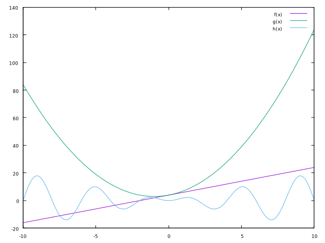
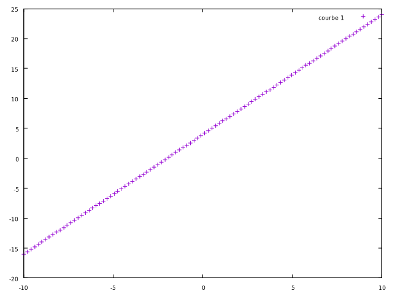
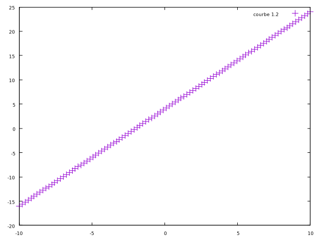
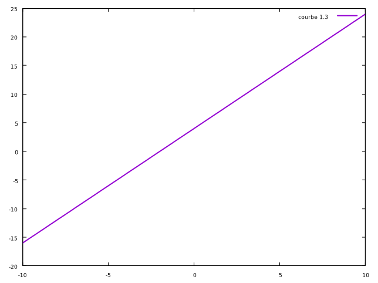
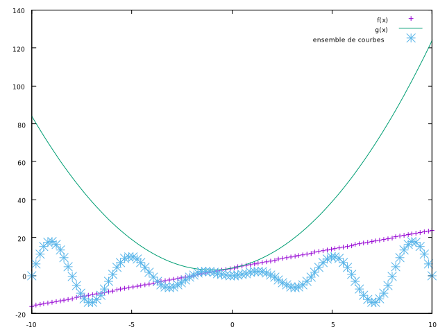
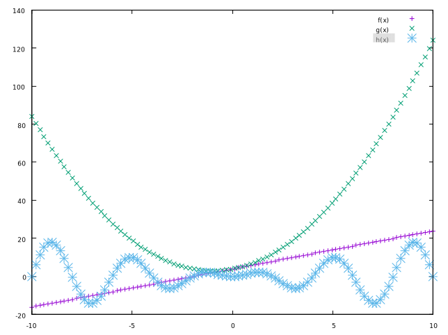
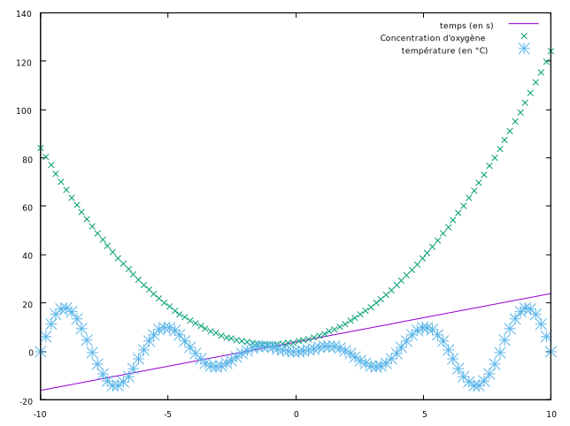
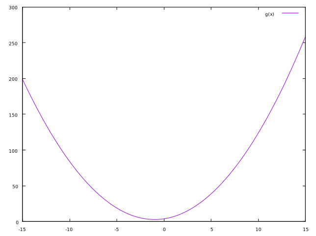
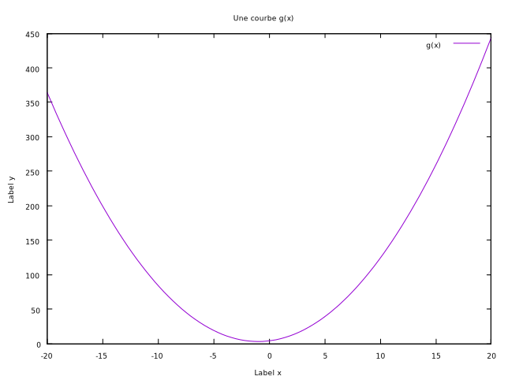
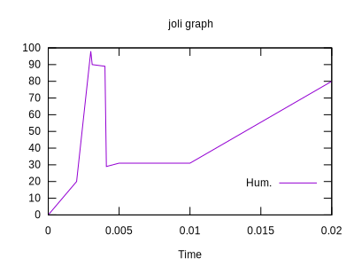

# SAE-15 - Introduction à Gnuplot

## 2 - Premier contact

Pour démarrer Gnuplot, il suffit d'invoquer la commande `gnuplot` dans le terminal.  
Le logiciel se présente sous la forme d'un shell (ligne de commande) qui attend vos commandes afin de tracer des courbes.

A tout moment, vous pouvez interroger l'aide en ligne en tapant la commande *help* suivie du nom d'une commande.  
Vous pouvez également consulter l'aide disponible sur le site de Gnuplot: [gnuplot.sourceforge.net](https://gnuplot.sourceforge.net)

Pour quitter le programme, vous pouvez utiliser la commande *exit*.  
Pour réinitialiser le programme, vous pouvez utiliser la commande *reset*

### 2.1 - Définition d'une fonction

Pour tracer des fonctions, il faut, dans un premier temps, les définir.  

```sh
f(x) = 2*sin(x + 3.14159);
plot f(x)
```

### 2.2 - Tracés simples

#### Exercice 1 - Tracé de courbes

Tracer les courbes des fonctions suivantes:

- $f(x) = 2x +4$
- $g(x) = x^2 + 2x + 1$
- $h(x) = 2x sin(\frac{\pi x}{2})$

```sh
f(x) = 2*x+4;
plot f(x)
```

Cela nous ce graph:

.svg)

```sh
g(x) = x**2 + 2*x + 4;
plot g(x)
```

Cela nous donne:

.svg)

```sh
h(x) = 2*x*sin((pi*x) / 2)
plot g(x)
```

Ce qui nous donne:

.svg)

#### Exercice 2 - Tracé de courbes

Tracer dans une seule fenêtre les trois fonctions `f`, `g` et `h`.

Vu que l'on a déjà défini les fonctions, on fait:

```sh
plot f(x), g(x), h(x)
```

Ce qui nous donne:



### 2.3 - Paramètres de tracé des courbes

Il est également possible de modifier certains paramètres de tracés (utiliser des points au lieu de lignes, changer la couleur, la légende de la courbe, ...).  
Par exemple, la commande suivante:

```sh
plot f(x) with points title "courbe 1";
```

permet de tracer la courbe f avec des points, en donnant comme légende à la courbe, le nom "courbe 1".

L'option *linewidth 2.0* permet de doubler l'épaisseur de la ligne
L'option *pointsize 2.0* permet de doubler la taille des points

#### Exercice 3 - Expérimentez les différentes options de tracé avec vos fonctions f,g et h

Après expérimentations, on a:













### 2.4 - Paramètres généraux

Les paramètres généraux s'effectue via la commande:

```sh
set <option> <valeur>
```

Pour réinitialier la valeur des réglages, vous pouvez utiliser la commande reset.

#### Exercice 4

En réglant le paramètre `xrange` à la valeur `[-15;15]`, vous pouvez
contrôler par exemple l'échelle des x sur votre graphique.



Trouvez comment tracer la courbe g, dans l'intervalle `[-20,20]`, en donnant un titre à la figure et des labels aux axes.

Pour cela, on fait:
```sh
set xrange [-20:20]
set xlabel "Label x"
set ylabel "Label y"
set title "Une courbe g(x)"
```



## 3 - Tracés à partir de fichier de données

Créons le fichier `data.dat`, accessible [ici](./data.dat).

et exécutons:

```sh
set terminal svg size 400,300 enhanced fname 'arial' fsize 10 butt solid
set key inside bottom right
set xlabel 'Time'
set title 'joli graph'
plot "data.dat" using 1:2 title 'Hum.' with lines, "data.txt" using 1:3 title 'Temp' with linespoints
```


